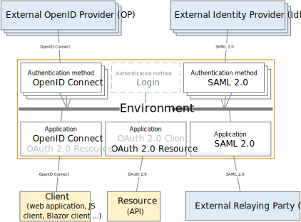

# How to connect

FoxIDs become an IdP by [registering an application](connections.md#application-registration) where you can connect applications and APIs. External IdPs is connected with an [authentication methods](connections.md#authentication-method).

By configuring a [SAML 2.0 authentication method](auth-method-saml-2.0.md) and a [OpenID Connect application](app-reg-oidc.md) FoxIDs become a [bridge](bridge.md) between SAML 2.0 and OpenID Connect and automatically convert SAML 2.0 claims to JWT (OAuth 2.0) claims.  
FoxIDs will then handle the SAML 2.0 connection and you only need to care about OpenID Connect in your application. You can possibly select multiple authentication methods from the same OpenID Connect application.

If needed you can [connect two FoxIDs environments](#connect-foxids-environments).

> Take a look at the FoxIDs test connections in FoxIDs Control: [https://control.foxids.com/test-corp](https://control.foxids.com/test-corp)  
> Get read access with the user `reader@foxids.com` and password `gEh#V6kSw`

## How to connect OpenID Provider / Identity Provider

An external OpenID Provider (OP) / Identity Provider (IdP) can be connected with a OpenID Connect or SAML 2.0 authentication method.

All IdPs supporting either OpenID Connect or SAML 2.0 can be connected to FoxIDs. The following is how to guides for some IdPs; more guides will be added over time.

### OpenID Connect

Configure [OpenID Connect](auth-method-oidc.md) which trust an external OpenID Provider (OP) - *an Identity Provider (IdP) is called an OpenID Provider (OP) if configured with OpenID Connect*.

> You should always ask for the `sub` claim, even if you only use the `email` claim or e.g. another custom user ID claim.

How to guides:

- Connect [IdentityServer](auth-method-howto-oidc-identityserver.md)
- Connect [Microsoft Entra ID (Azure AD)](auth-method-howto-oidc-microsoft-entra-id.md) 
- Connect [Azure AD B2C](auth-method-howto-oidc-azure-ad-b2c.md) 
- Connect [Amazon Cognito](auth-method-howto-oidc-amazon-cognito.md)
- Connect [Google](auth-method-howto-oidc-google.md)
- Connect [Facebook](auth-method-howto-oidc-facebook.md)
- Connect [Signicat](auth-method-howto-oidc-signicat.md)
- Connect [Nets eID Broker](auth-method-howto-oidc-nets-eid-broker.md)

### SAML 2.0

Configure [SAML 2.0](auth-method-saml-2.0.md) which trust an external Identity Provider (IdP).

> You should always ask for the `NameID` claim, even if you only use the email (`http://schemas.xmlsoap.org/ws/2005/05/identity/claims/emailaddress`) claim or e.g. another custom user ID claim. SAML 2.0 can not do logout without the `NameID` claim.  
> You should prefer to do SAML 2.0 connects with the use of the authentication methods metadata, then the customer's IdP can automatically download the certificate(s). And request for an online IdP metadata from the customer.

How to guides:

- Connect [PingIdentity / PingOne](auth-method-howto-saml-2.0-pingone.md)
- Connect [Google Workspace](auth-method-howto-saml-2.0-google-workspace.md)
- Connect [Microsoft AD FS](auth-method-howto-saml-2.0-adfs.md)
- Connect [NemLog-in (Danish IdP)](auth-method-howto-saml-2.0-nemlogin.md)
- Connect [Context Handler (Danish identity broker)](howto-saml-2.0-context-handler.md)

### Verified platforms

List of customer-verified platforms.

- [MobilityGuard](https://www.mobilityguard.com/)
- [F5 BIG-IP](https://www.f5.com/products/big-ip)
- [Swedish E-Identitet](https://e-identitet.se/)
- [PhenixID](https://www.phenixid.se/)
- [Nexus Group](https://www.nexusgroup.com/)

## How to connect applications
When you register an application with either OpenID Connect or SAML 2.0, FoxIDs become an OpenID Provider (OP) / Identity Provider (IdP). 
You would most often connect applications and APIs. But an application registration can also be used as a OP / IdP for an external system where the external system is the relaying party (RP). 

### OpenID Connect and OAuth 2.0
It is recommended to secure applications and APIs with [OpenID Connect](app-reg-oidc.md) and [OAuth 2.0](app-reg-oauth-2.0.md). Please see the [samples](samples.md).

How to guides:

- Connect [Tailscale](app-reg-howto-oidc-tailscale.md)

### SAML 2.0
Configure [SAML 2.0](app-reg-saml-2.0.md) to be an Identity Provider (IdP).

How to guides:

- Connect [Amazon IAM Identity Center](app-reg-howto-saml-amazon-iam-identity-center.md)
- Connect [Google Workspace](app-reg-howto-saml-google-workspace.md)
- Connect [Microsoft Entra ID](app-reg-howto-saml-microsoft-entra-id.md)
- Connect [Context Handler test IdP (Danish identity broker)](howto-saml-2.0-context-handler#configuring-test-identity-provider-for-context-handler)

## Connect FoxIDs environments

It is possible to interconnect FoxIDs environments with a [Environment Link](howto-environmentlink-foxids.md) or [OpenID Connect](howto-oidc-foxids.md).

You can connect two environments in the same tenant with a [Environment Link](howto-environmentlink-foxids.md).
Environment Links is fast and secure, but they can only be used in to connect within a tenant.  
*It is recommended to use Environment Link if you need to connect environments in the same tenant.*

You can connect two environments in the same or different tenants with [OpenID Connect](howto-oidc-foxids.md). The configuration is more complex than if you use a Environment Link. 
OpenID Connect is secure and you can connect all environments regardless of which tenant they are in. There is basically not different in external OpenID Connect connections and internal connections used between environments.
