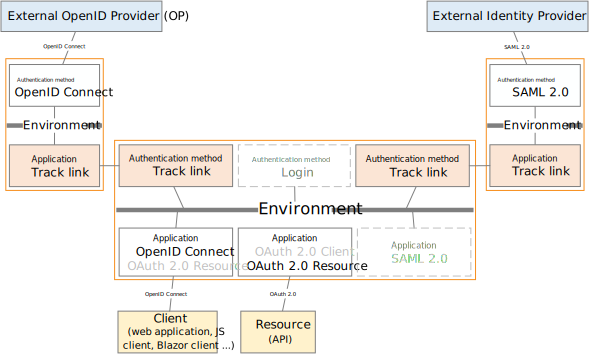

<!--
{
    "title":  "Environment Link",
    "description":  "FoxIDs environments in the same tenant can be connected with environment links. An Environment Link acts mostly like OpenID Connect but it is simpler to configure and the steps it goes through is faster.",
    "ogTitle":  "Environment Link",
    "ogDescription":  "FoxIDs environments in the same tenant can be connected with environment links. An Environment Link acts mostly like OpenID Connect but it is simpler to configure and the steps it goes through is faster.",
    "ogType":  "article",
    "ogImage":  "/images/foxids_logo.png",
    "twitterCard":  "summary_large_image",
    "additionalMeta":  {
                           "keywords":  "howto environmentlink foxids, FoxIDs docs"
                       }
}
-->

# Environment Link

FoxIDs environments in the same tenant can be connected with environment links. An Environment Link acts mostly like OpenID Connect but it is simpler to configure and the steps it goes through is faster. 

Environment links is fast and secure but can only be used in the same tenant. A link based on [OpenID Connect connection](howto-oidc-foxids.md) is required if you need to jump between environments located in different tenants.

> Take a look at the sample environment links configuration in FoxIDs Control: [https://control.foxids.com/test-corp](https://control.foxids.com/test-corp)  
> Get read access with the user `reader@foxids.com` and password `gEh#V6kSw` then e.g., take a look at the `nemlogin` and `Production` environments.

Environment links support login, logout and single logout and it is possible to configure [claim and claim transforms](claim.md), logout session and home realm discovery (HRD) like all other connecting authentication methods and application registrations.

## Configure integration

The following describes how to connect two environments called `Environment X` and `Environment Y`. The environment `Environment X` will be enabled to login with `Environment Y` as an authentication method.

**Select in the `Environment X` environment in [FoxIDs Control Client](control.md#foxids-control-client)**

1. Select the **Authentication** tab
2. Click **New authentication**
3. Select **Show advanced**  
4. Select **Environment Link**     
   

5. Add the **Name** e.g., `Environment X to Y` 
4. Select the `Environment Y` environment
   
6. Click Create

That's it, you are done. 

Your new authentication method `Environment X to Y` can now be selected as an allowed authentication method in the application registrations in you `Environment X` environment.  

You can find the application registration `Environment X to Y` in the `Environment Y` environment where authentication method(s) can be selected.

