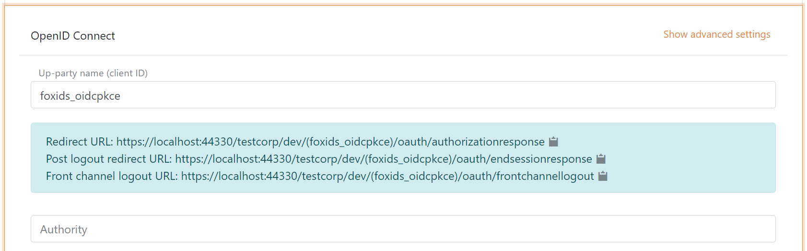
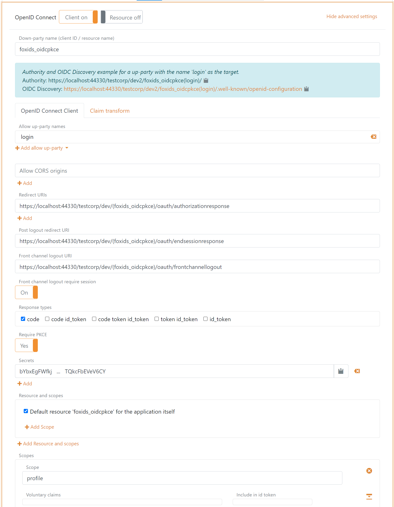
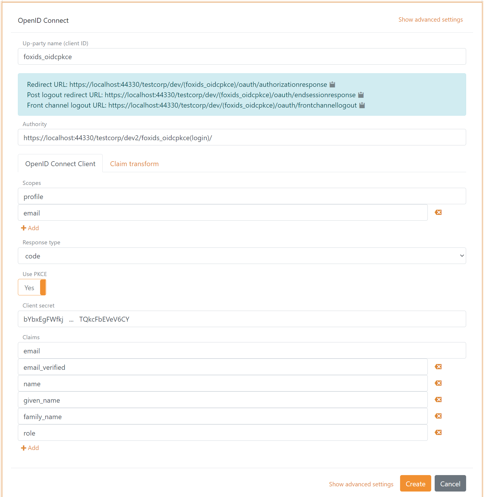

<!--
{
    "title":  "Interconnect FoxIDs with OpenID Connect",
    "description":  "Connect FoxIDs environments using OpenID Connect to enable cross-environment authentication, logout, and session handling within or across tenants.",
    "ogTitle":  "Interconnect FoxIDs with OpenID Connect",
    "ogDescription":  "Connect FoxIDs environments using OpenID Connect to enable cross-environment authentication, logout, and session handling within or across tenants.",
    "ogType":  "article",
    "ogImage":  "/images/foxids_logo.png",
    "twitterCard":  "summary_large_image",
    "additionalMeta":  {
                           "keywords":  "howto oidc foxids, FoxIDs docs"
                       }
}
-->

# Interconnect FoxIDs with OpenID Connect

FoxIDs environments can be connected with OpenID Connect and thereby authenticating end users in another FoxIDs environment or an external Identity Provider (IdP) configured as an authentication method.  
FoxIDs environments can be interconnect in the same FoxIDs tenant or in different FoxIDs tenants. Interconnections can also be configured between FoxIDs environments in different FoxIDs deployments.

> You can easily connect two environments in the same tenant with a [Environment Link](howto-environmentlink-foxids.md).

The integration between two FoxIDs environments support [OpenID Connect authentication](https://openid.net/specs/openid-connect-core-1_0.html#Authentication) (login), [RP-initiated logout](https://openid.net/specs/openid-connect-rpinitiated-1_0.html) and [front-channel logout](https://openid.net/specs/openid-connect-frontchannel-1_0.html). A session is established when the user authenticates and the session is invalidated on logout.

> You can test OpenID Connect environment connections with the [online web app sample](https://aspnetoidcsample.itfoxtec.com) ([sample docs](samples.md#aspnetcoreoidcauthcodealluppartiessample)) by clicking `Log in` and then `Parallel FoxIDs environment`.  
> Take a look at the environment connection configuration in FoxIDs Control: [https://control.foxids.com/test-corp](https://control.foxids.com/test-corp)  
> Get read access with the user `reader@foxids.com` and password `gEh#V6kSw` then take a look at the `parallel` and `Production` environments.

The following describes how to configure a OpenID Connect authentication method in your FoxIDs environment and trust a parallel FoxIDs environment where a OpenID Connect application registration is configured. This will make your FoxIDs environment trust the parallel FoxIDs environment to authenticate users.

## Configure integration

**1 - Start in your FoxIDs environment by creating an OpenID Connect authentication method in [FoxIDs Control Client](control.md#foxids-control-client)**

1. Add the name

It is now possible to read the `Redirect URL`, `Post logout redirect URL` and `Front channel logout URL`.

**2 - Then go to the parallel FoxIDs environment and create the application registration client**

The client is a confidential client using Authorization Code Flow and PKCE.

1. Specify client name in application registration name.
2. Select allowed authentication methods. E.g. `login` or some other authentication method.
3. Select show advanced.
4. Specify redirect URI read in your authentication method.
5. Specify post logout redirect URI read in your authentication method.
6. Specify front channel logout URI read in your authentication method.
7. Specify a secret (remember the secret to the next step).
8. Remove the `offline_access`.
9. Remove / edit the scopes depending on your needs.
10. Click create.

**3 - Go back to your FoxIDs authentication method in [FoxIDs Control Client](control.md#foxids-control-client)**

 1. Add the parallel FoxIDs environment application registration client authority.  
     > Default the parallel environment use the `login` authentication method to authenticate users with the `https://localhost:44330/testcorp/dev2/foxids_oidcpkce(login)/` authority.  
     > It is possible to select another authentication method in the parallel environment. E.g. `azure_ad` with the `https://localhost:44330/testcorp/dev2/foxids_oidcpkce(azure_ad)/` authority.
 2. Add the profile and email scopes (possible other or more scopes).
 3. Add the parallel FoxIDs environment application registration client's client secret.
 6. Add the claims which will be transferred from the authentication method to the application registrations. E.g., email, email_verified, name, given_name, family_name, role and possible the access_token claim to transfer the parallel FoxIDs environments access token.
 7. Click create.

 

That's it, you are done. 

> Your new authentication method can now be selected as an allowed authentication method in the application registrations in you environment.  
> The application registrations in you environment can read the claims from your authentication method. It is possible to add the access_token claim to include the parallel FoxIDs environments access token as a claim in the issued access token.

