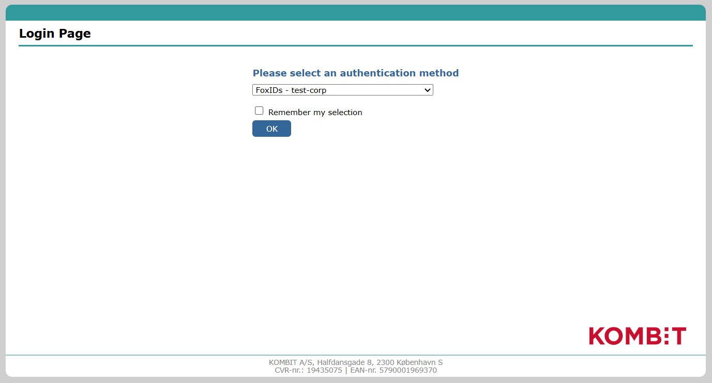
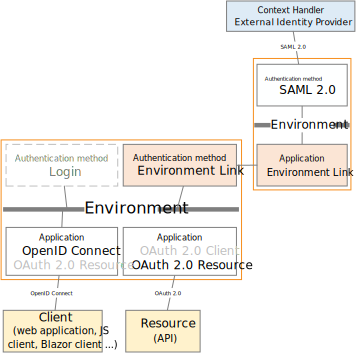
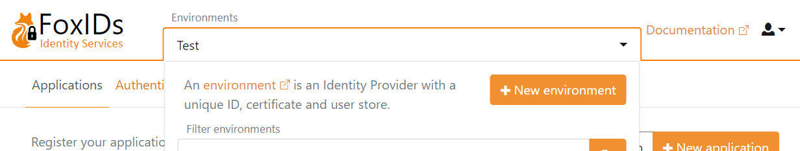
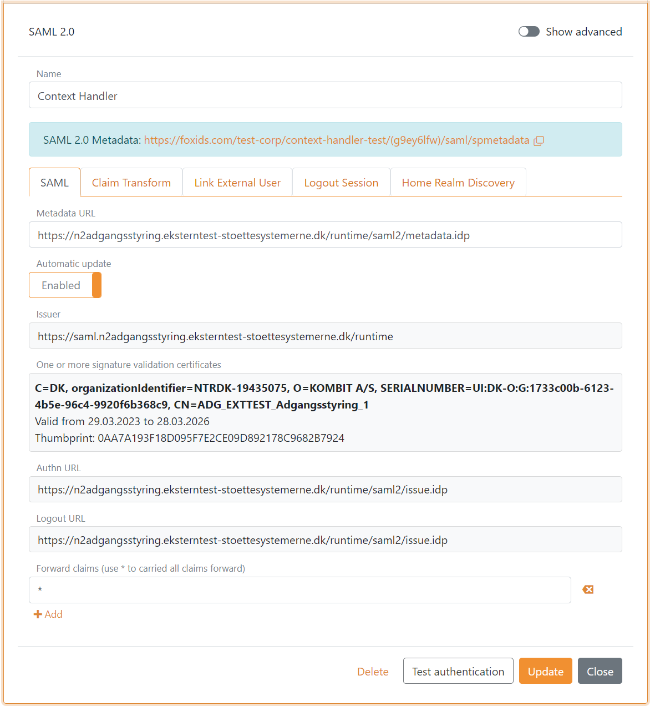
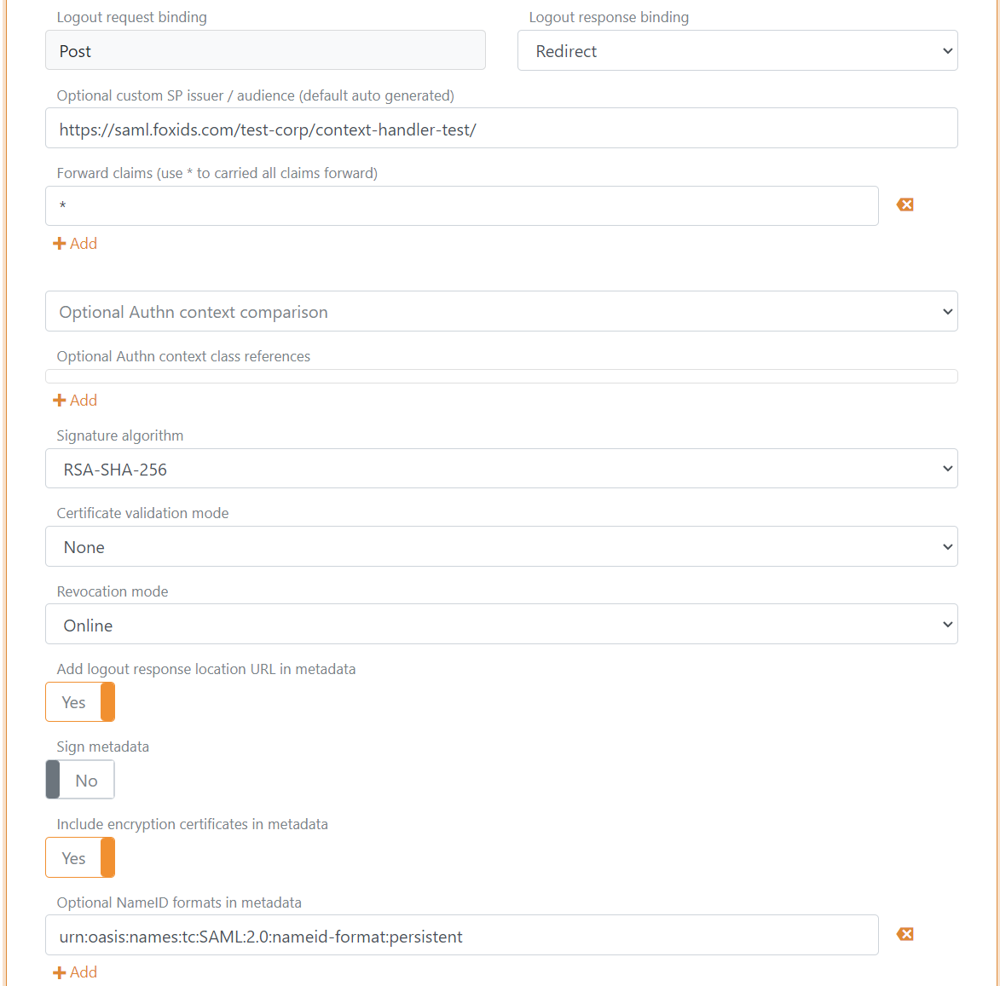
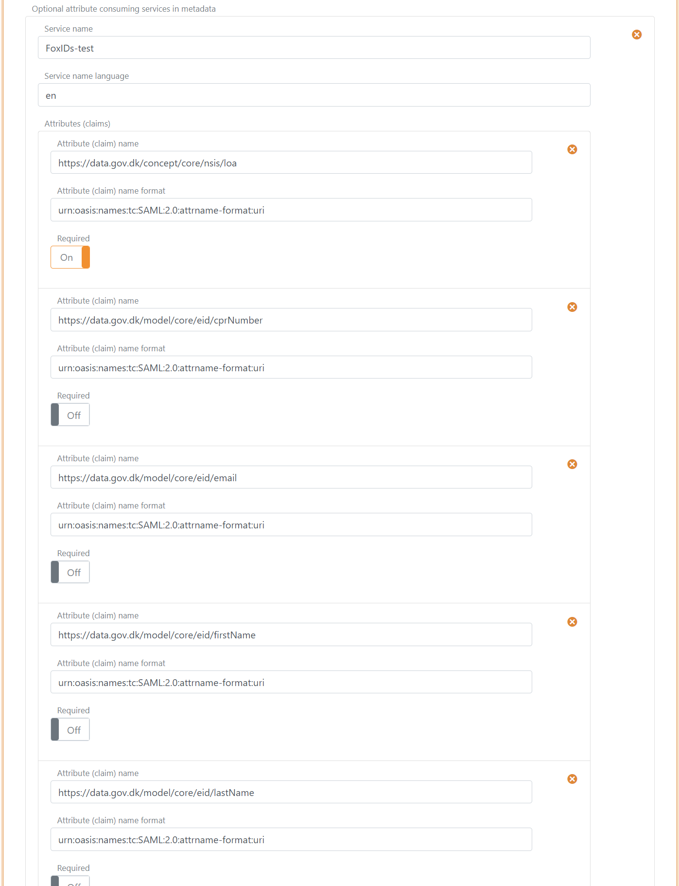
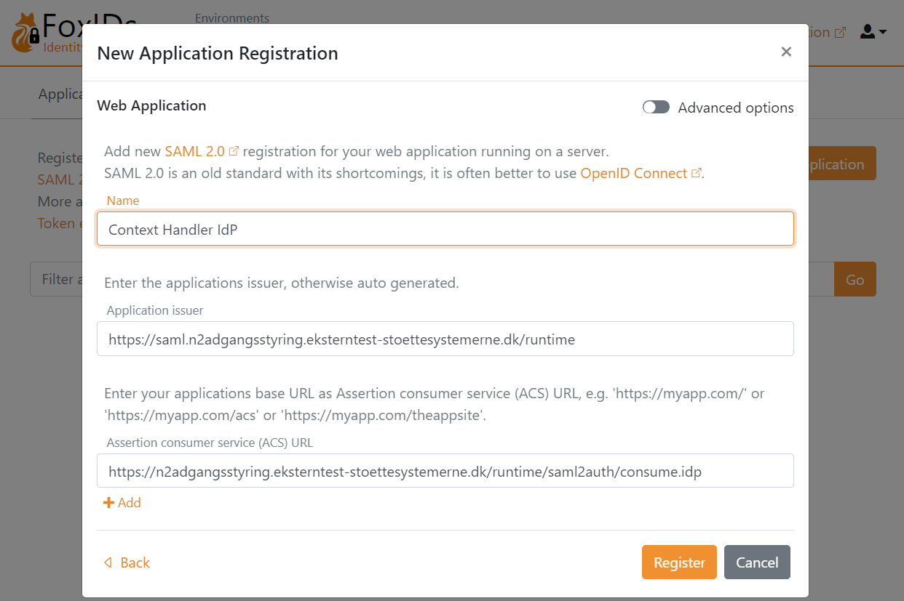
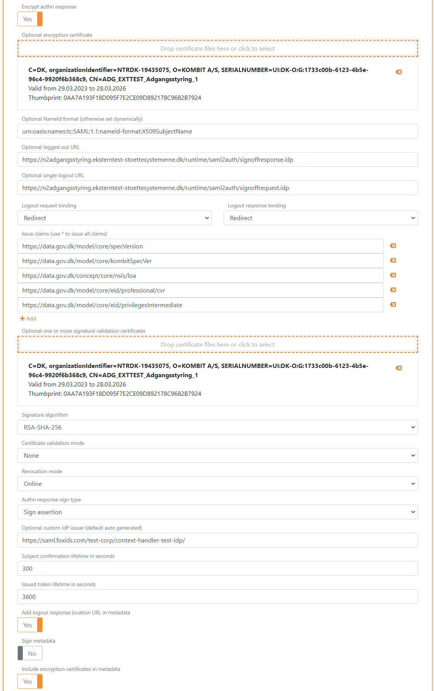
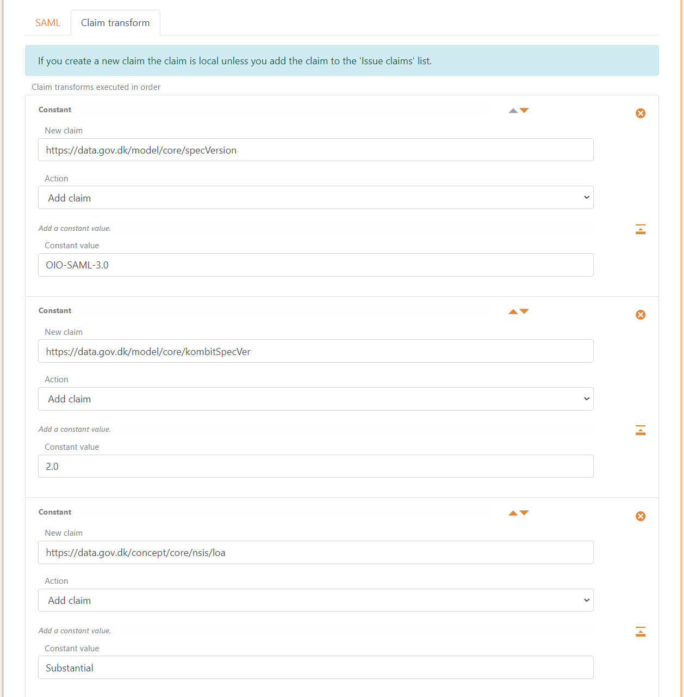
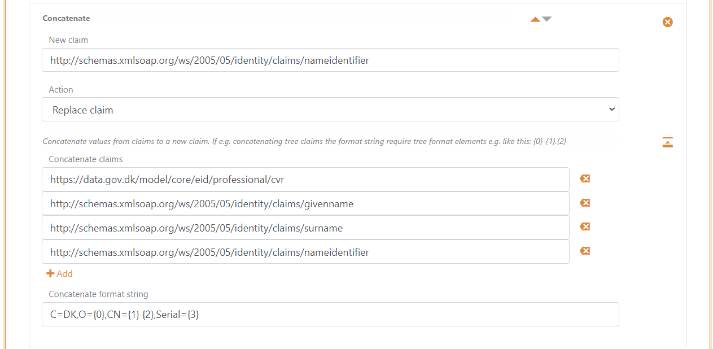

# Connect to Context Handler with SAML 2.0

FoxIDs can be connected to Context Handler with a [SAML 2.0 authentication method](auth-method-saml-2.0.md).

> Context Handler is a Danish identity broker connecting the Danish municipalities in a common federation, in Danish called **Fælleskommunal Adgangsstyring**.

[Context Handler is connected](#configuring-context-handler-as-identity-provider) as a SAML 2.0 Identity Provider (IdP) based on OIOSAML 3 and OCES3 (RSASSA-PSS).  

By configuring an [SAML 2.0 authentication method](auth-method-saml-2.0.md) and a [OpenID Connect application registration](app-reg-oidc.md) FoxIDs become a [bridge](bridge.md) between SAML 2.0 and OpenID Connect. 
FoxIDs will then handle the SAML 2.0 connection as a Relying Party (RP) / Service Provider (SP) and you only need to care about OpenID Connect in your application. If needed, you can possibly select multiple login option (authentication methods) from the same OpenID Connect application registration.

In test, you can log in with the FoxIDs test IdP.

Or configure a FoxIDs environment as a [test Identity Provider for Context Handler](#configuring-test-identity-provider-for-context-handler) with a [SAML 2.0 application registration](app-reg-saml-2.0.md) and authenticate test users.

Context Handler can be configured based on either OIOSAML 2 or OIOSAML 3 with OCES3 (RSASSA-PSS) and FoxIDs furthermore support the required certificates and it is possible to support NSIS.

> You can test Context Handler login with the [online web app sample](https://aspnetcoreoidcallupsample.itfoxtec.com) ([sample docs](samples.md#aspnetcoreoidcauthcodealluppartiessample)) by clicking `Log in` and then `Danish Context Handler TEST` for the test environment (select `FoxIDs - test-corp` on the Context Handler log in page) or `Danish Context Handler` for production.  
> Take a look at the Context Handler sample configuration in FoxIDs Control: [https://control.foxids.com/test-corp](https://control.foxids.com/test-corp)  
> Get read access with the user `reader@foxids.com` and password `TestAccess!` then select the `context-handler`, `context-handler-test` or `context-handler-idp-test` environment.  
> *The sample is configured with a separate environments for the Context Handler SAML 2.0 integration.*

Context Handler documentation:
- Context Handler [guide](https://digitaliseringskataloget.dk/l%C3%B8sninger/adgangsstyring-brugere).
- [Context Handler administration portal](https://serviceplatformen.dk/administration/) 
- Context Handler [test application](https://spwithnsis.eksterntest-stoettesystemerne.dk)

> Transform the [DK privilege XML claim](claim-transform-dk-privilege.md) to a JSON claim.

## Separate environment

Context Handler requires each connection in an environment (test or production) to use a unique OCES3 certificate.  
Therefore, consider connecting Context Handler in separate environments where the OCES3 certificates can be configured.

Create a new environment in [FoxIDs Control Client](control.md#foxids-control-client):
1. Find the **Environments** section in the top middle
2. Click the drop-down 
3. Click **New environment**
   
4. Add the **Name**
5. Click **Create**

If you both configure a test and production environment, they should be placed in separate environments. 
If you configure a [test Identity Provider for Context Handler](#configuring-test-identity-provider-for-context-handler), it should also be placed in a separate environment and have a unique OCES3 certificate.

You can easily connect two environments in the same tenant with a [Environment Link](howto-environmentlink-foxids.md).

## Certificate

Context Handler requires all requests (authn and logout) to be signed with **production** OCES3 certificates in all environments. It is NOT possible to use a certificate issued by another certificate authority, a self-signed certificate or test OCES3 certificates.

A OCES3 certificate is valid for three years. After that, it must be updated manually.

Add the `.P12` OCES3 certificate in [FoxIDs Control Client](control.md#foxids-control-client):
1. Select (or create) a [separate environment](#separate-environment) to be used for [Context Handler as Identity Provider](#configuring-context-handler-as-identity-provider) or a [test Identity Provider for Context Handler](#configuring-test-identity-provider-for-context-handler)
2. Select the **Certificates** tab
3. If not configured for contained certificates. Click the arrow down on the Swap certificate button and then in the **Contained certificates** section click **Change container type**
4. Click on the primary certificate
5, Add the password in **Optional certificate password** 
6. Upload the `.P12` OCES3 certificate 

It is subsequently possible to add a secondary certificate and to swap between the primary and secondary certificates.

## Configuring Context Handler as Identity Provider
This guide describe how to setup Context Handler as a SAML 2.0 Identity Provider and comply to OIOSAML3.

> You need to [configure the OCES3 certificate](#certificate) before following this guide.

**1 - Start by creating an SAML 2.0 authentication method in [FoxIDs Control Client](control.md#foxids-control-client)**

1. Select the **Authentication methods** tab
2. Click **New authentication** and then **Identity Provider (SAML 2.0)**
3. Add the **Name** e.g. `Context Handler`
4. Add the Context Handler IdP metadata in the **Metadata URL** field  
   Test metadata: `https://n2adgangsstyring.eksterntest-stoettesystemerne.dk/runtime/saml2/metadata.idp`  
   Production metadata: `https://n2adgangsstyring.stoettesystemerne.dk/runtime/saml2/metadata.idp` 
5. Click **Create**

6. Select Show advanced
7. Set **Logout response binding** to **Redirect**
8. Configure a **Custom SP issuer**, the issuer can optionally start with `https://saml.` The issuer in this example is `https://saml.foxids.com/test-corp/context-handler-test/`
9. Optionally set the **Certificate validation mode** to **Chain trust** if the OCES3 root certificate is trusted on your platform. The OCES3 root certificate is NOT trusted in Azure  
   Set the **Certificate revocation mode** to **Online** 
10. Select Yes in **Add logout response location URL in metadata**
11. Select Yes in **Include the encryption certificate in metadata**
12. Set the **NameID format in metadata** to `urn:oasis:names:tc:SAML:2.0:nameid-format:persistent`

13. In **Attribute consuming service in metadata**, click **Add attribute consuming service** and add the **Service name**
14. Add all the claims you want to receive as requested attributes with the format `urn:oasis:names:tc:SAML:2.0:attrname-format:uri`. Optionally set each attribute as required.

The following claims is most often used:

  - `https://data.gov.dk/model/core/specVersion`
  - `https://data.gov.dk/concept/core/nsis/loa`
  - `https://data.gov.dk/model/core/eid/professional/cvr`
  - `https://data.gov.dk/model/core/eid/professional/orgName`
  - `https://data.gov.dk/model/core/eid/cprNumber`
  - `https://data.gov.dk/model/core/eid/email`
  - `https://data.gov.dk/model/core/eid/firstName`
  - `https://data.gov.dk/model/core/eid/lastName`
  - `https://data.gov.dk/model/core/eid/privilegesIntermediate`

15. In **Contact persons in metadata**, click **Add contact person** and click **Administrative** to add a administrative contact person
16. Click **Update**
17. Go to the top of the SAML 2.0 authentication method
18. Find the SP-metadata in **SAML 2.0 method URL**, in this case https://foxids.com/test-corp/context-handler-test/(g9ey6lfw)/saml/spmetadata. 
19. The SP-metadata URL is used to configure a Context Handler user system (DK: brugervendt system).
 
**2 - Then go to the [Context Handler administration portal](https://serviceplatformen.dk/administration/)**

1. Select IT-systems (DK: IT-systemer) 
2. Click Add IT-system (DK: Tilslut it-system)
3. Fill out the fields and select User system (DK: Brugervendt system)
4. Go to the User system tab (DK: Brugervendt system)
5. Select Context Handler with NSIS and remove the selection of Context Handler (without NSIS)
6. Select OIOSAML3 as OIOSAML profile and NSIS level
7. Add the SAML 2.0 authentication method SP-metadata URL, in this case `https://foxids.com/test-corp/context-handler-test/(g9ey6lfw)/saml/spmetadata`.
8. Fill out the rest, accept the terms and click Save (DK: Gem)

 **3 - Add privilege claim transformation in [FoxIDs Control Client](control.md#foxids-control-client)**

FoxIDs can transform the [DK privilege XML claim](claim-transform-dk-privilege.md) to a JSON claim. It is recommended to add the transformation in order to obtain smaller claims and tokens.
Furthermore, it makes the tokens readable.

1. Select the **Claim transform** tab
2. Click **Add claim transform** and click **DK XML privilege to JSON**
3. Click **Add claim transform** and click **Match claim**
4. As **Action** select **Remove claim**, to remove the original privilege claim from the claims pipeline
5. In the **Remove claim** add `https://data.gov.dk/model/core/eid/privilegesIntermediate` 
6. Click **Update**

> Remember to add a claim mapping from SAML `http://schemas.foxids.com/identity/claims/privilege` to JWT `privilege` please see next section 4).

 **4 - Add SAML 2.0 claim to JWT claim mappings in [FoxIDs Control Client](control.md#foxids-control-client)**

 FoxIDs internally converts SAML 2.0 clams to JWT claims. Context Handler use a OIOSAML3 defined set of SAML 2.0 claims where corresponding JWT mappings need to be added in the environment.

 1. Go to Settings tab and Claim mappings
 2. Click **Add claim mapping** for all the claims configured in step 1.14, you can create you own short JWT claim names if no standard name exists
 3. Click **Update**

 

You are done. The SAML 2.0 authentication method can now be used as an authentication method for application registrations in the environment.

> A application registration will only issue added claims.  
> Therefore, remember to add the JWT claims to OpenID Connect application registrations or use the `*` notation.

## Configuring test Identity Provider for Context Handler

This guide describe how to configured FoxIDs as a test Identity Provider for Context Handler. Context Handler is added as a SAML 2.0 Relying Party.

> You need to use a [separate environment](#separate-environment) to have a place for the test users and to [configure the OCES3 certificate](#certificate) before following this guide.

**1 - Start by creating an SAML 2.0 application registration in [FoxIDs Control Client](control.md#foxids-control-client)**

1. Select the **Applications** tab
2. Click **New application**
3. Select **Show advanced**  
4. Select **Web Application (SAML 2.0)**
5. Add the **Name** e.g., `Context Handler IdP` 
6. Download the Context Handler RP metadata where you can find endpoints and the certificate to trust.  
   Test metadata: `https://n2adgangsstyring.eksterntest-stoettesystemerne.dk/runtime/saml2auth/metadata.idp`  
   The certificate is base64 encoded and can be converted into a certificate file `.cer` with the [FoxIDs certificate tool](https://www.foxids.com/tools/Certificate). 
7. Add the **Application issuer** `https://saml.n2adgangsstyring.eksterntest-stoettesystemerne.dk/runtime` and the metadata
8. Add the **Assertion consumer service (ACS) URL** `https://n2adgangsstyring.eksterntest-stoettesystemerne.dk/runtime/saml2auth/consume.idp` from the metadata
   
9. Click **Register**
10. Read the **Metadata URL** and save it for later
11. Click **Close**

12. The detailed configuration opens, select **Show advanced** in the top right corner of this configuration section
13. Enable **Absolute ACS URL**
14. Set **Encrypt authn response** to Yes
15. Add the encryption certificate from the metadata in **Encryption certificate**
16. Set the **NameID format** to `urn:oasis:names:tc:SAML:1.1:nameid-format:X509SubjectName`
17. Add the **Logged out URL** `https://n2adgangsstyring.eksterntest-stoettesystemerne.dk/runtime/saml2auth/signoffresponse.idp` from the metadata
18. Add the **Single logout out URL** `https://n2adgangsstyring.eksterntest-stoettesystemerne.dk/runtime/saml2auth/signoffrequest.idp` from the metadata
19. Set the **Logout request binding** and the **Logout response binding** to redirect
20. Set the OIOSAML3 claims which should be issued to Context Handler in **Issue claims**

The following claims is most often used:

  - `https://data.gov.dk/model/core/specVersion`
  - `https://data.gov.dk/model/core/kombitSpecVer`
  - `https://data.gov.dk/concept/core/nsis/loa`
  - `https://data.gov.dk/model/core/eid/professional/cvr`
  - `https://data.gov.dk/model/core/eid/privilegesIntermediate`

21. Add the signing certificate from the metadata in **Signature validation certificate**
22. Optionally the **Certificate validation mode** to **Chain trust** if the OCES3 root certificate is trusted on your platform. The OCES3 root certificate is NOT trusted in Azure  
    Set the **Certificate revocation mode** to **Online** 
23. Set **Authn response sign type** to **Sign assertion**
24. Configure a **Custom IdP issuer**, the issuer can optionally start with `https://saml.` The issuer in this example `https://saml.foxids.com/test-corp/context-handler-test-idp/`
25. Select Yes in **Add logout response location URL in metadata**
26. Select YEs in **Include the encryption certificate in metadata**
27. In **Contact persons in metadata**, click **Add contact person** and click **Administrative** to add a administrative contact person
    
28. Click **Update**
29. Go to the top of the SAML 2.0 application section
30. Find the test IdP-metadata in **SAML 2.0 Metadata**, in this case `https://foxids.com/test-corp/context-handler-idp-test/ch-idp(*)/saml/idpmetadata`  
    The test IdP-metadata is used to configure the Context Handler identity provider.

**2 - Then go to the [Context Handler administration portal](https://serviceplatformen.dk/administration/)**

1. Select IT-systems (DK: IT-systemer) 
2. Click Add IT-system (DK: Tilslut it-system)
3. Fill out the fields and select Identity Provider
4. Go to the Identity Provider tab
5. Select Context Handler with NSIS and remove the selection of Context Handler (without NSIS)
6. Select OIOSAML3 as OIOSAML profile and NSIS level
7. Add the test IdP-metadata URL, in this case `https://foxids.com/test-corp/context-handler-idp-test/ch-idp(*)/saml/idpmetadata`.
8. Fill out the rest, accept the terms and click Save (DK: Gem)

> You are required to be registered as your own test authority (DK: [egen test myndighed](https://digitaliseringskataloget.dk/oprettelse-af-som-egen-test-myndighed-grundpakken)) in the test environment to add a federation agreement. 
> A federation agreement (DK: f&oslash;derationsaftaler) is required to enable the identity provider in Context Handler. 

 **3 - Add claim transformation in [FoxIDs Control Client](control.md#foxids-control-client)**

Create the claims which has to be issued to Context Handler in claim transforms.

1. Go back to the SAML 2.0 application `Context Handler IdP` 
2. Select the **Claim transforms** tab
3. Add a **Constant** claim `https://data.gov.dk/model/core/specVersion` with the value `OIO-SAML-3.0`
4. Add a **Constant** claim `https://data.gov.dk/model/core/kombitSpecVer` with the value `2.0`
  
5. Add the spec. ver. `https://data.gov.dk/model/core/specVersion` and Kombit spec. ver. `https://data.gov.dk/model/core/kombitSpecVer` as constant claims
6. Add a **Constant** levels of assurance (loa) claim `https://data.gov.dk/concept/core/nsis/loa` with e.g. the value `Substantial` or read the claim through the claims pipeline

7. Add a **Concatenated** claim to replace the NameID `http://schemas.xmlsoap.org/ws/2005/05/identity/claims/nameidentifier` claim which a concatenated version of the CVR number, display name and unique user ID
8. Select **Action** **Replace claim**
9. Concatenate claims:
    - `https://data.gov.dk/model/core/eid/professional/cvr`
    - `http://schemas.xmlsoap.org/ws/2005/05/identity/claims/givenname`
    - `http://schemas.xmlsoap.org/ws/2005/05/identity/claims/surname`
    - `http://schemas.xmlsoap.org/ws/2005/05/identity/claims/nameidentifier`
10. Set the **Concatenate format string** to `C=DK,O={0},CN={1} {2},Serial={3}`

11. Click **Update**

 **4 - Add SAML 2.0 claim to JWT claim mappings in [FoxIDs Control Client](control.md#foxids-control-client)**

 FoxIDs internally converts SAML 2.0 clams to JWT claims. Context Handler use a OIOSAML3 defined set of SAML 2.0 claims where corresponding JWT mappings need to be added in the environment.

 1. Go to **Settings** tab and sub **Claim mappings** tab
 2. Click **Add claim mapping** for all the claims configured in step 1.20, you can create you own short JWT claim names if no standard name exists - please see the corresponding information in section [Configuring Context Handler as Identity Provider](#configuring-context-handler-as-identity-provider) step 4
 3. Click **Update**

**5 - Add test users in [FoxIDs Control Client](control.md#foxids-control-client)**

You can add test uses with test claims in the **Users** tab and sub **Internal Users** tab.  

> Test claims on test users is JWT based and mapped to SAML 2.0 claims.

Each test user is required to have a CVR `cvr` claim, given name `given_name` claim, family name `family_name` claim  and optionally a `privilege` claim with a base64 encoded DK privilege XML string value.

If the user should have the Job function role (DK: Jobfunktionsrolle) `http://foxids.com/roles/jobrole/test-corp-admin_access/1` the DK privilege XML would be (with test CVR number: 11111111):

    <?xml version="1.0" encoding="UTF-8"?>
    <bpp:PrivilegeList xmlns:bpp="http://digst.dk/oiosaml/basic_privilege_profile" xmlns:xsi="http://www.w3.org/2001/XMLSchema-instance" >
        <PrivilegeGroup Scope="urn:dk:gov:saml:cvrNumberIdentifier:11111111">
            <Privilege>http://foxids.com/roles/jobrole/test-corp-admin_access/1</Privilege>
        </PrivilegeGroup>
    </bpp:PrivilegeList>