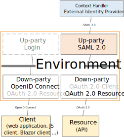
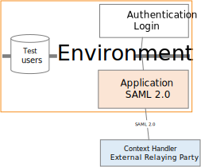
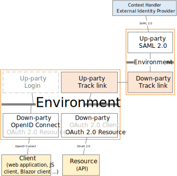
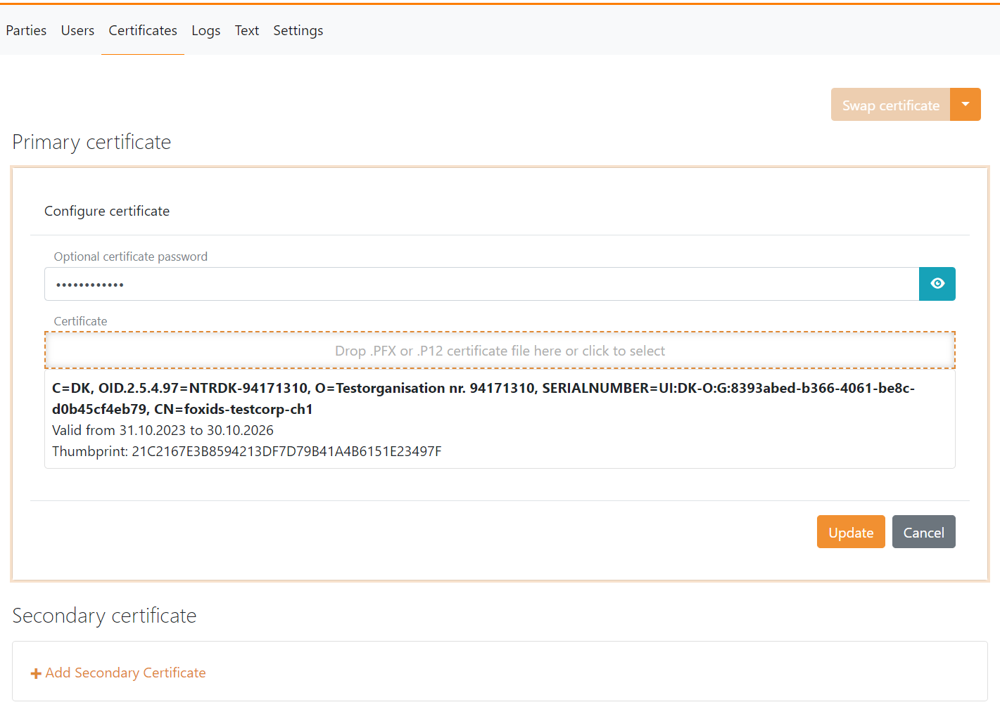
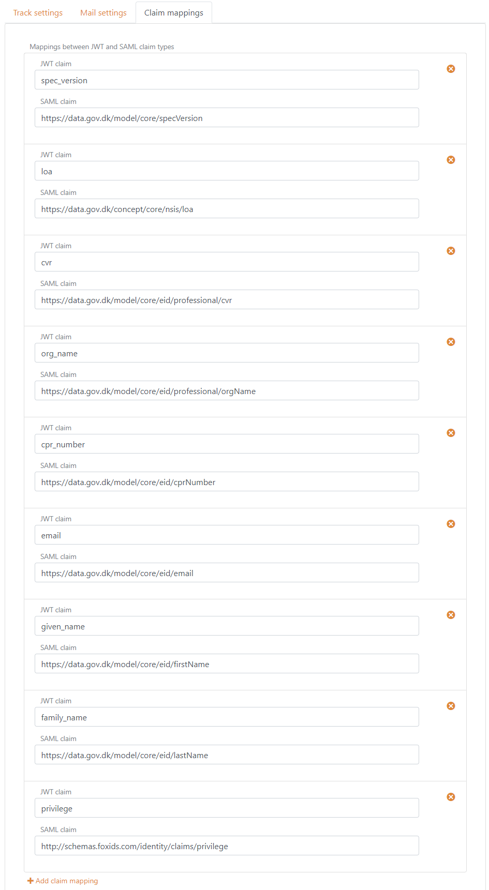
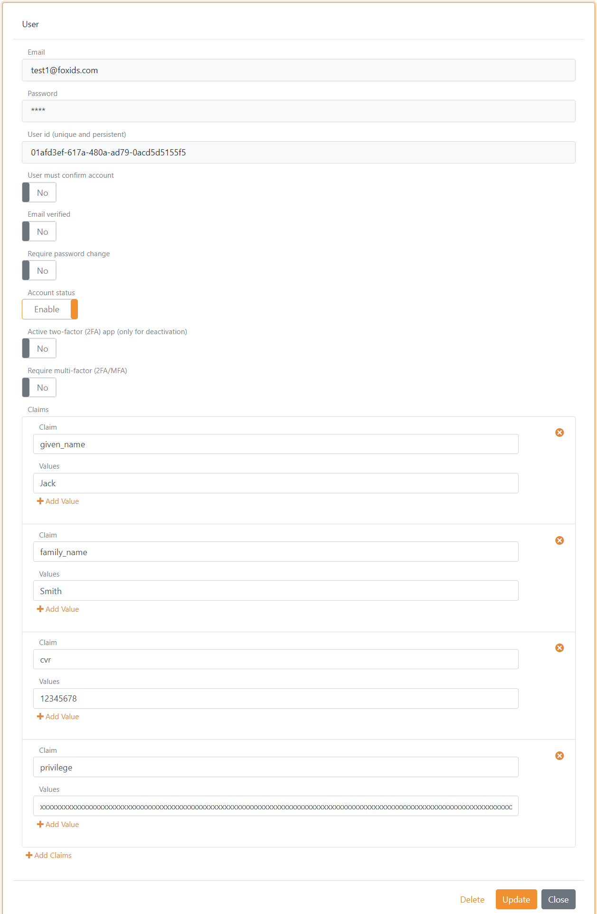

# Connect to Context Handler with SAML 2.0

Foxids can be connected to Context Handler / F&aelig;lleskommunal Adgangsstyring (Danish identity broker) with a [SAML 2.0 authentication method](up-party-saml-2.0.md). 
Context Handler is a Danish identity broker connecting the Danish municipalities in a common federation.

Context Handler is connected as a SAML 2.0 [Identity Provider (IdP)](#configuring-context-handler-as-identity-provider) based on OIOSAML 3 and OCES3 (RSASSA-PSS).  

By configuring an [SAML 2.0 authentication method](up-party-saml-2.0.md) and a [OpenID Connect application registration](app-reg-oidc.md) Foxids become a [bridge](bridge.md) between SAML 2.0 and OpenID Connect. 
Foxids will then handle the SAML 2.0 connection as a Relying Party (RP) / Service Provider (SP) and you only need to care about OpenID Connect in your application. If needed, you can possibly select multiple login option (authentication methods) from the same OpenID Connect application registration.

In the test environment, Foxids can be connected to Context Handler as a test Identity Provider with a [SAML 2.0 application registration](app-reg-saml-2.0.md) and authenticate test users. Context Handler is connected as a SAML 2.0 [test Relying Party (RP)](#configuring-context-handler-as-test-relying-party).

Context Handler can be configured based on either OIOSAML 2 or OIOSAML 3 with OCES3 (RSASSA-PSS) and Foxids furthermore support the required certificates and it is possible to support NSIS.

> You can test Context Handler login with the [online web app sample](https://aspnetcoreoidcallupsample.itfoxtec.com) ([sample docs](samples.md#aspnetcoreoidcauthcodealluppartiessample)) by clicking `Log in` and then `Danish Context Handler TEST` for the test environment (select `Foxids - test-corp` on the Context Handler log in page) or `Danish Context Handler` for production.  
> Take a look at the Context Handler sample configuration in Foxids Control: [https://control.foxids.com/test-corp](https://control.foxids.com/test-corp)  
> Get read access with the user `reader@foxids.com` and password `TestAccess!` then select the `context-handler`, `context-handler-test` or `context-handler-idp-test` track.  
> *The sample is configured with a separate tracks for the Context Handler SAML 2.0 integration.*

Context Handler documentation:
- Context Handler [guide](https://digitaliseringskataloget.dk/l%C3%B8sninger/adgangsstyring-brugere).
- [Context Handler administration portal](https://serviceplatformen.dk/administration/) 
- Context Handler [test application](https://spwithnsis.eksterntest-stoettesystemerne.dk)

> Transform the [DK privilege XML claim](claim-transform-dk-privilege.md) to a JSON claim.

## Separate track

Context Handler requires each connection in an environment (test or production) to use a unique OCES3 certificate.  
Therefore, consider connecting Context Handler in separate tracks where the OCES3 certificates can be configured without affecting any other configurations.

If you both configure a test and production environment, they should be placed in separate tracks. If you set up a [test Relying Party](#configuring-context-handler-as-test-relying-party), it should also be placed in a separate track and have a unique OCES3 certificate.

You can easily connect two tracks in the same tenant with a [track link](howto-tracklink-foxids.md).

## Certificate

Context Handler requires all requests (authn and logout) to be signed with real production OCES3 certificates in all environments. It is NOT possible to use a certificate issued by another certificate authority, a self-signed certificate or test OCES3 certificates.

A OCES3 certificate is valid for three years. After that, it must be updated manually.

> If the `.P12` file fails to load, you can convert it to a `.PFX` file with the [Foxids.ConvertCertificateTool](https://github.com/ITfoxtec/Foxids/tree/master/tools/Foxids.ConvertCertificateTool).

Add the `.P12` OCES3 certificate in [Foxids Control Client](control.md#foxids-control-client):
1. Select (or create) a [separate track](#separate-track) to be used for Context Handler as [Identity Provider](#configuring-context-handler-as-identity-provider) or [test Relying Party](#configuring-context-handler-as-test-relying-party)
2. Select the Certificates tab
3. Click the arrow down on the Swap certificate button and then in the Contained certificates section click Change container type
4. Then click on the primary certificate, then write the password and upload the `.P12` or `.PFX` OCES3 certificate 

It is subsequently possible to add a secondary certificate and to swap between the primary and secondary certificates.

## Configuring Context Handler as Identity Provider
This guide describe how to setup Context Handler as a SAML 2.0 Identity Provider and comply to OIOSAML3.

> You need to [configure the OCES3 certificate](#certificate) before following this guide.

**1 - Start by creating an SAML 2.0 authentication method in [Foxids Control Client](control.md#foxids-control-client)**

1. Select the Authentication methods tab
2. Click Create authentication method and then SAML 2.0
3. Add the name
4. Add the Context Handler IdP metadata in the Metadata URL field  
   Test metadata: `https://n2adgangsstyring.eksterntest-stoettesystemerne.dk/runtime/saml2/metadata.idp`  
   Production metadata: `https://n2adgangsstyring.stoettesystemerne.dk/runtime/saml2/metadata.idp` 
5. Click Create
6. Change Logout response binding to Redirect

7. Select Show advanced settings
8. Configure a custom SP issuer, the issuer can optionally start with `https://saml.` The issuer in this example is `https://saml.foxids.com/test-corp/context-handler-test/`
9. Set certificate validation mode to `Chain trust` (if the OCES3 certificate is global trusted) and revocation mode to `Online`
10. Select to add logout response location URL in metadata
11. Select to include the encryption certificate in metadata
12. Set the NameID format in metadata to `urn:oasis:names:tc:SAML:2.0:nameid-format:persistent`

13. Add an attribute consuming service in metadata and add the service name.
14. Add all the claims you want to receive as requested attributes with the format `urn:oasis:names:tc:SAML:2.0:attrname-format:uri`. Optionally set each attribute as required.

The following claims is most often used:

  - `https://data.gov.dk/model/core/specVersion`
  - `https://data.gov.dk/concept/core/nsis/loa`
  - `https://data.gov.dk/model/core/eid/professional/cvr`
  - `https://data.gov.dk/model/core/eid/professional/orgName`
  - `https://data.gov.dk/model/core/eid/cprNumber`
  - `https://data.gov.dk/model/core/eid/email`
  - `https://data.gov.dk/model/core/eid/firstName`
  - `https://data.gov.dk/model/core/eid/lastName`
  - `https://data.gov.dk/model/core/eid/privilegesIntermediate`

15. Add an administrative contact person
16. Click Update
17. Go to the top of the SAML 2.0 authentication method
18. Find the SAML 2.0 authentication method SP-metadata URL, in this case https://foxids.com/test-corp/context-handler-test/(cp-rp)/saml/spmetadata. 
19. The SP-metadata URL is used to configure a Context Handler user system (DK: brugervendt system).
 
**2 - Then go to the [Context Handler administration portal](https://serviceplatformen.dk/administration/)**

1. Select IT-systems (DK: IT-systemer) 
2. Click Add IT-system (DK: Tilslut it-system)
3. Fill out the fields and select User system (DK: Brugervendt system)
4. Go to the User system tab (DK: Brugervendt system)
5. Select Context Handler with NSIS and remove the selection of Context Handler (without NSIS)
6. Select OIOSAML3 as OIOSAML profile and NSIS level
7. Add the SAML 2.0 authentication method SP-metadata URL, in this case `https://foxids.com/test-corp/context-handler-test/(cp-rp)/saml/spmetadata`.
8. Fill out the rest, accept the terms and click Save (DK: Gem)

 **3 - Add privilege claim transformation in [Foxids Control Client](control.md#foxids-control-client)**

Foxids can transform the [DK privilege XML claim](claim-transform-dk-privilege.md) to a JSON claim. It is recommended to add the transformation in order to obtain smaller claims and tokens.
Furthermore, it makes the tokens readable.

1. Select the Claim transform tab
2. Click Add claim transform and click DK XML privilege to JSON
3. Click Add claim transform and click Match claim
4. As action select Remove claim, to remove the original privilege claim from the claims pipeline
5. In the Remove claim field add `https://data.gov.dk/model/core/eid/privilegesIntermediate` 
3. Click update

> Remember to add a claim mapping from SAML `http://schemas.foxids.com/identity/claims/privilege` to JWT `privilege` please see next section 4).

 **4 - Add SAML 2.0 claim to JWT claim mappings in [Foxids Control Client](control.md#foxids-control-client)**

 Foxids internally converts SAML 2.0 clams to JWT claims. Context Handler use a OIOSAML3 defined set of SAML 2.0 claims where corresponding JWT mappings need to be added in the track.

 1. Go to Settings tab and Claim mappings
 2. Add mappings for all the claims configured in step 1.14, you can create you own short JWT claim names if no standard name exists
 3. Click update

 

You are done. The SAML 2.0 authentication method can now be used as an authentication method for application registrations in the track.

> A application registration will only issue added claims.  
> Therefore, remember to add the JWT claims to OpenID Connect application registrations or use the `*` notation.

## Configuring Context Handler as test Relying Party

This guide describe how to setup Context Handler as a SAML 2.0 test Relying Party and comply to OIOSAML3.

> You need to use a [separate track](#separate-track) to have a place for the test users and to [configure the OCES3 certificate](#certificate) before following this guide.

**1 - Start by creating an SAML 2.0 application registration in [Foxids Control Client](control.md#foxids-control-client)**

1. Select the Applications tab
2. Click Create application registration and then SAML 2.0
3. Add the name
4. Click Add allow authentication method and click login, to let the user login with test users in the track
5. Download the Context Handler RP metadata where you can find endpoints and the certificate to trust.  
   Test metadata: `https://n2adgangsstyring.eksterntest-stoettesystemerne.dk/runtime/saml2auth/metadata.idp`  
   The certificate is base64 encoded and can be converted into a certificate .cer file with the [Foxids certificate tool](https://www.foxids.com/tools/Certificate). 
6. Add the issuer and endpoints from the metadata
7. Set the bindings to redirect with the exception of the Authn response binding which is set to post
8. Set the OIOSAML3 claims which should be issued to Context Handler

The following claims is most often used:

  - `https://data.gov.dk/model/core/specVersion`
  - `https://data.gov.dk/model/core/kombitSpecVer`
  - `https://data.gov.dk/concept/core/nsis/loa`
  - `https://data.gov.dk/model/core/eid/professional/cvr`
  - `https://data.gov.dk/model/core/eid/privilegesIntermediate`

9. Add the certificate from the metadata as a signature validation certificate
10. Click Create

11. Select Show advanced settings
12. Select Encrypt authn response
13. Add the certificate from the metadata as a optional encryption certificate

14. Set certificate validation mode to `Chain trust` (if the OCES3 certificate is global trusted) and revocation mode to `Online`
15. Set Authn response sign type to Sign assertion
16. Configure a custom IdP issuer, the issuer can optionally start with `https://saml.` The issuer in this example `https://saml.foxids.com/test-corp/context-handler-test-idp/`.
17. Select to add logout response location URL in metadata
18. Select to include the encryption certificate in metadata
19. Set the NameID format in metadata to `urn:oasis:names:tc:SAML:1.1:nameid-format:X509SubjectName`
20. Add an administrative contact person
20. Click Update
21. Go to the top of the SAML 2.0 application registration
22. Find the SAML 2.0 application registration IdP-metadata, in this case `https://localhost:44330/testcorp/test-contexthandler-idp/ch-idp(*)/saml/idpmetadata`. 
23. The IdP-metadata is used to configure the Context Handler identity provider.
 
**2 - Then go to the [Context Handler administration portal](https://serviceplatformen.dk/administration/)**

1. Select IT-systems (DK: IT-systemer) 
2. Click Add IT-system (DK: Tilslut it-system)
3. Fill out the fields and select Identity Provider
4. Go to the Identity Provider tab
5. Select Context Handler with NSIS and remove the selection of Context Handler (without NSIS)
6. Select OIOSAML3 as OIOSAML profile and NSIS level
7. Add the SAML 2.0 application registration IdP-metadata URL, in this case `https://localhost:44330/testcorp/test-contexthandler-idp/ch-idp(*)/saml/idpmetadata`.
8. Fill out the rest, accept the terms and click Save (DK: Gem)

> You are required to be registered as your own test authority (DK: egen test myndighed) in the test environment to add a federation agreement. 
> A federation agreement (DK: f&oslash;derationsaftaler) is required to enable the identity provider in Context Handler. 

 **3 - Add claim transformation in [Foxids Control Client](control.md#foxids-control-client)**

Create the claims which has to be issued to Context Handler in claim transforms.

1. Add the spec. ver. claims
2. Optionally add the levels of assurance (loa) claim or read it through the claims pipeline

3. Replace the NameID / NameIdentifier claim which a concatenated version of the CVR number, display name and unique user ID. Format string `C=DK,O={0},CN={1} {2},Serial={3}`

4. Click update

 **4 - Add SAML 2.0 claim to JWT claim mappings in [Foxids Control Client](control.md#foxids-control-client)**

 Foxids internally converts SAML 2.0 clams to JWT claims. Context Handler use a OIOSAML3 defined set of SAML 2.0 claims where corresponding JWT mappings need to be added in the track.

 1. Go to Settings tab and Claim mappings
 2. Add mappings for all the claims configured in step 1.8, you can create you own short JWT claim names if no standard name exists - please see step 4 in section [Configuring Context Handler as Identity Provider](#configuring-context-handler-as-identity-provider)
 3. Click update

**5 - Add test users in [Foxids Control Client](control.md#foxids-control-client)**

You can add test uses in the Foxids test track and add claims to each user.  
A claim with a CVR claim, given name, family name and optionally a base64 encoded DK privilege XML string.

If the user should have the Job function role (DK: Jobfunktionsrolle) `http://foxids.com/roles/jobrole/test-corp-admin_access/1` the DK privilege XML would be:

    <?xml version="1.0" encoding="UTF-8"?>
    <bpp:PrivilegeList xmlns:bpp="http://digst.dk/oiosaml/basic_privilege_profile" xmlns:xsi="http://www.w3.org/2001/XMLSchema-instance" >
        <PrivilegeGroup Scope="urn:dk:gov:saml:cvrNumberIdentifier:11111111">
            <Privilege>http://foxids.com/roles/jobrole/test-corp-admin_access/1</Privilege>
        </PrivilegeGroup>
    </bpp:PrivilegeList>