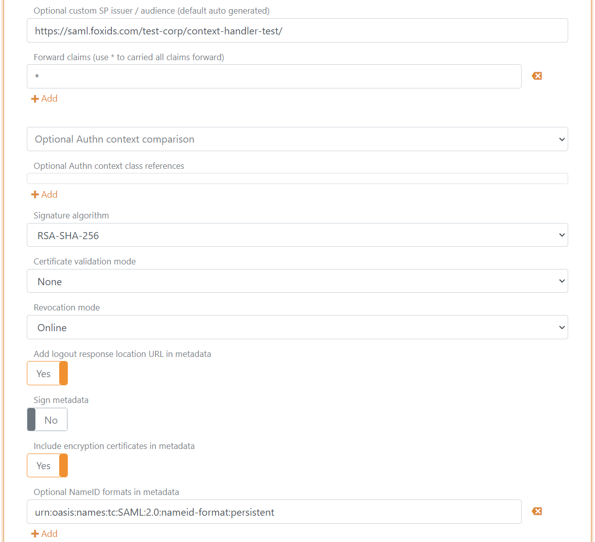

# Connect to Context Handler with SAML 2.0
**Both up-party and down-party**

FoxIDs can be connected to Context Handler (Danish IdP) with a [SAML 2.0 up-party](up-party-saml-2.0.md) and [SAML 2.0 down-party](down-party-saml-2.0.md). 
Where Context Handler is either a SAML 2.0 [Identity Provider (IdP)](#configuring-context-handler-as-identity-provider-idp) or [Relying Party (RP)](#configuring-context-handler-as-relying-party-rp) and FoxIDs is acting as an SAML 2.0 Relying Party or Identity Provider.

Context Handler is a Danish Identity Provider (IdP) connecting the Danish municipalities in a common federation. Context Handler can be configured based on either OIOSAML 2 or OIOSAML 3. FoxIDs support both OIOSAML 2 / OIOSAML 3, issuer naming, required certificates and it is possible to support NSIS.

> Transforms the [DK privilege XML claim](claim-transform-dk-privilege.md) to a JSON claim.

Context Handler documentation and configuration:
- The [Context Handler get started](https://digitaliseringskataloget.dk/l%C3%B8sninger/adgangsstyring-brugere).
- The [Context Handler administration portal](https://serviceplatformen.dk/administration/) 
- The Context Handler [test application with NSIS](https://spwithnsis.eksterntest-stoettesystemerne.dk ) and [test application with out NSIS](https://spwithoutnsis.eksterntest-stoettesystemerne.dk)
- The [current/old Context Handler test application](https://demo-brugervendtsystem.kombit.dk/test) 

## Consider separate track

Context Handler requires the Relying Party (RP) and Identity Provider (IdP) to use different OSES certificates. Therefore, consider connecting Context Handler in separate tracks where the OCES certificates can be configured without affecting any other configurations.

Two FoxIDs tracks can be connected with OpenID Connect. Please see the [connect FoxIDs with OpenID Connect](howto-oidc-foxids.md) guide. The track with a up-party connected to Context Handler is called the parallel FoxIDs track in the guide.

## Certificate

Context Handler requires all requests (authn and logout) to be signed with OCES (FOCES/VOCES) certificates. It is not possible to use a certificate issued by another certificate authority, a self-signed certificate or a certificate issued by FoxIDs.

An OCES certificate is valid for three years. After that, it must be updated manually.

Add the `.P12` OCES certificate in [FoxIDs Control Client](control.md#foxids-control-client):
1. Select (or create) the track to be used for Context Handler as Relying Party (RP) or Identity Provider (IdP)
2. Select the Certificates tab
3. Click the arrow down on the Swap certificate button and then in the Contained certificates section click Change container type
4. Then click on the primary certificate, then write the password and upload the `.P12` OCES certificate 

It is subsequently possible to add a secondary certificate and to swap between the primary and secondary certificates.

## Configuring Context Handler as Identity Provider (IdP)

*FoxIDs up-party is a SAML 2.0 Relying Party (RP) and trust Context Handler as an Identity Provider (IdP).*

> You need to [configure the OCES certificate](#certificate) before following this configuration.

**1 - Start by creating an SAML 2.0 up-party in [FoxIDs Control Client](control.md#foxids-control-client)**

1. Select the Parties tab and then the Up-parties
2. Click Create up-party and then SMAL 2.0
3. Add the name
4. Add the Context Handler IdP metadata in the Metadata URL field
5. Click Create
6. Change Logout response binding to Redirect

> Currently Context Handler has an error where it does logout with a post binding. Therefore, after successfully configuration you need to change the Logout response binding back to post in order to make logout work.

7. Select show advanced settings
8. Configure a custom SP issuer, the issuer is required to start with `https://saml.` The issuer in this example `https://saml.localdev.foxids.com/test-corp/contexthandler-test/`
9. In production only! Set certificate validation mode to `Chain trust` and revocation mode to `Online`
10. Select to add logout response location URL in metadata
11. Select to include the encryption certificate in metadata
12. Set the NameID format in metadata to `urn:oasis:names:tc:SAML:2.0:nameid-format:persistent`

13. Add an attribute consuming service in metadata and add the service name.
14. Add all the claims you want to receive as requested attributes with the format `urn:oasis:names:tc:SAML:2.0:attrname-format:uri`. Optionally set each attribute as required.

The following claims is most often used:

  - Current/old Context Handler
     - `dk:gov:saml:attribute:AssuranceLevel`
     - `dk:gov:saml:attribute:CvrNumberIdentifier`
     - (FamilyName) `urn:oid:2.5.4.4`
     - `dk:gov:saml:attribute:Privileges_intermediate`

  - New NSIS Context Handler
     - `https://data.gov.dk/concept/core/nsis/loa`
     - `https://data.gov.dk/model/core/eid/professional/cvr`
     - `https://data.gov.dk/model/core/eid/email`
     - `https://data.gov.dk/model/core/eid/firstName`
     - `https://data.gov.dk/model/core/eid/lastName`
     - `https://data.gov.dk/model/core/eid/privilegesIntermediate`

15. Add at least one technical contact person
16. Click Update
17. Go to the top of the SAML 2.0 up-party
18. Find the SAML 2.0 up-party SP-metadata, in this case `https://localhost:44330/testcorp/test-contexthandler-rp/(ch-rp)/saml/spmetadata`. 
19. The SP-metadata is used to configure the Context Handler user system (DK: brugervendt system).
 
**2 - Then go to the [Context Handler administration portal](https://serviceplatformen.dk/administration/)**

1. Select IT-systems (DK: IT-systemer) 
2. Click Add IT-system (DK: Tilslut it-system)
3. Fill out the fields and select User system (DK: Brugervendt system)
4. Add the SAML 2.0 up-party SP-metadata in the user system (DK: Brugervendt system) tab.
5. Fill out the rest and click Save (DK: Gem)

 **3 - Add privilege claim transformation in [FoxIDs Control Client](control.md#foxids-control-client)**

FoxIDs can transforms the [DK privilege XML claim](claim-transform-dk-privilege.md) to a JSON claim. It is recommended to add the transformation in order to obtain smaller claims and tokens.
Furthermore, it makes the tokens readable.

1. Set the privilege claim `dk:gov:saml:attribute:Privileges_intermediate` or `https://data.gov.dk/model/core/eid/privilegesIntermediate` depending of the Context Handler version. 
2. Remove the original privilege claim from the claims pipeline.
3. Click update

 **4 - Add SAML 2.0 claim to JWT claim mappings in [FoxIDs Control Client](control.md#foxids-control-client)**

 FoxIDs internally converts SAML 2.0 clams to JWT claims. Context Handler use a OIOSAML 2 or OIOSAML 3 defined set of SAML 2.0 claims where corresponding JWT mappings need to be added.

 1. Go to Settings tab and Claim mappings
 2. Add mappings for all the claims configured in step 1.14, you can create you own short JWT claim names if no standard name exists
 3. Click update

You are done. The SAML 2.0 up-party can now be used as an up-party for down-parties in the track.

> A down-party will only issue added claims.  
> Therefore, remember to add the JWT claims to OpenID Connect down-parties or use the `*` notation.

## Configuring Context Handler as Relying Party (RP)

*FoxIDs down-party is a SAML 2.0 Identity Provider (IdP) and trusted by Context Handler acting as an Relying Party (RP).*

> You need to [configure the OCES certificate](#certificate) before following this configuration.

**1 - Start by creating an SAML 2.0 down-party in [FoxIDs Control Client](control.md#foxids-control-client)**

1. Select the Parties tab and then the Down-parties
2. Click Create down-party and then SMAL 2.0
3. Add the name
4. Select where the user should be allowed to login in Allow up-party names

> Download the Context Handler RP metadata where you can find endpoints and the certificate to trust. The certificate is base64 and can be converted into a certificate .cer file with [FoxIDs certificate tool](https://www.foxids.com/tools/Certificate). 

5. Add the endpoints
6. Set the bindings to redirect with the exception of the Authn response binding which is set to post
7. Set the claims which should be issued to Context Handler (`NameId` / `http://schemas.xmlsoap.org/ws/2005/05/identity/claims/nameidentifier` is default issued)

The following claims is most often used:

  - Current/old Context Handler
     - `dk:gov:saml:attribute:SpecVer`
     - `dk:gov:saml:attribute:KombitSpecVer`
     - `dk:gov:saml:attribute:AssuranceLevel`
     - `dk:gov:saml:attribute:CvrNumberIdentifier`
     - `dk:gov:saml:attribute:Privileges_intermediate`

  - New NSIS Context Handler
     - `https://data.gov.dk/model/core/specVer`
     - `https://data.gov.dk/model/core/kombitSpecVer`
     - `https://data.gov.dk/concept/core/nsis/loa`
     - `https://data.gov.dk/model/core/eid/professional/cvr`
     - `https://data.gov.dk/model/core/eid/privilegesIntermediate`

8. Add the Context Handler RP certificate as a signature validation certificate
9. Click Create

10. Select show advanced settings
11. In production only! Set certificate validation mode to `Chain trust` and revocation mode to `Online`
12. Configure a custom IdP issuer, the issuer is required to start with `https://saml.` The issuer in this example `https://saml.localdev-ipd.foxids.com/test-corp/test-contexthandler-idp/`.
13. Select to add logout response location URL in metadata
14. Select to include the encryption certificate in metadata
15. Set the NameID format in metadata to `urn:oasis:names:tc:SAML:1.1:nameid-format:X509SubjectName`
16. Click Update
17. Go to the top of the SAML 2.0 down-party
18. Find the SAML 2.0 down-party IdP-metadata, in this case `https://localhost:44330/testcorp/test-contexthandler-idp/ch-idp(*)/saml/idpmetadata`. 
19. The IdP-metadata is used to configure the Context Handler identity provider.
 
**2 - Then go to the [Context Handler administration portal](https://serviceplatformen.dk/administration/)**

1. Select IT-systems (DK: IT-systemer) 
2. Click Add IT-system (DK: Tilslut it-system)
3. Fill out the fields and select Identity Provider
4. Add the SAML 2.0 down-party IdP-metadata in the Identity Provider tab.
5. Fill out the rest and click Save (DK: Gem)

> Additionally, a federation agreement (DK: f&oslash;derationsaftaler) is required to enable the identity provider in Context Handler.

 **3 - Add claim transformation in [FoxIDs Control Client](control.md#foxids-control-client)**

Create the claims which has to be issued to Context Handler in claim transforms.

1. Add the spec. ver. claims
2. Optionally add the assurance level claim or read it through the claims pipeline

3. Replace the NameID / NameIdentifier claim which a concatenated version of the CVR number, display name and unique user ID. Format string `C=DK,O={0},CN={1} {2},Serial={3}`

4. Click update

 **4 - Add SAML 2.0 claim to JWT claim mappings in [FoxIDs Control Client](control.md#foxids-control-client)**

 FoxIDs internally converts SAML 2.0 clams to JWT claims. Context Handler use a OIOSAML 2 or OIOSAML 3 defined set of SAML 2.0 claims where corresponding JWT mappings need to be added.

 1. Go to Settings tab and Claim mappings
 2. Add mappings for all the claims configured in step 1.7, you can create you own short JWT claim names if no standard name exists
 3. Click update

**5 - Optionally add users in [FoxIDs Control Client](control.md#foxids-control-client)**

You can add uses in the FoxIDs track and add claims to each user.

E.g. a claim with a CVR claim, given name, family name and a base64 encoded [DK privilege XML](claim-transform-dk-privilege.md) string.
