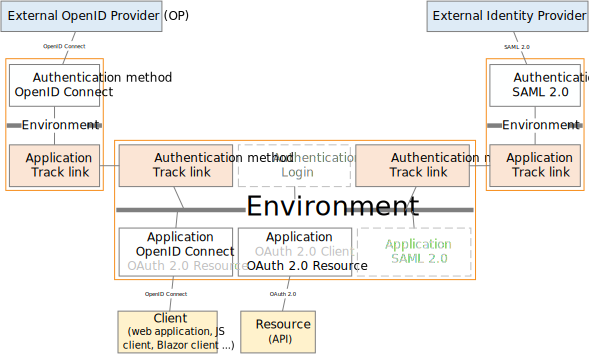

# Interconnect two Foxids tracks with a track link

Foxids tracks in the same tenant can be connected with track links. A track link acts mostly like OpenID Connect but it is simpler to configure and the steps it goes through is faster. 

Track links is fast and secure but can only be used in the same tenant. A link based on [OpenID connect connection](howto-oidc-foxids.md) is required if you need to jump between tracks located in different tenants.

> Take a look at the sample track links configuration in Foxids Control: [https://control.foxids.com/test-corp](https://control.foxids.com/test-corp)  
> Get read access with the user `reader@foxids.com` and password `TestAccess!` then e.g., take a look at the `nemlogin` and `- (dash is production)` tracks.

Track links support login, RP-initiated logout and front-channel logout. Furthermore, it is possible to configure [claim and claim transforms](claim.md), logout session and home realm discovery (HRD) like all other connecting authentication methods and application registrations.

## Configure integration

The following describes how to connect two tracks called `track_x` and `track_y` where `track_y` become an authentication method on `track_x`.

**1 - Start in the `track_x` track by creating a track link in [Foxids Control Client](control.md#foxids-control-client)**

1. Select the Parties Authentication methods tab
2. Click Create authentication method and then Track link
3. Add the name e.g., `track_y-connection` 
4. Add the `track_y` track name
5. Add the application registration name in the `track_y` track e.g., `track_x-connection` 
6. Click Create

**2 - Then go to the `track_y` track and create a track link in [Foxids Control Client](control.md#foxids-control-client)**

1. Select the Applications tab
2. Click Create application registration and then Track link
3. Add the name e.g., `track_x-connection` 
4. Add the `track_x` track name
5. Add the authentication method name in the `track_x` track e.g., `track_y-connection` 
6. Select which authentication methods in the `track_y` track the user is allowed to use for authentication
6. Click Create

That's it, you are done. 

> Your new authentication method `track_y-connection` can now be selected as an allowed authentication method in the application registrations in you `track_x` track.  
> The application registrations in you `track_x` track can read the claims from your `track_y-connection` authentication method. 