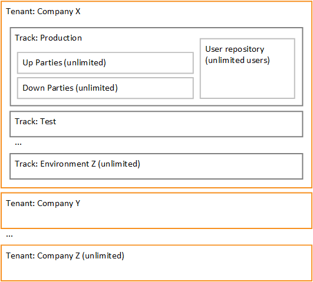

**FoxIDs is an open source identity service supporting login, OAuth 2.0, OpenID Connect 1.0, SAML 2.0 and convention between the standards.**

> STATUS: I'm currently working on the documentation and the first FoxIDs beta version.

FoxIDs consist of two services:

- Identity service called FoxIDs handling user login and all other security traffic.
- Client and API called FoxIDs Control. The FoxIDs Control Client is used to configure FoxIDs, or alternatively by calling the FoxIDs Control API directly.

FoxIDs is a cloud service ready to be [deployed in you Azure tenant](deployment.md). In the future, it will also be possible to use FoxIDs on [https://FoxIDs.com](https://foxids.com) for at small transaction fee.

> FoxIDs is .NET Core 3.1 and the FoxIDs Control Client is Blazor .NET Standard 2.1.

## Free and Open Source

FoxIDs is free and the open source GitHub repository is [https://github.com/ITfoxtec/FoxIDs](https://github.com/ITfoxtec/FoxIDs).  
The [license](https://github.com/ITfoxtec/FoxIDs/blob/master/LICENSE) grant all (individuals, companies etc.) the right to use FoxIDs for free. The license restricts reselling FoxIDs e.g. as a cloud service to third parties, without a supplementary agreement.

## Support

Please ask your question on [Stack Overflow](https://stackoverflow.com) and email a link to <a href="mailto:support@itfoxtec.com?subject=FoxIDs">support@itfoxtec.com</a> for me to answer.

## How FoxIDs works

FoxIDs is a multi-tenant system designed to be deployed in the Azure cloud. FoxIDs support being deployed as a service used by many companies, organizations etc. each with its one tenant. Or to be deployed in a company's Azure subscription where only one tenant is configured in FoxIDs holding company's entire security service.

**FoxIDs structure**

- **Tenant** contain the company, organization, individual etc. security service. A tenant contains the tracks.
- **Track** is a production, QA, test etc. environment. Each track contains a user repository and a track contains the up parties and down parties.
- **Up Party** is a upwards trust / federation or login configuration. Currently support: login (one view with both username and password) and SAML 2.0. Future support: OpenID Connect and two step login (two views separating the username and password input). 
- **Down party** is a downward application configuration. Currently support: OpenID Connect (secret or PKCE), OAuth 2.0 API and SAML 2.0.

FoxIDs support unlimited tenants. Unlimited tracks in a tenant. Unlimited users, up parties and down parties in a track.

