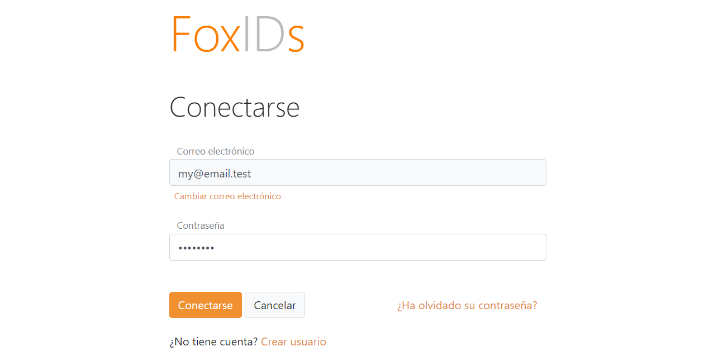
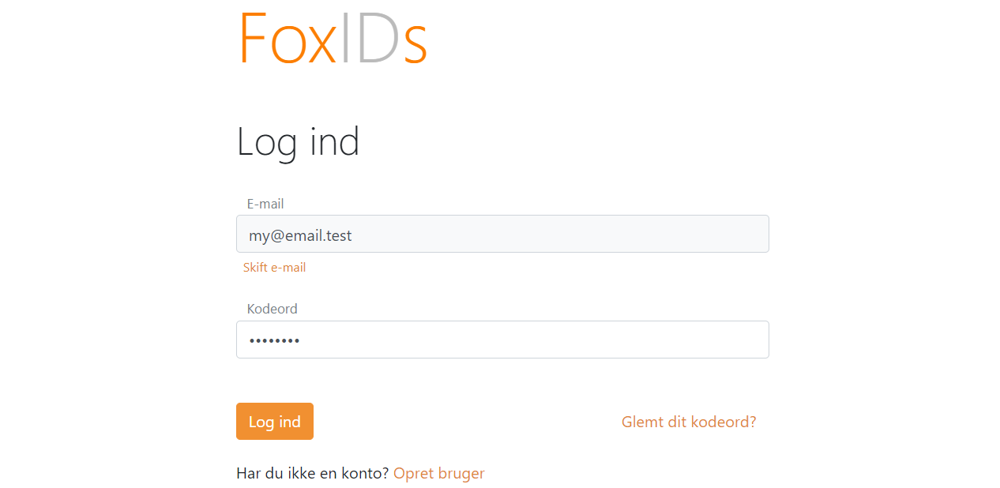
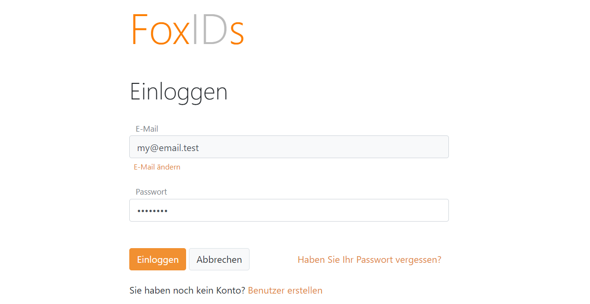
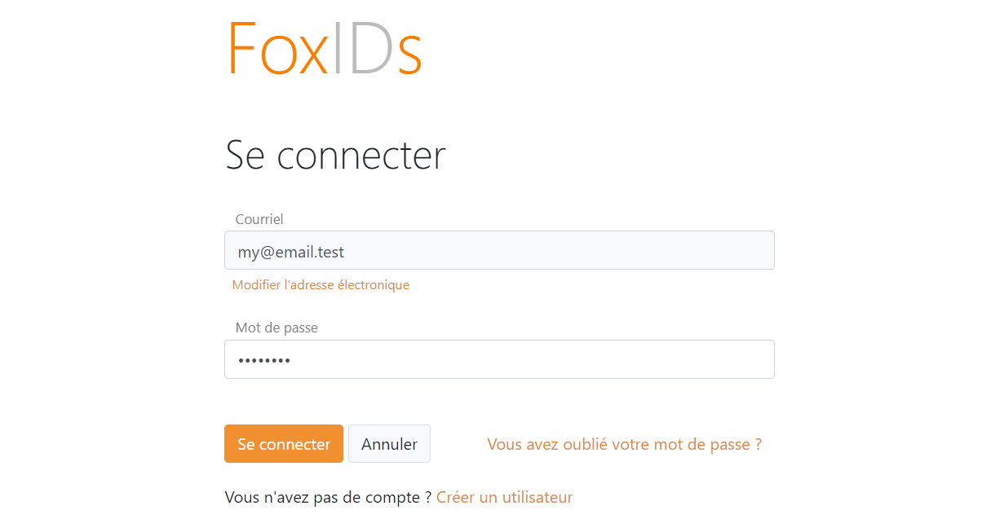
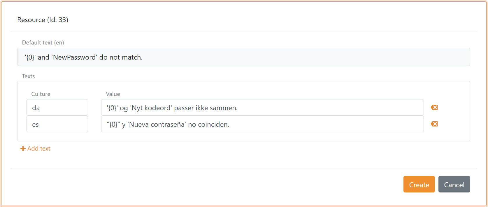

# Languages
Foxids has multi-language support with support for the following languages:

- Bulgarian (bg)
- Catalan (ca)
- Croatian (hr)
- Czech (cs)
- Danish (da)
- Dutch (nl)
- English (en)
- Estonian (et)
- Finnish (fi)
- French (fr)
- German (de)
- Greek (el)
- Icelandic (is)
- Italian (it)
- Latvian (lv)
- Lithuanian (lt)
- Norwegian (nb)
- Polish (pl)
- Portuguese (pt)
- Romanian (ro)
- Slovak (sk)
- Slovenian (sl)
- Spanish (es)
- Swedish (sv)
- Turkish (tr)
- Ukrainian (uk)

A language can be selected with the `ui_locales` parameter in a OpenID Connect request. The language is otherwise selected based on the culture send by the browser. English is the default language if the requested language is not supported.  
The Foxids Control Client administrative site only supports English.

The text translations are located in the embedded resource file ([EmbeddedResource.json](https://github.com/ITfoxtec/Foxids/blob/master/src/Foxids.Shared/Models/Master/Resources/EmbeddedResource.json)).

**Language examples**

Spanish

----

Danish

----

German

----

French

## Contributions

Text translations added to the [EmbeddedResource.json](https://github.com/ITfoxtec/Foxids/blob/master/src/Foxids.Shared/Models/Master/Resources/EmbeddedResource.json) file will become generally available. 
Please contribute if you see an error, the text can be improved or you are lacking a language.

> Text translation contributions are greatly appreciated.

It is possible to contribute either by creating a pull request in the Foxids [GitHub repository](https://github.com/ITfoxtec/Foxids) or by sending an updated [EmbeddedResource.json](https://github.com/ITfoxtec/Foxids/blob/master/src/Foxids.Shared/Models/Master/Resources/EmbeddedResource.json) file to [support@itfoxtec.com](mailto:support@itfoxtec.com?subject=Foxids-embedded-resource).

## Translation in track

It is possible to add track specific translations for each text element in multiple languages in [Foxids Control Client](control.md#foxids-control-client).

> If you want to change a text and thereby not using the default text. It can be archived by adding a new text for each supported language. It is also possible to add new HTML tags in the text and set the related CSS.

Add translation to a track:

1. Open the track
2. Select the Texts tab
3. Select a text element
4. Specify language and add the text
5. Click Add text to add a translation in another language
6. Click Create

This is an example of a text element translated into two languages; Danish (da) and Spanish (es).

