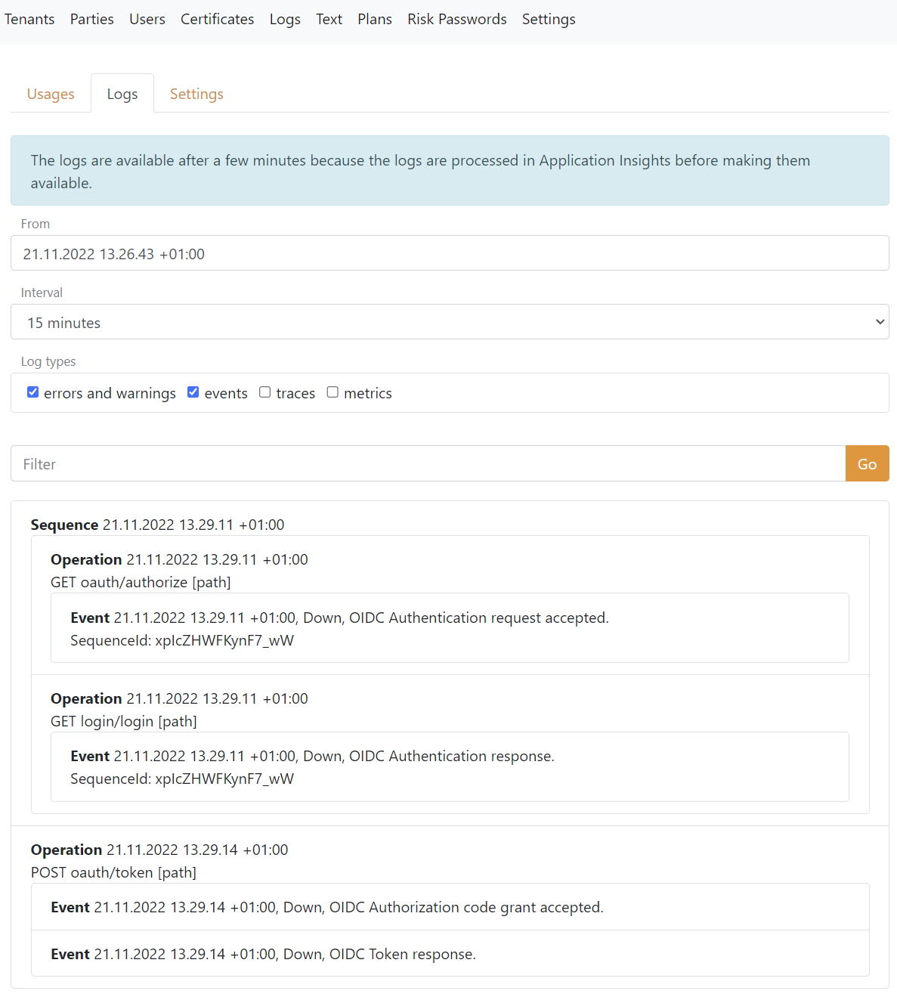
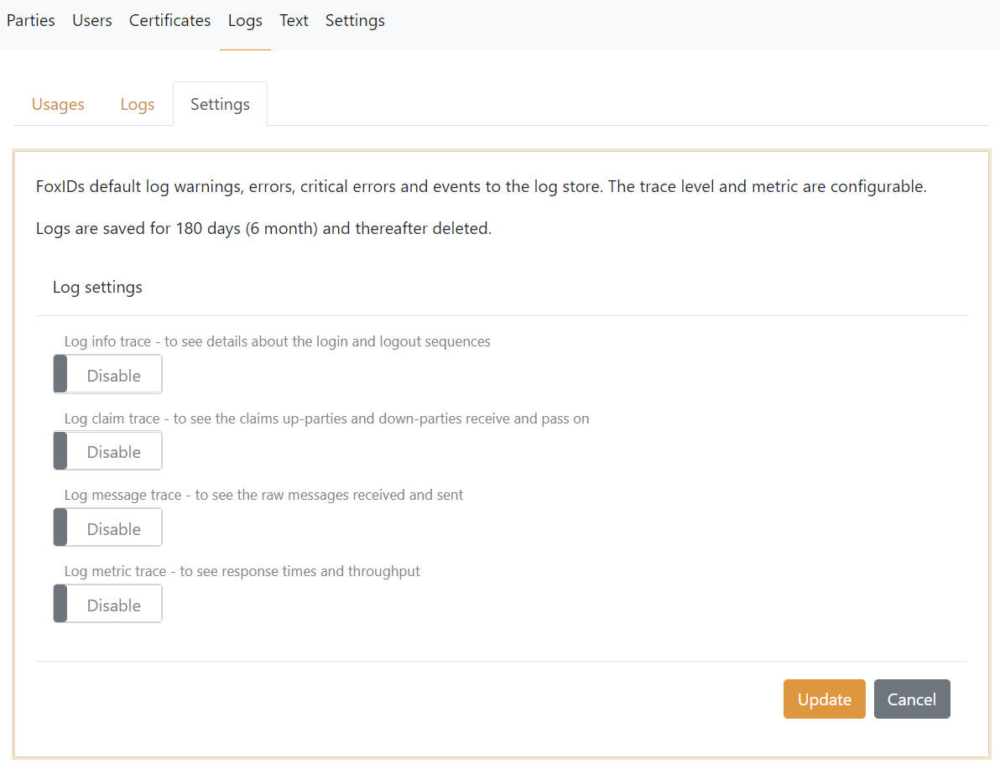

# Logging

FoxIDs default log errors and events including the time and the client IP address. The logs are sent to the Application Insights which is part of the FoxIDs cloud instance.

Logs can be searched in [FoxIDs Control Client and API](control.md).

## Log settings

The log level can be configured per FoxIDs track:

 - Enable `Log info trace` - to see details about the login and logout sequences
 - Enable `Log claim trace` - to see the claims up-parties and down-parties receive and pass on
 - Enable `Log message trace` - to see the raw messages received and sent
 - Enable `Log metric trace` - to see response times and throughput

## Log stream

It can be configured which logs should be logged to an external repository with a log stream.

Add external Application Insights with a log stream and select which logs should be sent.

