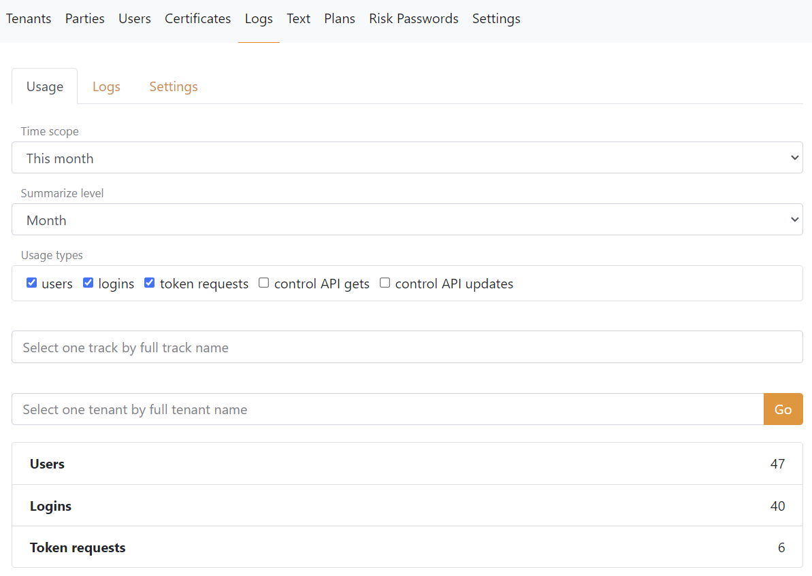

# Logging

FoxIDs default log errors and events including the time and the client IP address. 

The two supported log options `Settings__Options:Log` is:

- `Stdout` which logs to the console output. This log options are used for small Docker / Kubernetes (k8s) deployment.
- `OpenSearchAndStdoutErrors` which logs to OpenSearch and send errors logs to the console output. The OpenSearch logs can subsequently be view in FoxIDs Control. This log options are used for Kubernetes (k8s) deployment.
- `ApplicationInsights` which sends logs to Azure Application Insights and the logs can subsequently be view in FoxIDs Control. This log options are used for Azure deployment.

The [log settings](#log-settings) and [log stream](#log-stream) are available for both log options.

## Logs in FoxIDs Control

The logs can be viewed in FoxIDs Control if you use the log option `OpenSearchAndStdoutErrors` or `ApplicationInsights`.

### Usage

FoxIDs usage can be searched in [FoxIDs Control Client and API](control.md).  

- If you look at the usage in a particular environment, the usage of that selected environment is shown.  
- If you instead look at the usage in the `master` environment it will show the usage for the entire tenant, which can be limited to a particular environment. 
- Likewise, the `master` tenant `master` environment shows usage for the entire cloud installation of FoxIDs, which can be limited to a particular tenant and environment.

This screen dump shows the usage view in a environment.

### Logs

Logs can be searched in [FoxIDs Control Client and API](control.md).

## Log settings

The log level can be configured per FoxIDs environment:

 - Enable `Log info trace` - to see details about the login and logout sequences
 - Enable `Log claim trace` - to see the claims authentication methods and application registrations receive and pass on
 - Enable `Log message trace` - to see the raw messages received and sent
 - Enable `Log metric trace` - to see response times and throughput

## Log stream

It can be configured which logs should be logged to an external repository with a log stream.

Add external Azure Application Insights with a log stream and select which logs should be sent.

