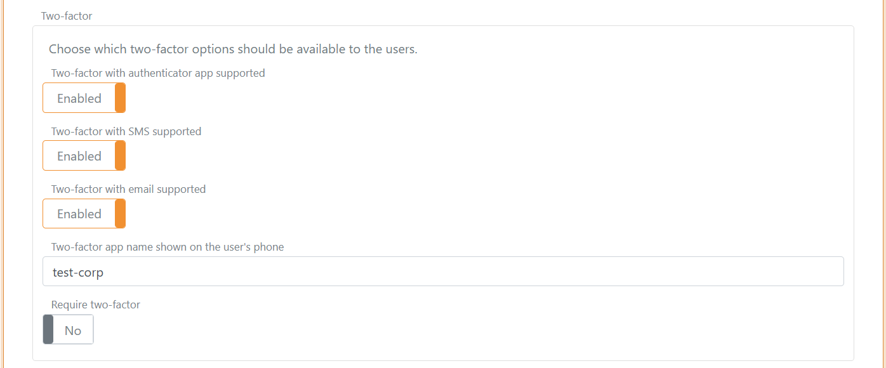

# Login and 2FA / MFA
FoxIDs handle user login in the up-party login user interface (UI). There can be configured a number of up-party logins per track with different configurations and look and feel.

A track contains one [user repository](users.md#user-repository) and all up-party login's configured in a track authenticate users with the same user repository.

When a user authenticates the user's session is connected to the particular up-party login. Therefore, a user can authenticate in multiple configured up-party login's and have multiple separate user sessions.  
A user session is only established in the up-party login if the session lifetime is set to more than 0 seconds.

A [down-party OpenID Connect](down-party-oauth-2.0-oidc.md) or [down-party SAML 2.0](down-party-saml-2.0.md) can authenticate users by selecting an up-party login.

The up-party login user interface authenticates users in a one-step user interface with the username and password on the same page. In the future, a two-step login interface will be added hawing the username and password input on two separate pages.

## Two-factor authentication (2FA/MFA)
Two-factor authentication with an authenticator app is per default enabled and is initiated if required.  
Two-factor authentication can be set as a requirement in each up-party login or required by the calling [OpenID Connect](down-party-oidc.md#require-two-factor-authentication) or [SAML 2.0](down-party-saml-2.0.md#require-two-factor-authentication) down-party.  

You can use a two-factor authenticator app of your choice like [Anthy](https://authy.com/), [Google Authenticator](https://support.google.com/accounts/answer/1066447), [Microsoft Authenticator](https://www.microsoft.com/en-us/security/mobile-authenticator-app) and others.

## Configuration
A default up-party login is created in each track. 

> The default login can be changed or deleted but be careful as you may lose access.

### Configure login options
It can be configured whether users should be allowed to cancel login and whether users are allowed to create a new user online through the login user interface. New users can alternatively be created by the administrator through [FoxIDs Control Client](control.md#foxids-control-client) or be provisioned through [FoxIDs Control API](control.md#foxids-control-api).

### Configure two-factor authentication
The Two-factor authenticator app name shown for the user's is per default set to the tenant's name. You most likely want to change the name to something more human readable.

You can select to require two-factor authentication for all users authenticating using the up-party login. 

### Configure user session
The user sessions lifetime can be changed. The default lifetime is 10 hours. 
The user session is a sliding session, where the lifetime is extended every time, an application makes a login request until the absolute session lifetime is reached.  
It is possible to configure an absolute session lifetime in the advanced settings.

The user session can be changed to a persistent session which is preserved when the browser is closed and reopened.  
The user session become a persistent session if either the persistent session lifetime is configured to be grater, then 0. Or the persistent session lifetime unlimited setting is set to on.

> Click `show advanced settings` to see all session settings.

### Configure customization
The up-party login interface can be [customized with custom title, icon and CSS](title-icon-css).

### Configure claims
You can change the claims the up-party login pass on with [claim transforms](claim-transform.md).

### All login configurations
All login configurations are available after clicking show advanced settings.

