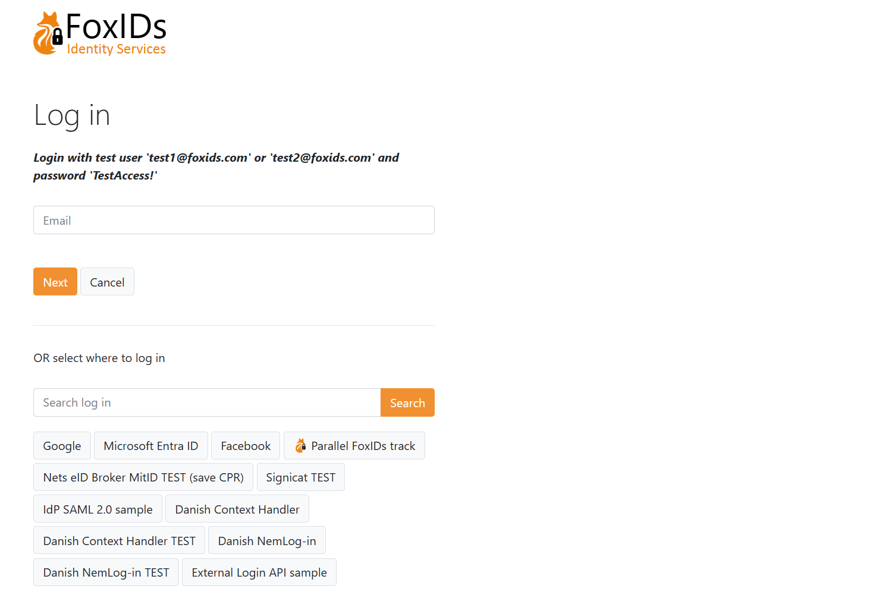
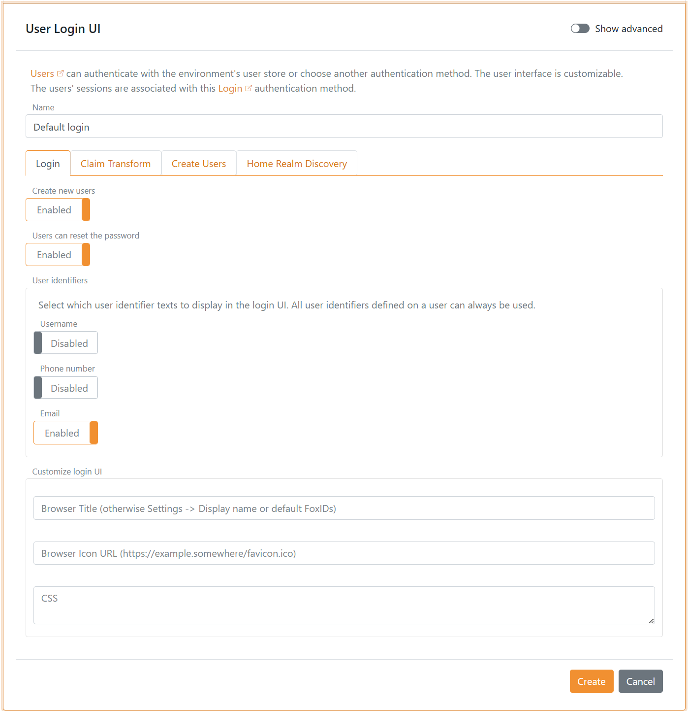

# Login, Home Realm Discovery (HRD) and 2FA / MFA
Foxids handle user login in the login authentication method user interface (UI). There can be configured a number of login authentication methods per environment with different configurations and look and feel.

A environment contains one [user repository](users.md#user-repository) and all login authentication methods configured in a environment authenticate users with the same user repository.

When a user authenticates the user's session is connected to the particular login authentication method. Therefore, a user can authenticate in multiple configured login authentication methods and have multiple separate user sessions.  
A user session is only established in the login authentication method if the session lifetime is set to more than 0 seconds.

A [OpenID Connect application registration](app-reg-oidc.md) or [SAML 2.0 application registration](app-reg-saml-2.0.md) can authenticate users by selecting an login authentication method.

The login authentication method user interface authenticates users in a two-step login interface with the username and password input on two separate pages.

## Home Realm Discovery (HRD)
When you create a application registration it is in most cases the best solution to use a star `(*)` in round brackets to select the authentication methods. 
If a application registration is configured to only be allowed to use one authentication method the user is immediately redirected to that particular authentication method. 
If more than one authentication method is allowed the user is redirected to a login authentication method which make it possible to select an authentication method either by writing an e-mail (looking at the domain) or by clicking a HRD button.

It is possible to select up to 4 authentication methods by name or use the star notation, please see more about [selection](index.md#selection-by-url).

It is configurable for each authentication method which domains should result in selecting the authentication method and if a HRD button should be shown optionally with a logo. 
A HRD button is shown for the authentication method if not at least one domain or wildcard is configured. 

An example of how a login screen with HRD looks like, it can be [customized](title-icon-css.md).

The [title, icon and CSS](title-icon-css.md) configured on the first allowed login authentication method on the application registration is used. Without an allowed login authentication method configured the title, icon and CSS from the default login authentication method is used.

## Two-factor authentication (2FA/MFA)
A login authentication method support multi-factor authentication (MFA) by supporting two-factor authentication (2FA) with an authenticator app.

Two-factor authentication with an authenticator app is per default enabled and is initiated if required.  
Two-factor authentication can be set as a requirement in each [login authentication method](login.md#configure-two-factor-authentication-2fa), per [user](users.md#configure-multi-factor-authentication-mfa) or required by the calling [OpenID Connect](app-reg-oidc.md#require-multi-factor-authentication-mfa) or [SAML 2.0](app-reg-saml-2.0.md#require-multi-factor-authentication-mfa) application registration.  

You can use a two-factor authenticator app of your choice like [Anthy](https://authy.com/), [Google Authenticator](https://support.google.com/accounts/answer/1066447), [Microsoft Authenticator](https://www.microsoft.com/en-us/security/mobile-authenticator-app) and others.

## Login configuration
A default login authentication method is created in each environment. 

> The default login with the name `login` can be changed but not deleted, be careful as you may lose access.

The [title, icon and CSS](title-icon-css.md) configured on the default login authentication method is use in the case where no login authentication method is selected e.g., on the error page or during [HRD](#home-realm-discovery-hrd) selection without a login authentication method.

### Configure login options
It can be configured whether users should be allowed to cancel login and whether users are allowed to create a new user online through the login user interface. New users can alternatively be created by the administrator through [Foxids Control Client](control.md#foxids-control-client) or be provisioned through [Foxids Control API](control.md#foxids-control-api).

### Configure two-factor authentication (2FA)
The two-factor authenticator app name shown for the user's is per default set to the tenant's name. You most likely want to change the name to something more human readable.

You can select to require two-factor authentication for all users authenticating using the login authentication method. 

### Configure user session
The user sessions lifetime can be changed. The default lifetime is 10 hours. 
The user session is a sliding session, where the lifetime is extended every time, an application makes a login request until the absolute session lifetime is reached.  
It is possible to configure an absolute session lifetime as well.

The user session can be changed to a persistent session which is preserved when the browser is closed and reopened.  
The user session become a persistent session if either the persistent session lifetime is configured to be grater, then 0. Or the persistent session lifetime unlimited setting is set to on.

> Click the `User session` tag to see all session settings.

### Configure customization
The login authentication method interface can be [customized with custom title, icon and CSS](title-icon-css).

### Configure claims
You can change the claims the login authentication method pass on with [claim transforms](claim-transform.md).

### All login configurations
All login configurations are available after clicking show advanced settings.

