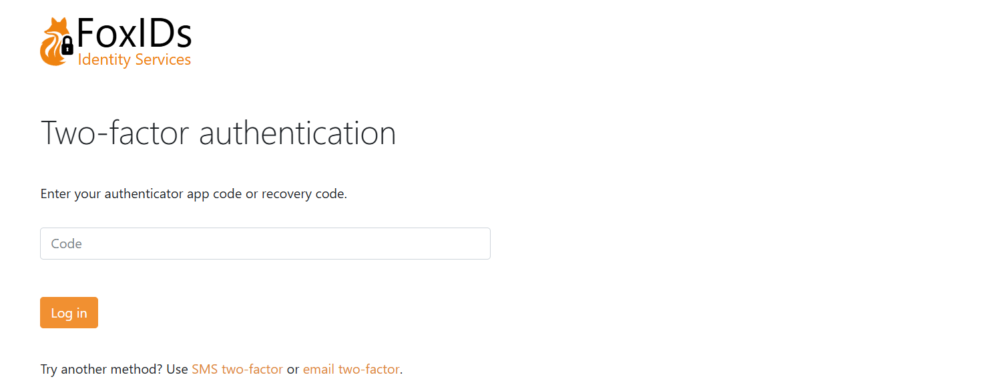

# Login, Home Realm Discovery and MFA
FoxIDs handle user login in the login authentication method. There can be configured a number of login authentication methods per environment with different configurations and [look and feel](customisation.md).

A environment contains one user repository and all login authentication methods configured in a environment authenticate [users](users-internal.md) with the same user repository.

When a [user](users-internal.md) authenticates, the user's session is associated with the login authentication method. Therefore, a user can authenticate in multiple configured login authentication methods and have multiple separate user sessions.  
A user session is not established in the login authentication method if the session lifetime is set to 0 seconds.

A [OpenID Connect application registration](app-reg-oidc.md) or [SAML 2.0 application registration](app-reg-saml-2.0.md) can authenticate users by selecting an login authentication method.

The login authentication method authenticates users in a two-step login UI with the username and password input on two separate pages.

## Home Realm Discovery (HRD)
When you create a application registration it is most often the best solution to use the default star notation `(*)` to [select](index.md#selection-by-url) all the authentication methods. 
If a application registration is configured to only be allowed to use one authentication method the user is immediately redirected to that particular authentication method. 
If more than one authentication method is allowed the user is redirected to a login authentication method which make it possible to select an authentication method either by client IP address, email domains or regular expressions.
The login UI is not shown if an authentication method is selected based the client IP address.

**Client IP address**  
Select the authentication method based on the client device's / PCs IP address.

Select by IP address or with an IP range:

- `192.168.0.0/255.255.255.0` selects from '192.168.0.0' to '192.168.0.255'
- `192.168.10.0/24` selects from '192.168.10.0' to '192.168.10.255'
- `192.168.0.10 - 192.168.10.20` selects from '192.168.0.10' to '192.168.10.20'
- `192.168.10.10-20` selects from '192.168.10.10' to '192.168.10.20'
- `fe80::/10` select e.g. 'fe80::d503:4ee:3882:c586%3'

**Email domain**  
Select the authentication method based on the users email domain.

Select by domains or use `(*)` to select all domains not configured on another authentication method.

**Regular expression**  
Select the authentication method based on case-insensitive regular expression match of the users email, phone and username.

Select by regular expression:

- `xyz$` match emails and usernames ending with 'xyz'
- `^+45` match phone numbers starting with phone code '+45'
- `abd` match emails and usernames containing 'abc'
- `^q10.*@@xyz\.com$` match emails starting with 'q10' at the domain 'xyz.com'

It can be selected if the HRD button should be displayed for the authentication method even if IP address / range, HRD domain or regular expression is configured.

An example of how a login screen with HRD looks like, it can be [customised](title-icon-css.md).

The [title, icon and CSS](title-icon-css.md) configured on the first allowed login authentication method on the application registration is used. Without an allowed login authentication method configured the title, icon and CSS from the default login authentication method is used.

## Two-factor authentication (2FA/MFA)
A login authentication method support two-factor authentication (2FA) / multi-factor authentication (MFA) with an authenticator app, SMS and email.

Two-factor authentication with an authenticator app, SMS and email is per default enabled and is initiated if required.  
Two-factor authentication can be set as a requirement in each [login authentication method](login.md#configure-two-factor-authentication-2fa), per [user](users-internal.md#multi-factor-authentication-mfa) or required by the calling [OpenID Connect](app-reg-oidc.md#require-multi-factor-authentication-mfa) or [SAML 2.0](app-reg-saml-2.0.md#require-multi-factor-authentication-mfa) application registration.  

You can use a two-factor authenticator app of your choice like [Anthy](https://authy.com/), [Google Authenticator](https://support.google.com/accounts/answer/1066447), [Microsoft Authenticator](https://www.microsoft.com/en-us/security/mobile-authenticator-app) and others.

In this example the user is asked to do two-factor authentication with an authenticator app or change to use SMS or email.

A phone number and email can either be configured as a user identifier or as a claim with the `phone_number` and `email` claim types.

The two-factor authentication type is selected as shown in this table.

<table>
    <tr>
        <th>SMS two-factor enabled and user has phone number</th>
        <th>Email two-factor enabled and user has email</th>
        <th>User has registered authenticator app</th>
        <th>Possible two-factor type(s)</th>
        <th>Selected two-factor type</th>
    </tr>
    <tr>
        <td>false</td>
        <td>false</td>
        <td>false</td>
        <td>Authenticator app</td>
        <td>Authenticator app</td>
    </tr>
    <tr>
        <td>false</td>
        <td>false</td>
        <td>true</td>
        <td>Authenticator app</td>
        <td>Authenticator app</td>
    </tr>
    <tr>
        <td>true</td>
        <td>false</td>
        <td>false</td>
        <td>SMS - can register authenticator app after SMS verification</td>
        <td>SMS</td>
    </tr>
    <tr>
        <td>true</td>
        <td>false</td>
        <td>true</td>
        <td>SMS and authenticator app</td>
        <td>Authenticator app</td>
    </tr>
    <tr>
        <td>false</td>
        <td>true</td>
        <td>false</td>
        <td>Email - can register authenticator app after email verification</td>
        <td>Email</td>
    </tr>
    <tr>
        <td>false</td>
        <td>true</td>
        <td>true</td>
        <td>Email and authenticator app</td>
        <td>Authenticator app</td>
    </tr>
    <tr>
        <td>true</td>
        <td>true</td>
        <td>false</td>
        <td>SMS and mail - can register authenticator app after SMS/email verification</td>
        <td>SMS</td>
    </tr>
    <tr>
        <td>true</td>
        <td>true</td>
        <td>true</td>
        <td>SMS, email and authenticator app</td>
        <td>Authenticator app</td>
    </tr>
</table>

## Login configuration
A default login authentication method is created in each environment. 

> The default login with the name `login` can be changed but not deleted, be careful as you may lose access.

The [title, icon and CSS](title-icon-css.md) configured on the default login authentication method is use in the case where no login authentication method is selected e.g., on the error page or during [HRD](#home-realm-discovery-hrd) selection without a login authentication method.

### Configure login options
It can be configured whether users should be allowed to set there password, whether users are allowed to create a [new user online](users-internal.md), which user identifiers to use and if the user should login with a password or one-time password (OTP) via email or SMS.
The [UI can be customised](title-icon-css.md) and much more.  
New users can be created by the administrator through the [Control Client](control.md#foxids-control-client) or be provisioned through the [Control API](control.md#foxids-control-api).

### Configure two-factor authentication (2FA)
The two-factor options can be changed and the authenticator app name shown for the user's can be changed. The name is per default set to the tenant's name. You most likely want to change the name to something more human readable.

You can select to require two-factor authentication for all users authenticating using the login authentication method. 

### Configure user session
Click **Show advanced** to change the user sessions lifetime. The default lifetime is 10 hours. 
The user session is a sliding session, where the lifetime is extended every time, an application makes a login request until the absolute session lifetime is reached.  
It is possible to configure an absolute session lifetime or not.

The user session can be changed to a persistent session which is preserved when the browser is closed and reopened.  
The user session become a persistent session if either the persistent session lifetime is configured to be grater, then 0. Or the persistent session lifetime unlimited setting is set to **Yes**.

> Click the `User session` tag to see all session settings.

### Configure claims
You can change the claims and do claim tasks with [claim transforms and claim tasks](claim-transform-task.md).
