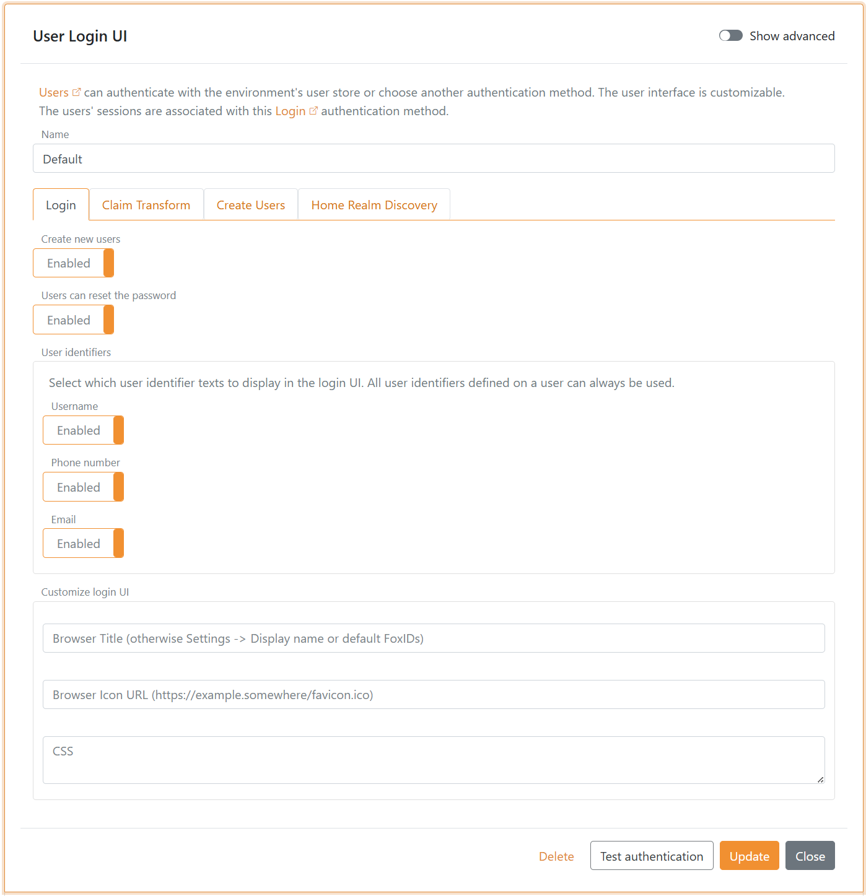
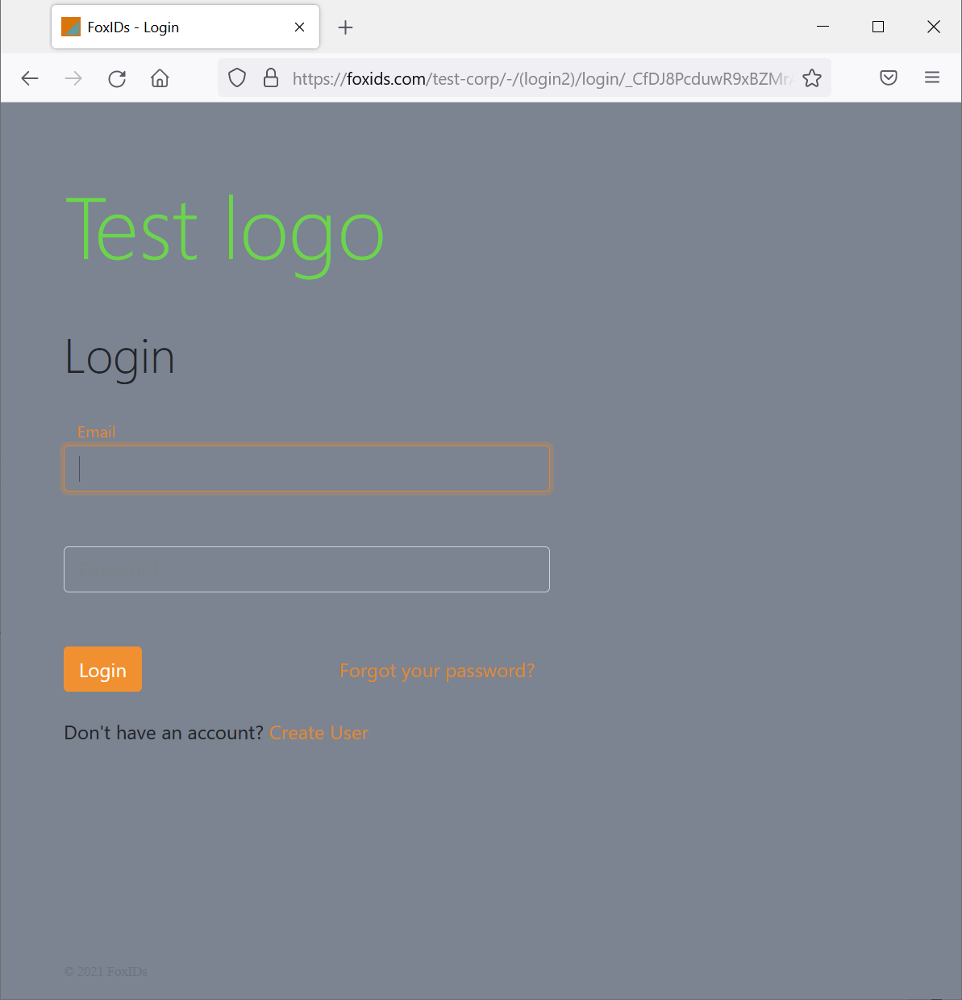
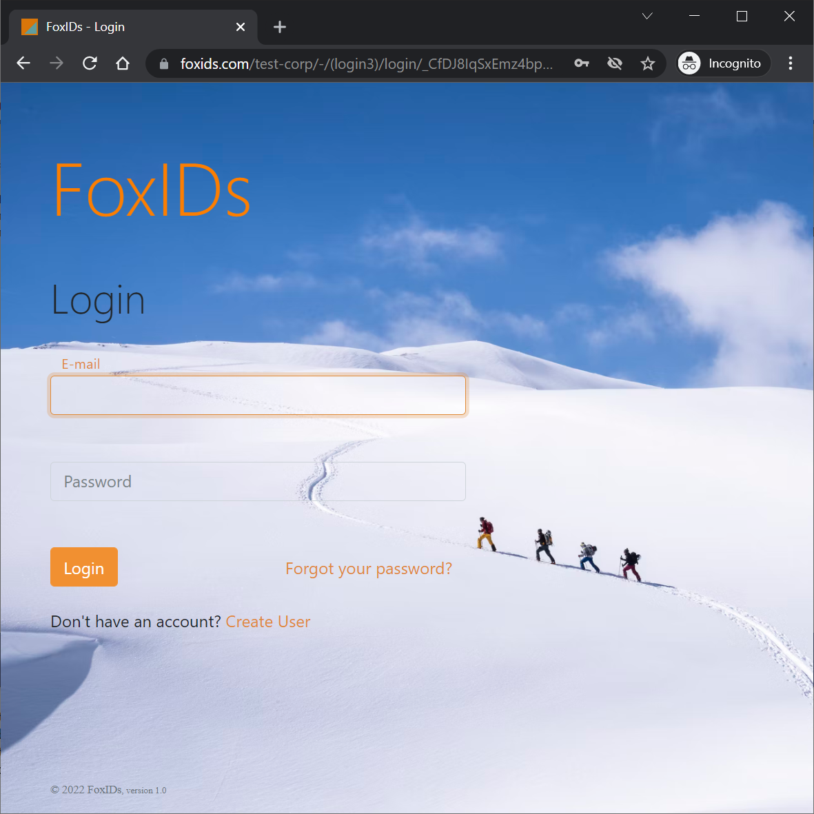
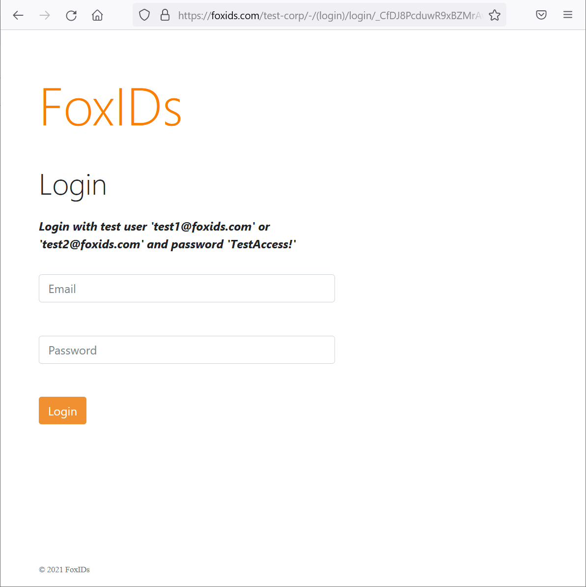

# Name, browser title, browser icon and CSS

## Display name

A display name for you organisation, company or system can be configured on each track. When FoxIDs send an email to a user the email text is customized by adding the display name.

The name is configured in the track settings in [FoxIDs Control Client](control.md#foxids-control-client).

1. Select Settings
2. Add the name in the Track display name field
3. Click Update

## Add browser title, browser icon and CSS

The FoxIDs user interface can be customized per [up-party login](login). This means that a single FoxIDs track can support multiple user interface designs with different browser titles, browser icons and CSS.

> FoxIDs use Bootstrap 4.6 and Flexbox CSS.

Find the up-party login in [FoxIDs Control Client](control.md#foxids-control-client) that you want to configure.

 1. Select show advanced settings
 4. Add the browser title text
 4. Add the browser icon URL from an external site, supported image formats: ico, png, gif, jpeg and webp
 2. Add the CSS to the CSS field, if necessary drag the field bigger
 5. Click Update

 After update the title, icon and CSS is instantly active.

 

 ## CSS examples

 Change background and add logo text. 

    body {
        background: #7c8391;
    }

    .brand-content-text {
        visibility: hidden;
    }

    .brand-content-text:before {
        color: #6ad54a;
        content: "Test logo";
        visibility: visible;
    }

    

It is also possible to use a logo image.

    .brand-content-text {
        display: none;
    }

    .brand-content-icon:before {
       content:url('https://some-external-site.com/logo.png');
    }

Add a background image from an external site.

    body {
        background: #FFF;
        background: url(https://some-external-site.com/image.png);
        background-position: no-repeat center center fixed;
        background-color: inherit;
        background-repeat: no-repeat;
        background-size:cover;
    }

   

Change button and link color, in this example CSS to green.

    label {
        color: #a4c700 !important;
    }

    .input:focus {
        outline: none !important;
        border:1px solid #a4c700;
        box-shadow: 0 0 10px #a4c700;
      }

    .btn-link, .btn-link:hover, a, a:hover {
        color: #a4c700;
    }

    .btn-primary.disabled, .btn-primary:disabled {
        color: #fff;
        background-color: #afc44f;
        border-color: #afc44f;
    }

    .btn-primary, .btn-primary:hover, .btn-primary:active, .btn-primary:focus, .btn-primary:active {
        background-color: #a4c700;
        border-color: #a4c700;
    }

    .btn-primary:not(:disabled):not(.disabled).active, .btn-primary:not(:disabled):not(.disabled):active, .show>.btn-primary.dropdown-toggle {
        background-color: #7c9600;
        border-color: #7c9600;
    }

    .btn-link:not(:disabled):not(.disabled):active, .btn-link:not(:disabled):not(.disabled).active, .show>.btn-link.dropdown-toggle {
        color: #a4c700;
    }

    .btn:focus, .form-control:focus {
        border-color: #a4c700;
        box-shadow: 0 0 0 .2rem rgba(64,78,0,.25);
    }

    .btn-primary:not(:disabled):not(.disabled).active:focus, .btn-primary:not(:disabled):not(.disabled):active:focus, .show>.btn-primary.dropdown-toggle:focus {
        box-shadow: 0 0 0 .2rem rgba(64,78,0,.25);
    }

 Add information to the login box.

    div.page-content:before {
      font-weight: bold;
      font-style: italic;
      content: "Login with test user 'test1@foxids.com' or 'test2@foxids.com' and password 'TestAccess!'";
    }

