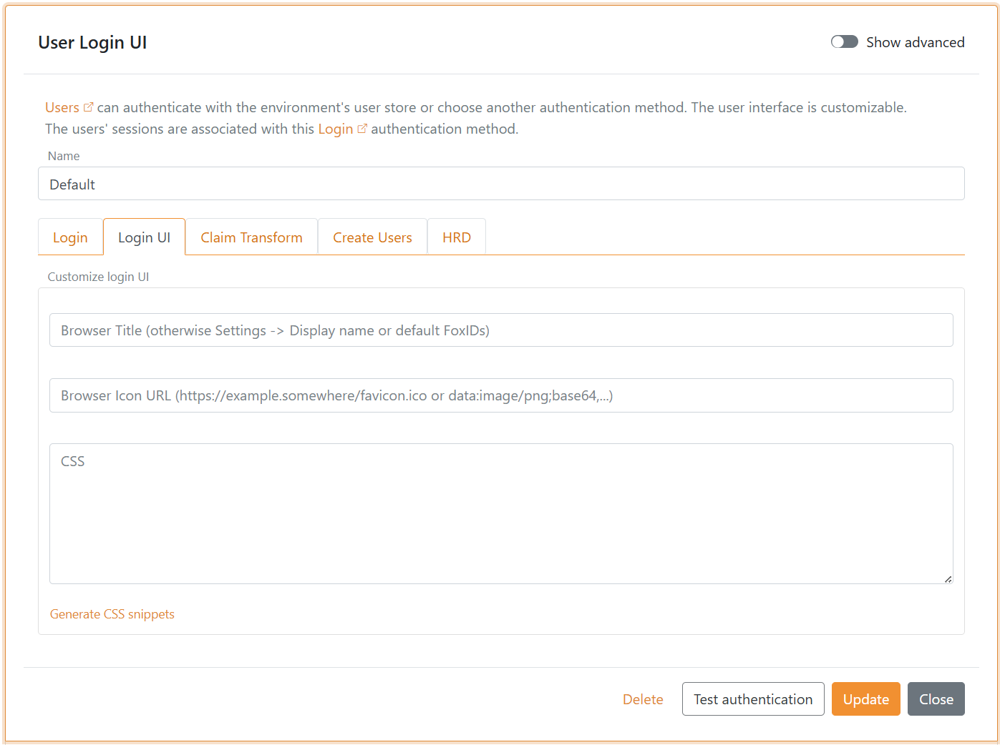

# Name, browser title, browser icon and CSS

## Display name

Name and address for you company, organisation or system can be configured on each environment. When FoxIDs send an SMS or email to a user the SMS and email text is customised by adding the information.

The name and address is configured in the environment settings in [FoxIDs Control Client](control.md#foxids-control-client).

1. Select **Settings**
2. Select **Environment**
3. Fill in the name and address
4. Click **Update**


## Add browser title, browser icon and CSS

The FoxIDs user interface can be customised per [login authentication method](login). This means that a single FoxIDs environment can support multiple user interface designs with different browser titles, browser icons and CSS.

If you do not specify a login authentication method as an allowed authentication method in your application. The default login authentication method is used and also what is customised in it.

> FoxIDs use Bootstrap 4.6 and Flexbox CSS.

Find the login authentication method in [FoxIDs Control Client](control.md#foxids-control-client) that you want to configure.

1. Add the **Browser Title** text
2. Add the **Browser Icon URL** from an external site, supported image formats: ico, png, gif, jpeg and webp
3. Add your **CSS**, if necessary drag the field bigger
4. Click **Update**

After update the title, icon and CSS is instantly active.



## CSS examples

Change background and add logo text. 

```CSS
body {
    background: #ddddc0;
}

.brand-content-text {
    visibility: hidden;
}

.brand-content-text::before {
    color: #6ad54a;
    content: "Test logo";
    visibility: visible;
    display: block;
    font-size: 4rem;
    font-weight: 400;
    line-height: 1.6;
}
```

    

It is also possible to use a logo image.

```CSS
.brand-content-text {
    display: none;
}

.brand-content-icon::before {
    content:url('https://some-external-site.com/logo.png');
}
```

Add a background image from an external site.

```CSS
body {
    background: #FFF;
    background: url(https://some-external-site.com/image.png);
    background-position: no-repeat center center fixed;
    background-color: inherit;
    background-repeat: no-repeat;
    background-size:cover;
}
```

   

Change button and link color, in this example CSS to green.

```CSS
label {
    color: #a4c700 !important;
}

.input:focus {
    outline: none !important;
    border:1px solid #a4c700;
    box-shadow: 0 0 10px #a4c700;
}

.btn-link, .btn-link:hover, a, a:hover {
    color: #a4c700;
}

.btn-primary.disabled, .btn-primary:disabled {
    color: #fff;
    background-color: #afc44f;
    border-color: #afc44f;
}

.btn-primary, .btn-primary:hover, .btn-primary:active, .btn-primary:focus, .btn-primary:active {
    background-color: #a4c700;
    border-color: #a4c700;
}

.btn-primary:not(:disabled):not(.disabled).active, .btn-primary:not(:disabled):not(.disabled):active, .show>.btn-primary.dropdown-toggle {
    background-color: #7c9600;
    border-color: #7c9600;
}

.btn-link:not(:disabled):not(.disabled):active, .btn-link:not(:disabled):not(.disabled).active, .show>.btn-link.dropdown-toggle {
    color: #a4c700;
}

.btn:focus, .form-control:focus {
    border-color: #a4c700;
    box-shadow: 0 0 0 .2rem rgba(64,78,0,.25);
}

.btn-primary:not(:disabled):not(.disabled).active:focus, .btn-primary:not(:disabled):not(.disabled):active:focus, .show>.btn-primary.dropdown-toggle:focus {
    box-shadow: 0 0 0 .2rem rgba(64,78,0,.25);
}
```

Add information to the login box.

```CSS
div.page-content::before {
    font-weight: bold;
    font-style: italic;
    content: "Login with test user 'test1@foxids.com' or 'test2@foxids.com' and password 'TestAccess!'";
}
```


