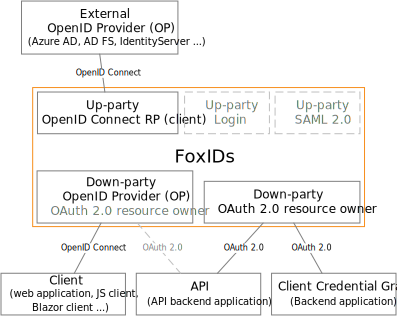

# OAuth 2.0 and OpenID Connect

FoxIDs support OpenID Connect as both up-party and down-party. OAuth 2.0 is only supported as down-party.

*FoxIDs do not support plain OAuth 2.0 client authorization because it is less secure then using OpenID Connect.*

## Up-party

FoxIDs up-party [Relying Party (RP) / Client](up-party-oidc.md) which trust an external OpenID Provider (OP) using OpenID Connect.

How to guides:

- Connect [Azure AD](up-party-howto-oidc-azure-ad.md) 
- Connect [IdentityServer](up-party-howto-oidc-identityserver.md)

## Down-party

FoxIDs down-party [OpenID Provider (OP)](down-party-oauth-2.0-oidc.md) authenticating the client using OpenID Connect. Besides receiving a ID token the client can request an access token for multiple APIs defined as [OAuth 2.0 resources](down-party-oauth-2.0-oidc.md#oauth-20-resource).

FoxIDs support [down-party Client Credentials Grant](down-party-oauth-2.0-oidc.md#client-credentials-grant) acting as an OAuth 2.0 resource owner.

## Client secrets
It is important to store client secrets securely, therefor client secrets are hashed with the same [hash algorithm](login.md#password-hash) as passwords. If the secret is more than 20 character (which it should bee) the first 3 characters is saved as test and is shown for each secret as information in FoxIDs Control. 

## OAuth 2.0, OpenID Connect and JWT in FoxIDs
OAuth 2.0, OpenID Connect, JWT and JWT claims are first class citizens in FoxIDs. Internally claims are always represented as JWT claims and request / response properties are described with OAuth 2.0 and OpenID Connect attributes. When FoxIDs converts between standards it also converts to the same internal representation using JWT claims and OAuth 2.0 / OpenID Connect attributes.

