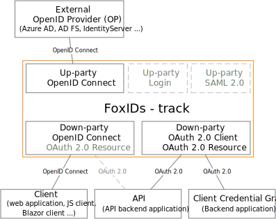

# OpenID Connect and OAuth 2.0

FoxIDs support OpenID Connect as both up-party and down-party. OAuth 2.0 is only supported as down-party.

*FoxIDs only support OAuth 2.0 Client Credentials Authorization Grant and not the remaining Authorization Grants. Instead, OpenID Connect is used because it is more secure.*

## Up-party

FoxIDs up-party [OpenID Connect](up-party-oidc.md) which trust an external OpenID Provider (OP).

How to guides:

- Connect [Azure AD](up-party-howto-oidc-azure-ad.md) 
- Connect [IdentityServer](up-party-howto-oidc-identityserver.md)

## Down-party

FoxIDs down-party [OpenID Connect](down-party-oauth-2.0-oidc.md). Besides receiving an ID token the client can request an access token for multiple APIs defined as [OAuth 2.0 resources](down-party-oauth-2.0-oidc.md#oauth-20-resource).

FoxIDs support [down-party Client Credentials Grant](down-party-oauth-2.0-oidc.md#client-credentials-grant).

## Client secrets
It is important to store client secrets securely, therefor client secrets are hashed with the same [hash algorithm](login.md#password-hash) as passwords. If the secret is more than 20 character (which it should be) the first 3 characters is saved as information and is shown for each secret in FoxIDs Control. 

## OpenID Connect, OAuth 2.0 and JWT in FoxIDs
OpenID Connect, OAuth 2.0, JWT and JWT claims are first class citizens in FoxIDs. Internally claims are always represented as JWT claims and request / response properties are described with OAuth 2.0 and OpenID Connect attributes. When FoxIDs converts between standards it also converts to the same internal representation using JWT claims and OAuth 2.0 / OpenID Connect attributes.

