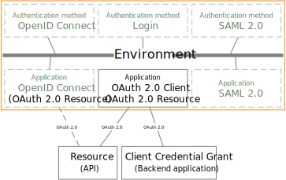

# OAuth 2.0

FoxIDs support OAuth 2.0 as a application registration. OAuth 2.0 is not supported as an authentication method.

FoxIDs support OAuth 2.0 application registration Client Credentials Authorization Grant and not the remaining Authorization Grants. Instead, OpenID Connect is used because it is more secure.  

FoxIDs support OAuth 2.0 resource (API) as a application registration.

## Application registration

Configure your application as a [OAuth 2.0 application registration](app-reg-oauth-2.0.md).

