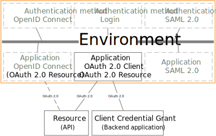

# OAuth 2.0

FoxIDs support OAuth 2.0 as a down-party. OAuth 2.0 is not supported as an up-party.

FoxIDs support down-party OAuth 2.0 Client Credentials Authorization Grant and not the remaining Authorization Grants. Instead, OpenID Connect is used because it is more secure.  

FoxIDs support OAuth 2.0 resource (API) as a down-party.

## Down-party

Configure your application as a [down-party Client Credentials Grant](down-party-oauth-2.0.md#client-credentials-grant).

The client can request an access token for multiple APIs defined as [down-party OAuth 2.0 resources](down-party-oauth-2.0.md#oauth-20-resource).

