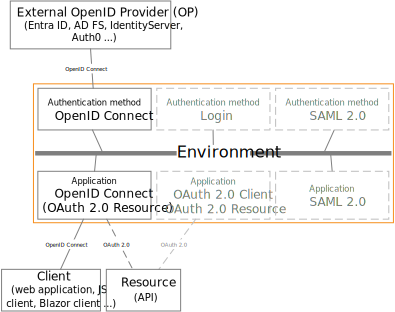

# OpenID Connect

FoxIDs support OpenID Connect as both authentication method and application registration.

> It is recommended to use OpenID Connect Authorization Code flow with PKCE, because it is considered a secure flow.

## Authentication method

Configure [OpenID Connect authentication method](auth-method-oidc.md) which trust an external OpenID Provider (OP).

How to guides:

- Connect [IdentityServer](auth-method-howto-oidc-identityserver.md)
- Connect [Microsoft Entra ID (Azure AD)](auth-method-howto-oidc-azure-ad.md) 
- Connect [Azure AD B2C](auth-method-howto-oidc-azure-ad-b2c.md) 
- Connect [Amazon Cognito](auth-method-howto-oidc-amazon-cognito.md)
- Connect [Google](auth-method-howto-oidc-google.md)
- Connect [Facebook](auth-method-howto-oidc-facebook.md)
- Connect [Signicat](auth-method-howto-oidc-signicat.md)
- Connect [Nets eID Broker](auth-method-howto-oidc-nets-eid-broker.md)
- Connect two FoxIDs environments in the same or different tenants with [OpenID Connect](howto-oidc-foxids.md)
- Connect two FoxIDs environments in the same tenant with a [Environment Link](howto-environmentlink-foxids.md)

## Application registration

Configure your application as a [OpenID Connect application registration](app-reg-oidc.md).

Besides receiving an ID token the client can request an access token for multiple APIs defined as [OAuth 2.0 application registration resources](app-reg-oauth-2.0.md#oauth-20-resource).  
An OAuth 2.0 resource can optionally be defined in a OpenID Connect application registration or a OAuth 2.0 application registration.

