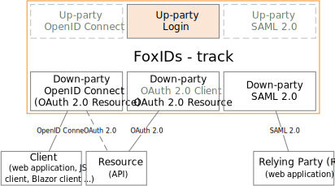

# FoxIDs parties

FoxIDs is configured with up-parties and down-parties. Up-parties authenticate the internal users or optionally by trust to an external Identity Provider (IdP). Applications and APIs are connected to FoxIDs as down-parties.

There are four different party types:

- [Login](login.md)
- [OpenID Connect](oidc.md)
- [OAuth 2.0](oauth-2.0.md)
- [SAML 2.0](saml-2.0.md)

## Up-party

FoxIDs support tree different up-party types:

- [Up-party Login](login.md)
- [Up-party OpenID Connect](up-party-oidc.md)
- [Up-party SAML 2.0](up-party-saml-2.0.md)

### Up-party session
Each up-party creates a session when a user is authenticated. All sessions are separately connected to an up-party. There are two different kinds of sessions.
A login up-party create a [user session](login.md#configure-user-session). An OpenID Connect up-party and SAML 2.0 up-party create an up-party session which only holds information to enable logout. 

Both session types lifetime, absolute lifetime and persistence (if the session should be saved when the browser is closed) can be configured.

## Down-party

FoxIDs support tree different down-party types:

- [Down-party OpenID Connect](down-party-oidc.md)
- [Down-party OAuth 2.0](down-party-oauth-2.0.md)
- [Down-party SAML 2.0](down-party-saml-2.0.md)

## JWT and SAML 
OpenID Connect, OAuth 2.0, JWT and JWT claims are first class citizens in FoxIDs. Internally claims are always represented as JWT claims and request / response properties are described with OAuth 2.0 and OpenID Connect attributes. 

FoxIDs converts between standards where attributes are converted to the same internal representation using JWT claims and OAuth 2.0 / OpenID Connect attributes.  
Therefor, SAML 2.0 claims is internally converted to JWT claims between up-party and down-party.
