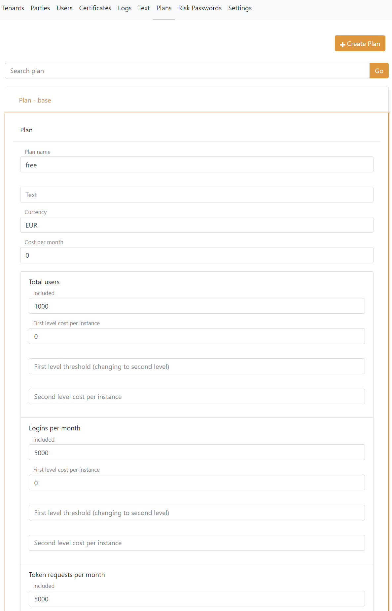
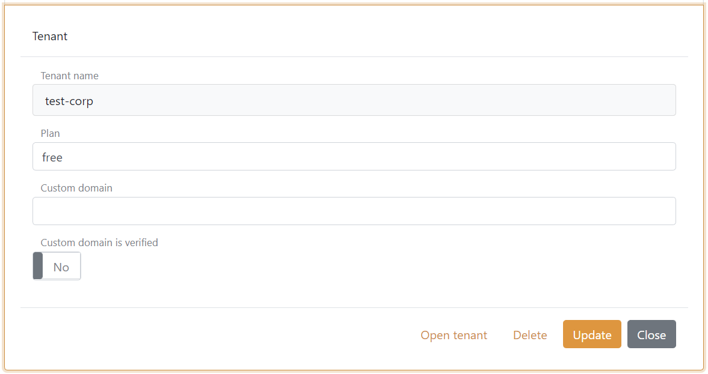

# Plans

FoxIDs is a cloud applications designed as a container with multi-tenant support. FoxIDs can be deployed and use by e.g. a single company or deployed as a shared cloud container and used by multiple organisation, companies or everyone with the need.

Plan is for a shared cloud deployment like on [FoxIDs.com](https://foxids.com) to be able to calculate payments in an external system.

Plans is defined and connected to tenants in the `master` tenant `master` track.

A plan is configured with:

- Plan name and a text
- Currency and cost per month
- Included usage in two levels for
	- Users
	- Logins per month
	- Token requests per month
	- Control API gets per month
	- Control API updates per month
- Optionally plan specific Application Insights and Log Analytics Workspace

Tenants can optionally be connected to a plan

