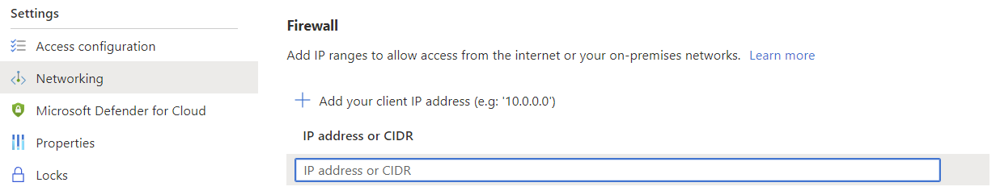
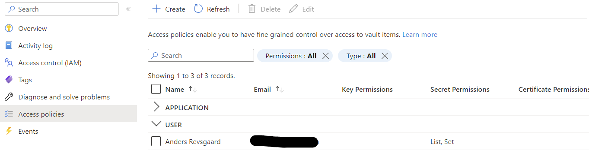
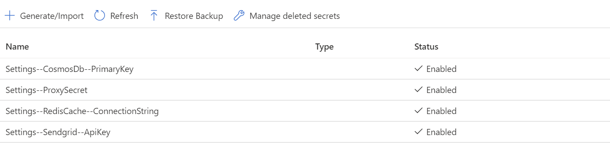

# Reverse proxy
It is recommended to place both the FoxIDs Azure App service and the FoxIDs Control Azure App service behind a reverse proxy. 

The [custom primary domains](deployment.md#custom-primary-domains) is exposed through the reverse proxy alongside optionally [custom domains](custom-domain.md).  

The FoxIDs service support [custom domains](custom-domain.md) which is handled with domain rewrite through the reverse proxy.

> FoxIDs only support [custom domains](custom-domain.md) if it is behind a reverse proxy and the access is restricted by the `X-FoxIDs-Secret` HTTP header or the `Settings:TrustProxyHeaders` setting is set to `true` in the FoxIDs App Service configuration.

## Restrict access
Both the FoxIDs service and FoxIDs Control sites can restrict access based on the `X-FoxIDs-Secret` HTTP header.  
The access restriction is activated by adding a secret with the name `Settings--ProxySecret` in Key Vault.

1. Grant your IP address access through the Key Vault firewall

2. Grant your user List and Set permissions in Access policies.

3. Add the `Settings--ProxySecret` secret

4. After successfully configuration, remove you IP address and permissions.

> The sites needs to be restarted to read the secret.

After the reverse proxy secret has been configured in Key Vault the reverse proxy needs to add the `X-FoxIDs-Secret` HTTP header in all backed calls to FoxIDs to get access.

## Read HTTP headers
FoxIDs service support reading the client IP address in the following prioritized HTTP headers:

 1. `CF-Connecting-IP`
 2. `X-Azure-ClientIP`
 3. `X-Forwarded-For`

FoxIDs service support reading the [custom domain](custom-domain.md) (host name) exposed on the revers proxy in the following prioritized HTTP headers:

 1. `X-ORIGINAL-HOST`
 2. `X-Forwarded-Host`

 > The host header is only read if access is restricted by the `X-FoxIDs-Secret` HTTP header.

## Supported and tested reverse proxies
FoxIDs generally support all reverse proxies. The following reverse proxies is tested to work with FoxIDs.
 
### Azure Front Door
Azure Front Door can be configured as a reverse proxy. Azure Front Door rewrite domains by default. 

> Do NOT enable caching. The `Accept-Language` header is not forwarded if caching is enabled. The header is required by FoxIDs to support cultures.

Configuration:
- Add a Azure Front Door endpoint for both the FoxIDs App Service and the FoxIDs Control App Service
- In the Networking section of the App Services. Enable access restriction to only allow traffic from Azure Front Door
- Optionally add a Front Door endpoint for both the FoxIDs App Service and the FoxIDs Control App Service test slots
- Restrict access to the App Services test slots
- Add the `Settings:TrustProxyHeaders` setting with the value `true` in the FoxIDs App Service (optionally also the test slot) configuration to support [custom domains](custom-domain.md)
- Disable Session affinity
- Optionally configure WAF policies

### Cloudflare
Cloudflare can be configured as a reverse proxy. But Cloudflare require a Enterprise plan to rewrite domains (host headers). The `X-FoxIDs-Secret` HTTP header should be added.

### IIS ARR Proxy
Internet Information Services (IIS) Application Request Routing (ARR) Proxy require a Windows server. ARR Proxy rewrite domains with a rewrite rule. 
The `X-FoxIDs-Secret` HTTP header can optionally be added (recommended depended on the infrastructure) but is required to support [custom domain](custom-domain.md).

An accept all external exposed domains rule can be configured. This example is a global rule, rules can also be added to websites.  
Optionally both requiring (`secret1`) and sending (`secret2`) in a `X-FoxIDs-Secret` HTTP header. You could require a `X-FoxIDs-Secret` HTTP header if you have a reverse proxy in front of the ARR Proxy.

    <globalRules>
        <rule name="my-rule-name" patternSyntax="Wildcard" stopProcessing="true">
            <match url="*" />
            <conditions>
                <add input="{HTTP_X-FoxIDs-Secret}" pattern="... secret1 ..." ignoreCase="false" />
            </conditions>                                                
            <action type="Rewrite" url="https://my-foxids-installation.com/{R:1}" />
            <serverVariables>
                <set name="HTTP_X-ORIGINAL-HOST" value="{HTTP_HOST}" />
                <set name="HTTP_X-FoxIDs-Secret" value="... secret2 ..." />
            </serverVariables>
        </rule>
    </globalRules>