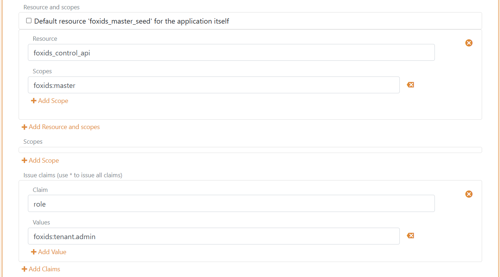

<!--
{
    "title":  "Risk passwords",
    "description":  "You can achieve higher password quality and a higher level of security by using risk passwords for password validation.",
    "ogTitle":  "Risk passwords",
    "ogDescription":  "You can achieve higher password quality and a higher level of security by using risk passwords for password validation.",
    "ogType":  "article",
    "ogImage":  "/images/foxids_logo.png",
    "twitterCard":  "summary_large_image",
    "additionalMeta":  {
                           "keywords":  "risk passwords, FoxIDs docs"
                       }
}
-->

# Risk passwords

You can achieve higher password quality and a higher level of security by using risk passwords for password validation. 

Hundreds of millions of real world passwords previously exposed in data breaches is collected as risk passwords. By validating that the leaked passwords are not reused, you significantly increase the level of password security.

> The risk passwords are uploaded ones per FoxIDs deployment in the master tenant and can be used in all tenants and environments.


## 1) Download risk passwords (pwned passwords)
Download the `SHA-1` pwned passwords in a single file from [haveibeenpwned.com/passwords](https://haveibeenpwned.com/Passwords) using the [PwnedPasswordsDownloader tool](https://github.com/HaveIBeenPwned/PwnedPasswordsDownloader).

> Be aware that it takes some time to download all risk passwords.

## 2) Upload risk passwords to FoxIDs
You then upload the risk passwords with the FoxIDs master seed tool console application.  

Download the `FoxIDs.MasterSeedTool-x.x.x-win-x64.zip` file for Windows or `FoxIDs.MasterSeedTool-x.x.x-linux-x64.zip` file for Linux from the [FoxIDs release](https://github.com/ITfoxtec/FoxIDs/releases) and unpack the master seed tool.

### Configure the master seed tool

The master seed tool is configured in the `appsettings.json` file.

Access to upload risk passwords is granted in the `master` tenant.

Create a master seed tool OAuth 2.0 client in the [FoxIDs Control Client](control.md#foxids-control-client):

*This will grant the master seed tool full access to the FoxIDs installation.*

1. Login to the **master** tenant
2. Select the **Applications** tab
3. Click **New Application**
4. Click **Backend Application**
    a. Select **Show advanced**
    b. Add a **Name** e.g., `Master seed tool`
    c. Change the **Client ID** to `foxids_master_seed`
    d. Click **Register**
    e. Remember the **Authority**.
    f. Remember the **Client secret**.
    g. Click **Close**
5. Click on the application in the list to open it
6. In the **Resource and scopes** section
    a. Remove the check mark from **Default resource 'foxids_master_seed' for the application itself**
    b. Click **Add Resource and scope** and add the resource `foxids_control_api`
    c. Then click **Add Scope** and add the scope `foxids:master` 
7. Select **Show advanced**
8. In the **Issue claims** section
    a. Click **Add Claim** and add the claim `role`
    b. Then click **Add Value** and add the claim value `foxids:tenant.admin`
9. Click **Update**



Add your FoxIDs Control API endpoint and the master seed tool **Authority**, **Client secret** and local risk passwords (pwned passwords) file to the master seed tool configuration. 

```json
"SeedSettings": {
    "FoxIDsControlEndpoint": "https://control.foxids.com", // self-hosted "https://control.yyyyxxxx.com" or local development https://localhost:44331
    "Authority": "https://id.foxids.com/zzzzz/master/foxids_seed/", // custom domain, self-hosted or local development "https://https://localhost:44331/zzzzz/master/foxids_seed/"
    "ClientId": "foxids_master_seed",
    "ClientSecret": "xxxxxx",
    "Scope": "foxids_control_api:foxids:master",
    "PwnedPasswordsPath": "c:\\... xxx ...\\pwned-passwords-sha1-ordered-by-count-v4.txt"
}
```

### Run the master seed tool

1. Start a Command Prompt 
2. Run the master seed tool with `MasterSeedTool.exe`
3. Click `R` to start uploading risk passwords  

> The risk password upload will take a while.

## 3) Test
You can read the number of risk passwords uploaded to FoxIDs in [FoxIDs Control Client](control.md#foxids-control-client) master tenant on the Settings / Risk Passwords tap. And you can test if a password is okay or has appeared in breaches.


