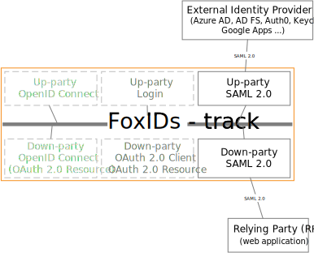
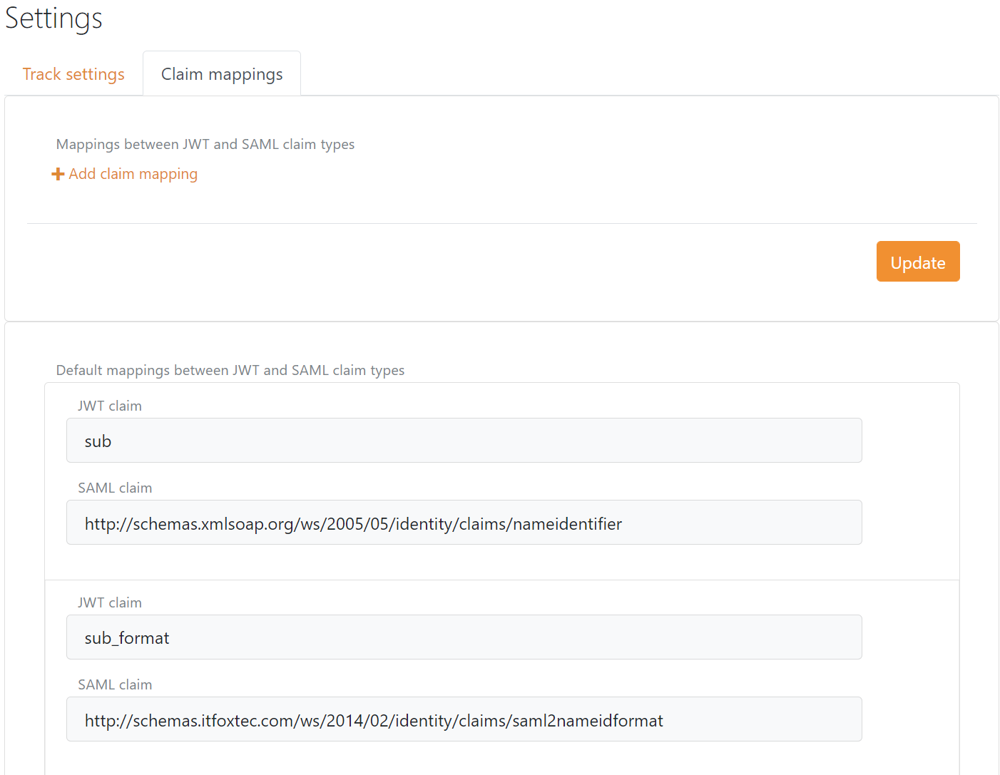

# SAML 2.0

Foxids support SAML 2.0 as both authentication method and application registration.

## Authentication method

Configure [SAML 2.0 authentication method](auth-met-saml-2.0.md) which trust an external SAML 2.0 Identity Provider (IdP).

How to guides:

- Connect [AD FS](auth-met-howto-saml-2.0-adfs.md)
- Connect [PingIdentity / PingOne](auth-met-howto-saml-2.0-pingone.md)
- Connect [NemLog-in (Danish IdP)](auth-met-howto-saml-2.0-nemlogin.md)
- Connect [Context Handler (Danish IdP)](howto-saml-2.0-context-handler.md#auth-met---connect-to-context-handler)

## Application registration

Configure your application as a [SAML 2.0 application registration](app-reg-saml-2.0.md).

How to guides:

- Connect [AD FS](app-reg-howto-saml-2.0-adfs.md)
- Connect [Context Handler (Danish IdP)](howto-saml-2.0-context-handler.md#app-reg---connect-to-context-handler)

## Claim mappings
Claim mapping between SAML 2.0 claim types and JWT claim types can be configured in the setting menu in [Foxids Control](control.md). The claim mappings is global for the track.

> SAML 2.0 claims are internally [converted to JWT claims](parties.md#jwt-and-saml) between authentication method and application registration.

If no claim mapping exists for a particular claim. The long SAML 2.0 claim name is kept from claims revived in a SAML 2.0 token instead of a shorter equivalent JWT claim name. The same goes in the opposite direction.
