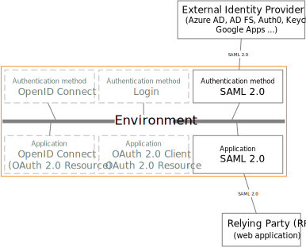

<!--
{
    "title":  "SAML 2.0",
    "description":  "FoxIDs support SAML 2.0 as both authentication method and application registration.",
    "ogTitle":  "SAML 2.0",
    "ogDescription":  "FoxIDs support SAML 2.0 as both authentication method and application registration.",
    "ogType":  "article",
    "ogImage":  "/images/foxids_logo.png",
    "twitterCard":  "summary_large_image",
    "additionalMeta":  {
                           "keywords":  "saml 2.0, FoxIDs docs"
                       }
}
-->

# SAML 2.0

FoxIDs support SAML 2.0 as both authentication method and application registration.

[SAML (Security Assertion Markup Language) 2.0](https://docs.oasis-open.org/security/saml/v2.0/saml-core-2.0-os.pdf) is an XML-based open standard for authentication and authorization. 
It enables Single Sign-On (SSO), allowing users to authenticate once and gain access to multiple applications without needing to re-enter credentials.

The two SAML 2.0 flows are supported in authentications methods and application registrations. The SP-Initiated Login flow, which is the most widely used, and the recommended flow and IdP-initiated Login flow.

## Authentication method

Configure [SAML 2.0 authentication method](auth-method-saml-2.0.md) which trust an external SAML 2.0 Identity Provider (IdP).

SAML 2.0 is widely used in enterprise environments, enabling secure identity federation across different organizations and applications.

How to guides:

- Connect [PingIdentity / PingOne](auth-method-howto-saml-2.0-pingone.md)
- Connect [Google Workspace](auth-method-howto-saml-2.0-google-workspace.md)
- Connect [Microsoft AD FS](auth-method-howto-saml-2.0-adfs.md)
- Connect [NemLog-in (Danish IdP)](auth-method-howto-saml-2.0-nemlogin.md)
- Connect [Context Handler (Danish identity broker)](howto-saml-2.0-context-handler.md)
- Connect two FoxIDs environments in the same tenant with a [Environment Link](howto-environmentlink-foxids.md)

## Application registration

Configure your application as a [SAML 2.0 application registration](app-reg-saml-2.0.md).

How to guides:

- Connect [Amazon IAM Identity Center](auth-method-howto-saml-amazon-iam-identity-center.md)
- Connect [Context Handler test IdP (Danish identity broker)](howto-saml-2.0-context-handler#configuring-test-identity-provider-for-context-handler)

## Claim mappings
Claim mapping between SAML 2.0 claim types and JWT claim types is created automatically and can be configured in the setting menu in [FoxIDs Control](control.md). The claim mappings is global for the environment.

> SAML 2.0 claims are internally [converted to JWT claims](connections.md#jwt-and-saml) between authentication method and application registration.

