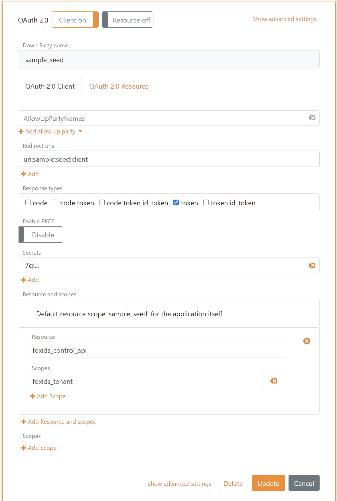

# Samples
The samples for FoxIDs show login and logout with OAuth 2.0, OpenID Connect 1.0, SAML 2.0 and API call with OAuth 2.0. The samples is located in the [FoxIDs.Samples](https://github.com/ITfoxtec/FoxIDs.Samples) repository.

> The samples need a FoxIDs track to run. The samples are configured in the [FoxIDs.com test track](#foxidscom-test-track-for-samples), or you can configure the [samples in your one FoxIDs track](#configure-samples-in-foxids-track).

> The samples can be run locally in Visual Studio on the configured localhost ports. All sample applications will open in a browser tap except the [API sample](#aspnetcoreapi1sample).

## Sample applications

The sample Visual Studio solution contain the following sample applications.

### AspNetCoreOidcAuthorizationCodeSample

Sample application showing login and logout with OpenID Connect (OIDC) using authorization code flow as a service provider.\
Show how to call the [API sample](#aspnetcoreapi1sample) secured with an access token. 

Support login/(logout) with FoxIDs login page, [SAML 2.0 IdP sample](#aspnetcoresamlidpsample) and if configured [AD FS using SAML 2.0](saml-2.0.md#connecting-ad-fs).

Local development domain and port: `https://localhost:44340`

### AspNetCoreOidcImplicitSample

Sample application showing login and logout with OpenID Connect (OIDC) using implicit flow as a service provider.

Support login/(logout) with FoxIDs login page, [SAML 2.0 IdP sample](#aspnetcoresamlidpsample) and if configured [AD FS using SAML 2.0](saml-2.0.md#connecting-ad-fs).

Local development domain and port: `https://localhost:44341`

### AspNetCoreSamlIdPSample

Sample application implementing a SAML 2.0 identity provider (IdP) making it possible to configure at sample SAML 2.0 IdP in the FoxIDs track.

Local development domain and port: `https://localhost:44342`

### AspNetCoreSamlSample

Sample application showing login and logout with SAML 2.0 as a relying party.

Support login/(logout) with FoxIDs login page, [SAML 2.0 IdP sample](#aspnetcoresamlidpsample) and if configured [AD FS using SAML 2.0](saml-2.0.md#connecting-ad-fs).

Local development domain and port: `https://localhost:44343`

### AspNetCoreApi1Sample

Sample API showing how to secure an API with an access token and how to restrict access by a scope.

Local development domain and port: `https://localhost:44344`

### BlazorOidcPkceSample

Blazor sample application showing login and logout with OpenID Connect (OIDC) using authorization code flow and PKCE as a service provider.\
Show how to call the [API sample](#aspnetcoreapi1sample) secured with an access token. 

Local development domain and port: `https://localhost:44345`

## FoxIDs.com test track for samples
//TODO

## Configure samples in FoxIDs track

The samples can be configured in a FoxIDs track with the sample seed tool or manually through the FoxIDs Control Client.  

> The sample seed tool is found in the sample solution: tools/SampleSeedTool.

### Configure the sample seed tool

> The sample seed tool is configured in the `appsettings.json` file.

Add the FoxIDs and FoxIDs Control API endpoints to the sample seed tool configuration. They can be added by updating the instance names `foxidsxxxx` and `foxidsconsolxxxx` or by configuring custom domains. Or if you are running FoxIDs locally in Visual Studio by configuring FoxIDs localhost `https://localhost:44330/` and FoxIDs Control API localhost `https://localhost:44331/`.

```json
"SeedSettings": {
    "FoxIDsEndpoint": "https://foxidsxxxx.azurewebsites.net", 
    "FoxIDsConsolApiEndpoint": "https://foxidsconsolxxxx.azurewebsites.net/api"
}
```

Create the sample seed OAuth 2.0 client in the FoxIDs Control Client.  
Set the client id to `sample_seed`, redirect uri to `uri:sample:seed:client`) and response type to `token`. Remember the client secret. Give the sample seed client access to the resource `foxids_control_api` with the scope `foxids_tenant`. The sample seed client is thereby granted access to update the tenant.



Create a new FoxIDs track for the sample applications or select an existing track.

Change the tenant, the track and the sample seed tool client secret in the sample seed tool configured. 

```json
"SeedSettings": {
  "Tenant": "xxx",
  "Track": "xxx",
  "DownParty": "sample_seed",
  "RedirectUri": "uri:sample:seed:client",
  "ClientSecret": "xxx"
}
```

> Change the tenant and the track configuration for all the samples. 

### Run the sample seed tool

Run the sample seed tool executable SampleSeedTool.exe or run the seed tool directly from Visual Studio. 

* Click 'c' to create the sample configuration 
* Click 'd' to delete the sample configuration

The sample seed tool will create and delete configurations for all samples.

The sample applications require a login up party with the name `login` (handles user login). It is created by the sample seed tool if it do not exists. The login up party is not deleted if the sample configuration is deleted.
