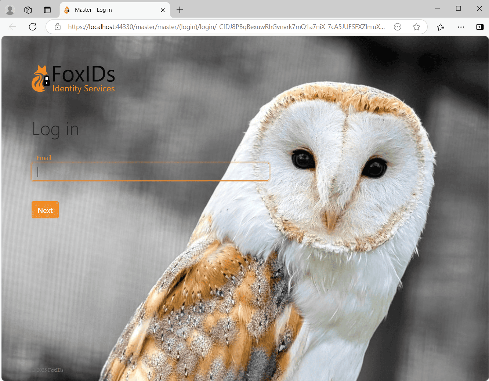
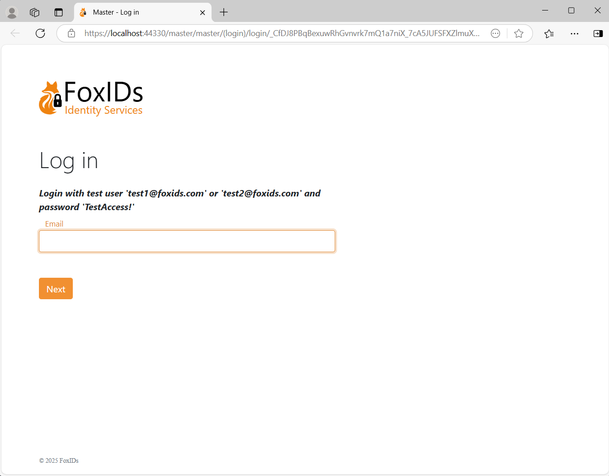

# Title, Icon and CSS

The FoxIDs user interface can be customized per [up-party login](login). This means that a single FoxIDs track can support multiple user interface designs with different browser title, icon and CSS.

## Add Title, Icon and CSS

Find the up-party login in [FoxIDs Control Client](control.md#foxids-control-client) that you want to configure.

 1. Select show advanced settings
 4. Add the bowser title text
 4. Add the bowser icon URL from an external site, supported image formats: ico, png, gif, jpeg and webp
 2. Add the CSS to the CSS field, if necessary drag the field bigger
 5. Click Update

 After update the title, icon and CSS is instantly active.

 

 ## CSS examples

 Change background and add logo text. It is also possible to add a logo image.

    body {
        background: #7c8391;
    }

    .brand-content-text {
        visibility: hidden;
    }

    .brand-content-text:before {
        color: #6ad54a;
        content: "Test logo";
        visibility: visible;
    }

    

Add a background image from an external site.

    body {
        background: #FFF;
        background: url(https://some-external-site.com/image.png);
        background-position: no-repeat center center fixed;
        background-color: inherit;
        background-repeat: no-repeat;
        background-size:cover;
    }

   

 Add information to the login box.

    div.page-content:before {
      font-weight: bold;
      font-style: italic;
      content: "Login with test user 'test1@foxids.com' or 'test2@foxids.com' and password 'TestAccess!'";
    }

