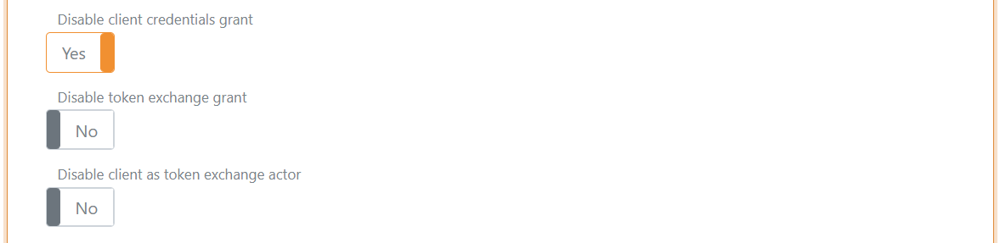
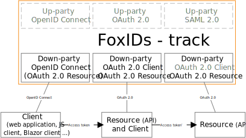
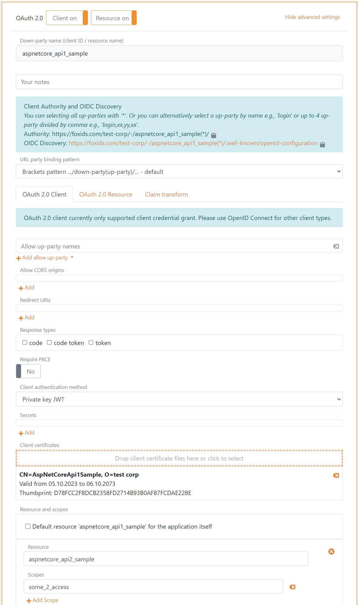
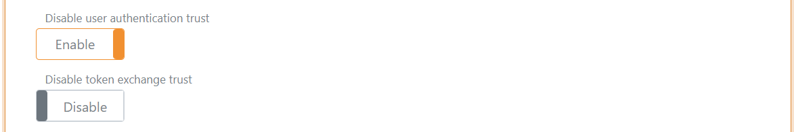
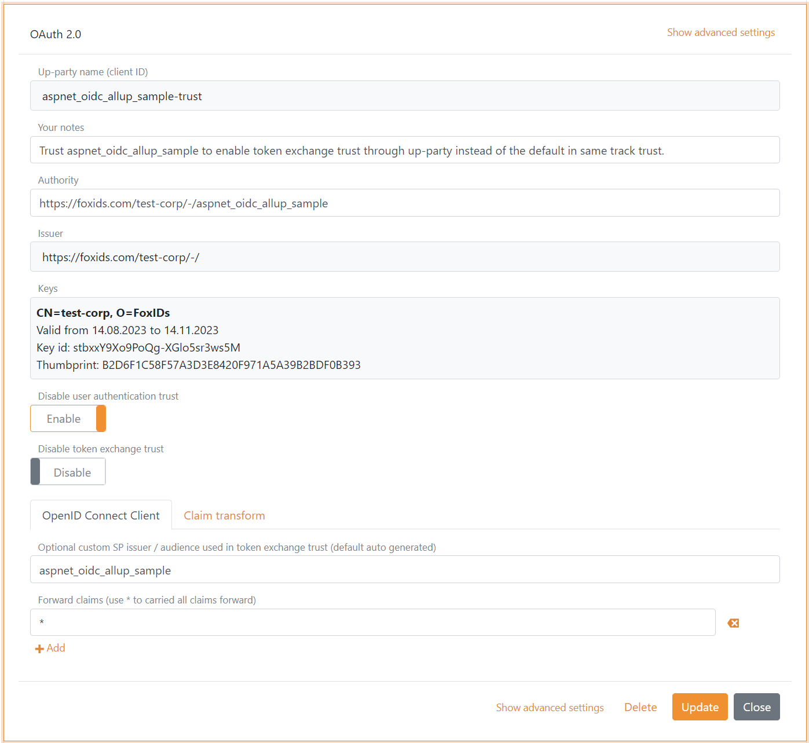
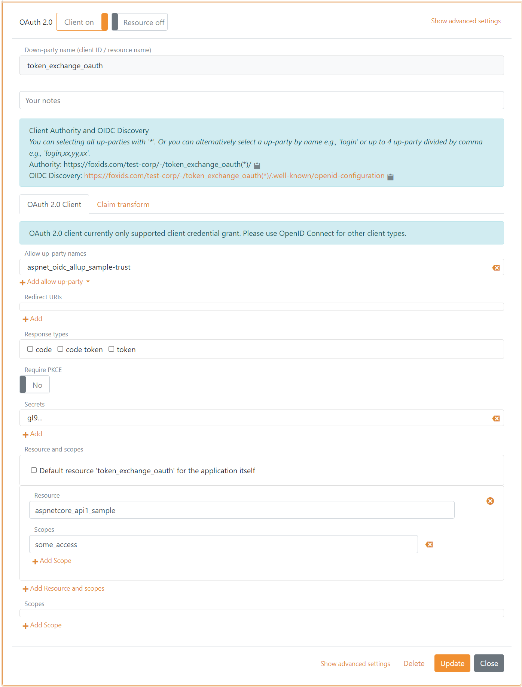
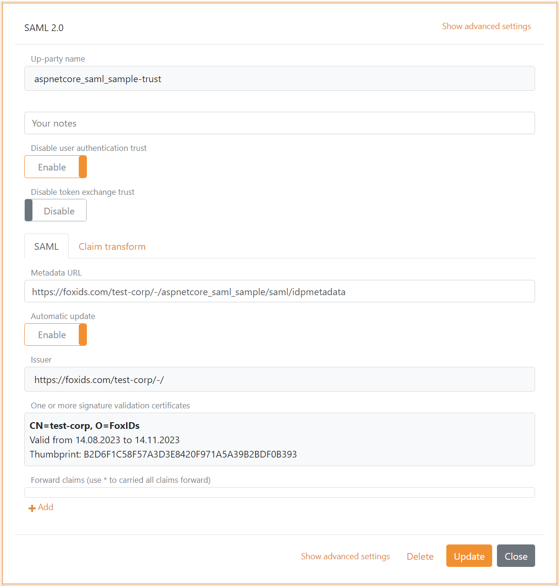
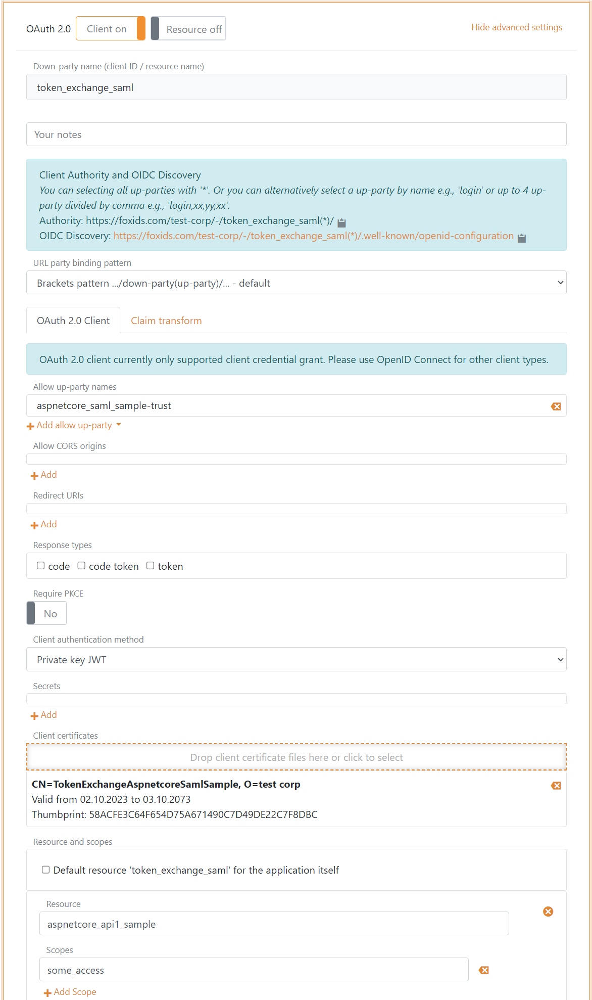

# Token exchange

FoxIDs support two different sceneries of token exchange: [token exchange in the same track](#token-exchange-in-the-same-track) and [token exchange by trust to external IdP/OP](#token-exchange-by-trust). 

In the same track it is possible to do token exchange of [access tokens](#access-token-to-access-token-in-the-same-track) between resources.

By external trust it is possible to do token exchange of external [access tokens](#access-token-to-access-token-by-trust) and [SAML 2.0 tokens](#saml-20-to-access-token-by-trust) to internal access tokens.

## Samples  

Token exchange is implemented in the following samples:

- [AspNetCoreOidcAuthCodeAllUpPartiesSample](samples.md#aspnetcoreoidcauthcodealluppartiessample), show token exchange from access token to access token insight a website backend
- [AspNetCoreSamlSample](samples.md#aspnetcoresamlsample), show token exchange from SAML 2.0 token to access token
- [AspNetCoreApi1Sample](samples.md#aspnetcoreapi1sample), show token exchange from access token to access token insight an API

## Down-party configuration

It is possible to configure if token exchange is allowed on the down-party OAuth 2.0 or OpenID Connect client. Likewise, it is possible to configure if client credentials grant should be allowed. 
Default both client credentials grant and token exchange is allowed on down-party OAuth 2.0 and OpenID Connect clients.  
Default the client is added as the token exchange actor, this behaviour can be disabled.

## Token exchange in the same track

It is possible to token exchange an [access token](#access-token-to-access-token-in-the-same-track) issued to a resource and thereby obtain an access token for another resource in the track.  
A down-party client is configured to handle the token exchange and to whitelist for which resources in the track, it is allowed to do a token exchange.

### Access token to Access token in the same track

Token exchange JWT access token to JWT access token' in the same track.

In this scenario an OpenID Connect client has obtained an access token after user authentication. The client could also be an OAuth 2.0 client using [client credentials grant](#client-credentials-grant).

The track includes two resources and the OpenID Connect client is allowed to call the first resource directly. On the first resource a client is configured allowing calling access tokens to be exchange to an access token' valid for the second resource.  
The flowing client on the first resource is configured with a certificate as client credentials.

During the token exchange sequence the claims transformations and limitations is executed on the down-party. 

The OpenID Connect client call the first resource with the obtained access token. The resources client does a token exchange call to FoxIDs authenticating the client and passing the access token while asking for an access token' to the second resource. 
If success, the resources client gets back an access token' and can now call the second resource with the access token'.

## Token exchange by trust

By external trust to IdP/OP it is possible to token exchange an [access token](#access-token-to-access-token-by-trust) or [SAML 2.0 token](#saml-20-to-access-token-by-trust) issued by an external party (or another FoxIDs track) and thereby obtain an access token for a resource in the track.  
A up-party trust is configured and a down-party client is configured to allow token exchange based on the up-party trust(s). The down-party client furthermore whitelists for which resources in the track, it is allowed to do a token exchange.

It is possible to configure if the up-party trust should be allowed for token exchange and user authentication. Default both is allowed on a OAuth 2.0, OpenID Connect and SAML 2.0 up-party trusts. 

### Access token to Access token by trust

Token exchange external JWT access token to internal JWT access token by external trust.

In this scenario an OpenID Connect client trust an external OpenID Provider (OP) / Identity Provider (IdP) and has obtained an access token after user authentication. The client could also be an OAuth 2.0 client using [client credentials grant](#client-credentials-grant) to obtain the external access token.

There is a resource in the track but the external defined OpenID Connect client is NOT allowed to call the resource directly.  
First an OAuth 2.0 or OpenID Connect up-party is configured to trust the external OpenID Provider (OP) / Identity Provider (IdP) and the SP issuer is configured to match the OpenID Connect client's audience.  
The flowing external trust example is a trust to another FoxIDs track.

Then an OAuth 2.0 down-party client is configured to accept external access tokens by the up-party trust. It is possible to have one or more up-party trusts.  
The flowing client is configured with a secret as client credentials.

It is thereby possible to token exchange an external access token to an internal access token valid for the resource.

During the token exchange sequence both the claims' transformations and limitations is executed firs on the up-party and then on the down-party. 

The OpenID Connect client backend application do a token exchange call to FoxIDs. Authenticating the internal OAuth 2.0 client and passing the external access token while asking for an access token to the resource. 
If success, the OpenID Connect client backend application get back an access token and can now call the resource.

### SAML 2.0 to Access token by trust

Token exchange external SAML 2.0 token to internal JWT access token by external trust.

In this scenario an SAML 2.0 application trust an external Identity Provider (IdP) and has obtained a SAML 2.0 token after user authentication. 

There is a resource in the track but the external defined SAML 2.0 application is NOT allowed to call the resource directly.  
First an SAML 2.0 up-party is configured to trust the Identity Provider (IdP) and the SP issuer is configured to match the SAML 2.0 applications audience. 

Then an OAuth 2.0 down-party client is configured to accept external SAML 2.0 tokens by the up-party trust. It is possible to have one or more up-party trusts.  
The flowing client is configured with a certificate as client credentials.

It is thereby possible to token exchange an external SAML 2.0 token to an internal access token valid for the resource.

During the token exchange sequence both the claims' transformations and limitations is executed firs on the up-party and then on the down-party. 

The SAML 2.0 backend application do a token exchange call to FoxIDs. Authenticating the internal OAuth 2.0 client and passing the external SAML 2.0 token while asking for an access token to the resource. 
If success, the SAML 2.0 backend application get back an access token and can now call the resource.

