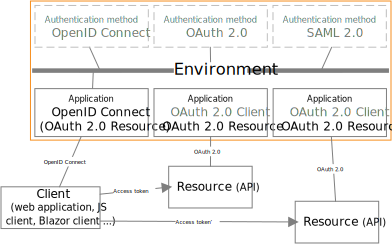
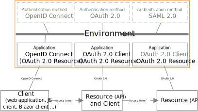
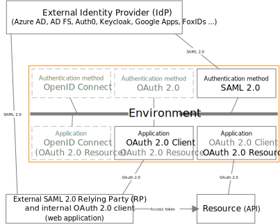

# Token exchange

FoxIDs support two different sceneries of token exchange: [token exchange in the same environment](#token-exchange-in-the-same-environment) and [token exchange by trust to external IdP/OP](#token-exchange-by-trust). 

In the same environment it is possible to do token exchange of access tokens in a [web application](#access-token-to-access-token-in-web-application) or [API/resource](#access-token-to-access-token-in-api) to another resource.

By external trust it is possible to do token exchange of external [access tokens](#access-token-to-access-token-by-trust) and [SAML 2.0 tokens](#saml-20-to-access-token-by-trust) to internal access tokens.

## Samples  

Token exchange is implemented in the following samples:

- [AspNetCoreOidcAuthCodeAllUpPartiesSample](samples.md#aspnetcoreoidcauthcodealluppartiessample), show token exchange from access token to access token insight a website backend
- [AspNetCoreSamlSample](samples.md#aspnetcoresamlsample), show token exchange from SAML 2.0 token to access token
- [AspNetCoreApi1Sample](samples.md#aspnetcoreapi1sample), show token exchange from access token to access token insight an API

> You can test token exchange with the [online web app sample](https://aspnetoidcsample.itfoxtec.com) ([sample docs](samples.md#aspnetcoreoidcauthcodealluppartiessample)) by clicking `Log in` and log in with an optional IdP. The click `Call API1 which call API2` or `Token Exchange + Call Api2` to call an API using token exchange.  
> Take a look at the sample configuration in FoxIDs Control: [https://control.foxids.com/test-corp](https://control.foxids.com/test-corp)  
> Get read access with the user `reader@foxids.com` and password `TestAccess!`  

## Application registration configuration

It is possible to configure if token exchange is allowed on the OAuth 2.0 application registration or OpenID Connect client. Likewise, it is possible to configure if client credentials grant should be allowed. 
Default both client credentials grant and token exchange is allowed on OAuth 2.0 application registration and OpenID Connect clients.  
Default the client is added as the token exchange actor, this behaviour can be disabled.


## Token exchange in the same environment

It is possible to token exchange an [access token](#access-token-to-access-token-in-the-same-environment) issued to a resource and thereby obtain an access token for another resource in the environment.  
A application registration client is configured to handle the token exchange and to whitelist for which resources in the environment, it is allowed to do a token exchange.

### Access Token to Access Token in web application

A web application token exchange JWT access token to JWT access token' in the same environment.

In this scenario an OpenID Connect client has obtained an access token after user authentication.  
The client could also be an OAuth 2.0 client using [client credentials grant](app-reg-oauth-2.0.md#client-credentials-grant).



The environment includes two resources and the OpenID Connect client is allowed to call both the first and second resource directly. To achieve lease privileges the OpenID Connect client only get an access token for the first resource after user authentication. 
And subsequently get an access token for the second resource when it's needed. 


The first access token is issued with a scope/audience for the OpenID Connect client and the client is thereby allowed to exchange the access tokens to an access token' valid for the second resource.  
The OpenID Connect client is configured with a secret as client credentials used both in the OpenID Connect communication and token exchange.

During the token exchange sequence the claims transformations and limitations is executed on the OpenID Connect application registration. 

The OpenID Connect client does a token exchange call to FoxIDs authenticating the client and passing the access token while asking (with a scope) for an access token' to the second resource. 
If success, the resource client gets back an access token' and can now call the second resource with the access token'.

Sample token exchange POST request to the token endpoint:

```plaintext 
POST https://foxids.com/test-corp/-/aspnet_oidc_allup_online_sample(*)/oauth/token HTTP/1.1
Host: foxids.com
Content-Type: application/x-www-form-urlencoded

client_id=aspnet_oidc_allup_sample
&client_secret=IxIruKswG4sQxzOrKlXR58strgZtoyZPG18J3FhzEXI
&grant_type=urn%3Aietf%3Aparams%3Aoauth%3Agrant-type%3Atoken-exchange
&scope=aspnetcore_api2_sample%3Asome_2_access
&subject_token=accVkjcJyb4...UC5PbRDqceLTC
&subject_token_type=urn%3Aietf%3Aparams%3Aoauth%3Atoken-type%3Aaccess_token
```

Sample token exchange JSON response:

```plaintext
HTTP/1.1 200 OK
Content-Type: application/json
Cache-Control: no-cache, no-store

{
    "access_token":"eyJhGcjlc...nNjb3IIWvmDCM",
    "issued_token_type": "urn:ietf:params:oauth:token-type:access_token",
    "token_type":"Bearer",
    "expires_in":600
}
```

Sample JWT access token' body:

```json
{
    "sub": "2f18c344-1204-4629-b992-215913b85c2b",
    "auth_time": "1699955593",
    "amr": "pwd",
    "email": "test1@foxids.com",
    "role": ["role1","role2"],
    "name": "Test 1 user",
    "act": "{\"sub\":\"c_aspnet_oidc_allup_sample\"}",
    "scope": "aspnetcore_api2_sample:some_2_access",
    "client_id": "aspnet_oidc_allup_sample",
    "nbf": 1699955534,
    "exp": 1699956194,
    "iat": 1699955594,
    "iss": "https://foxids.com/test-corp/-/",
    "aud": "aspnetcore_api2_sample"
}
```

### Access Token to Access Token in API

An API token exchange JWT access token to JWT access token' in the same environment.

In this scenario an OpenID Connect client has obtained an access token after user authentication.  
The client could also be an OAuth 2.0 client using [client credentials grant](app-reg-oauth-2.0.md#client-credentials-grant).



The environment includes two resources and the OpenID Connect client is allowed to call the first resource directly. The OpenID Connect client is NOT allowed to call the second resource directly. On the first resource a client is configured allowing access tokens with the client/resource audience to be exchange to an access token' valid for the second resource.  
The flowing client on the first resource is configured with a certificate as client credential.


During the token exchange sequence the claims transformations and limitations is executed on the application registration. 

The OpenID Connect client call the first resource with the obtained access token. The resource client does a token exchange call to FoxIDs authenticating the client and passing the access token while asking (with a scope) for an access token' to the second resource. 
If success, the resource client gets back an access token' and can now call the second resource with the access token'.

Sample token exchange POST request to the token endpoint:

```plaintext 
POST https://foxids.com/test-corp/-/aspnet_oidc_allup_online_sample(*)/oauth/token HTTP/1.1
Host: foxids.com
Content-Type: application/x-www-form-urlencoded

client_assertion_type=urn%3Aietf%3Aparams%3Aoauth%3Aclient-assertion-type%3Ajwt-bearer
&client_assertion=eyJhbGciOiI...kyX3NhbXBsZS
&grant_type=urn%3Aietf%3Aparams%3Aoauth%3Agrant-type%3Atoken-exchange
&scope=aspnetcore_api2_sample%3Asome_2_access
&subject_token=accVkjcJyb4...C5PbRDqceLTC
&subject_token_type=urn%3Aietf%3Aparams%3Aoauth%3Atoken-type%3Aaccess_token
```

Sample token exchange JSON response:

```plaintext 
HTTP/1.1 200 OK
Content-Type: application/json
Cache-Control: no-cache, no-store

{
    "access_token":"eyJhGcRwczov...nNjb3BlIjoi",
    "issued_token_type": "urn:ietf:params:oauth:token-type:access_token",
    "token_type":"Bearer",
    "expires_in":600
}
```

Sample JWT access token' body:

```json 
{
    "sub": "2f18c344-1204-4629-b992-215913b85c2b",
    "auth_time": "1699955841",
    "amr": "pwd",
    "act": "{\"sub\":\"c_aspnetcore_api1_sample\"}",
    "scope": "aspnetcore_api2_sample:some_2_access",
    "client_id": "aspnetcore_api1_sample",
    "nbf": 1699955786,
    "exp": 1699956446,
    "iat": 1699955846,
    "iss": "https://foxids.com/test-corp/-/",
    "aud": "aspnetcore_api2_sample"
}
```

## Token exchange by trust

By external trust to IdP/OP it is possible to token exchange an [access token](#access-token-to-access-token-by-trust) or [SAML 2.0 token](#saml-20-to-access-token-by-trust) issued by an external party (or another FoxIDs environment) and thereby obtain an access token for a resource in the environment.  
A authentication method trust is configured and a application registration client is configured to allow token exchange based on the authentication method trust(s). The application registration client furthermore whitelists for which resources in the environment, it is allowed to do a token exchange.

It is possible to configure if the authentication method trust should be allowed for token exchange and user authentication. Default both is allowed on a OAuth 2.0, OpenID Connect and SAML 2.0 authentication method trusts. 


### Access Token to Access Token by trust

Token exchange external JWT access token to internal JWT access token by external trust.

In this scenario an OpenID Connect client trust an external OpenID Provider (OP) / Identity Provider (IdP) and has obtained an access token after user authentication.  
The client could also be an OAuth 2.0 client using [client credentials grant](app-reg-oauth-2.0.md#client-credentials-grant) to obtain the external access token.


There is a resource in the environment but the external defined OpenID Connect client is NOT allowed to call the resource directly.  
First an OAuth 2.0 or OpenID Connect authentication method is configured to trust the external OpenID Provider (OP) / Identity Provider (IdP) and the SP issuer is configured to match the external OpenID Connect client's audience.  
The flowing external trust example is a trust to another FoxIDs environment.


Then an OAuth 2.0 application registration client is configured to accept external access tokens by the authentication method trust. It is possible to have one or more authentication method trusts.  
The flowing client is configured with a secret as client credentials.


It is thereby possible to token exchange an external access token to an internal access token valid for the resource.

During the token exchange sequence both the claims' transformations and limitations is executed firs on the authentication method and then on the application registration. 

The OpenID Connect client backend application do a token exchange call to FoxIDs. Authenticating the internal OAuth 2.0 client and passing the external access token while asking (with a scope) for an access token to the resource. 
If success, the OpenID Connect client backend application get back an access token and can now call the resource.

Sample token exchange POST request to the token endpoint:

```plaintext 
POST https://foxids.com/test-corp/-/aspnet_oidc_allup_online_sample(*)/oauth/token HTTP/1.1
Host: foxids.com
Content-Type: application/x-www-form-urlencoded

client_id=some_external_id
&client_secret=goOxwj8Kz...wUC-3CGs
&grant_type=urn%3Aietf%3Aparams%3Aoauth%3Agrant-type%3Atoken-exchange
&scope=aspnetcore_api2_sample%3Asome_2_access
&subject_token=accVkjcJyb4...UC5PbRDqceLTC
&subject_token_type=urn%3Aietf%3Aparams%3Aoauth%3Atoken-type%3Aaccess_token
```

Sample token exchange JSON response:

```plaintext
HTTP/1.1 200 OK
Content-Type: application/json
Cache-Control: no-cache, no-store

{
    "access_token":"eyJhGcjlc...nNjb3IIWvmDCM",
    "issued_token_type": "urn:ietf:params:oauth:token-type:access_token",
    "token_type":"Bearer",
    "expires_in":600
}
```

### SAML 2.0 to Access Token by trust

Token exchange external SAML 2.0 token to internal JWT access token by external trust.

In this scenario an SAML 2.0 application trust an external Identity Provider (IdP) and has obtained a SAML 2.0 token after user authentication. 



There is a resource in the environment but the external defined SAML 2.0 application is NOT allowed to call the resource directly.  
First an SAML 2.0 authentication method is configured to trust the Identity Provider (IdP) and the SP issuer is configured to match the external SAML 2.0 applications audience.  
The flowing external trust example is a trust to a FoxIDs SAML 2.0 application registration.


Then an OAuth 2.0 application registration client is configured to accept external SAML 2.0 tokens by the authentication method trust. It is possible to have one or more authentication method trusts.  
The flowing client is configured with a certificate as client credentials.


It is thereby possible to token exchange an external SAML 2.0 token to an internal access token valid for the resource.

During the token exchange sequence both the claims transformations and limitations is executed firs on the authentication method and then on the application registration. 

The SAML 2.0 backend application do a token exchange call to FoxIDs. Authenticating the internal OAuth 2.0 client and passing the external SAML 2.0 token while asking (with a scope) for an access token to the resource. 
If success, the SAML 2.0 backend application get back an access token and can now call the resource.

Sample token exchange POST request to the token endpoint:

```plaintext 
POST https://foxids.com/test-corp/-/aspnet_oidc_allup_online_sample(*)/oauth/token HTTP/1.1
Host: foxids.com
Content-Type: application/x-www-form-urlencoded

client_assertion_type=urn%3Aietf%3Aparams%3Aoauth%3Aclient-assertion-type%3Ajwt-bearer
&client_assertion=eyJhbGciOiI...kyX3NhbXBsZS
&grant_type=urn%3Aietf%3Aparams%3Aoauth%3Agrant-type%3Atoken-exchange
&scope=aspnetcore_api2_sample%3Asome_2_access
&subject_token=%3Csaml%3AAssertion%20xmlns%3Asaml...%3AAssertion%3E%0A
&subject_token_type=urn%3Aietf%3Aparams%3Aoauth%3Atoken-type%3Asaml2
```

Sample token exchange JSON response:

```plaintext 
HTTP/1.1 200 OK
Content-Type: application/json
Cache-Control: no-cache, no-store

{
    "access_token":"eyJhGcRwczov...nNjb3BlIjoi",
    "issued_token_type": "urn:ietf:params:oauth:token-type:access_token",
    "token_type":"Bearer",
    "expires_in":600
}
```