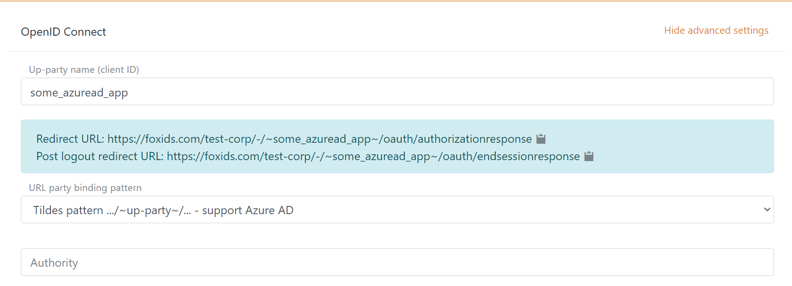

# Up-party - connect Azure AD with OpenID Connect

FoxIDs can be connected to Azure AD with OpenID Connect and thereby authenticating end users in a Azure AD tenant.

It is possible to connect both a [single tenant](#configure-single-tenant) and [multitenant](#configure-multitenant) Azure AD App as an up-party on FoxIDs using OpenID Connect. A more complex case is to [read claims form the access token](#read-claims-from-access-token).

> A sample multitenant Azure AD App which support personal accounts is configured in the FoxIDs `test-corp` with the up-party name `azuread_oidcpkce`.  
> You can test Azure AD login with the `AspNetCoreOidcAuthorizationCodeSample` [sample](samples.md) application by clicking `OIDC Azure AD Log in`.

## Configure single tenant

**1 - Start by creating an OpenID Connect up-party client in [FoxIDs Control Client](control.md#foxids-control-client)**

 1. Add the name
 2. Select show advanced settings
 3. Select tildes URL binding pattern

It is now possible to read the `Redirect URL` and `Post logout redirect URL`.

**2 - Then go to the Azure Portal and create the Azure AD App**

 1. Add the name
 2. Select single tenant
 3. (It is a Web application) Add the FoxIDs up-party `Redirect URL` 
 4. Click Register
 5. Copy the Application (client) ID
 6. Copy the Directory (tenant) ID
 7. Go to the Authentication tab and add the FoxIDs up-party `Post logout redirect URL` as `Front-channel logout URL`, click save
 8. Go to the Certificates & secrets tab and click New client secret and add the secret
 9. Copy the client secret value

**3 - Go back to the FoxIDs up-party client in [FoxIDs Control Client](control.md#foxids-control-client)**

 1. Add the authority, which is `https://login.microsoftonline.com/{Azure AD tenant ID}/v2.0`
 2. Add the profile and email scopes (possible other or more scopes)
 3. Add the Azure AD client ID as a custom SP client ID
 4. Add the Azure AD client secret value as the client secret
 5. Select use claims from ID token
 6. Add the claims which will be transferred from the up-party to the down-parties. E.g., preferred_username, email, name, given_name, family_name, oid, ipaddr and possible the access_token claim to transfer the Azure AD access token to down-parties
 7. Click create

That's it, you are done. 

> The new up-party can now be selected as an allowed up-party in a down-party.  
> The down-party can read the claims from the up-party. It is possible to add the access_token claim to include the Azure AD access token as a claim in the issued access token.

## Configure multitenant

The multitenant configuration differs slightly form the single tenant configuration.

**1 - The Azure AD Portal**

 1. During the App creation select multitenant

**2 - The FoxIDs up-party client in [FoxIDs Control Client](control.md#foxids-control-client)**

 1. Add the authority `https://login.microsoftonline.com/common/v2.0`
 2. Select edit issuer
 3. Change the issuer to `https://login.microsoftonline.com/{Azure AD tenant ID}/v2.0`, where you add the Azure AD tenant ID. You can possible add multiple issuers and thereby trust multiple Azure tenants

## Read claims from access token

If you want to read claims from the access token you need to add one more Azure AD App for a resource (API). Where the first Azure AD App is for a client.

**1 - In the Azure Portal**

1. Create the resource Azure AD App 
2. Expose a scope from the resource app and grant the client app the resource app scope

**2 - Then go to [FoxIDs Control Client](control.md#foxids-control-client)**

1. Add the resource app scope as a scope in the FoxIDs up-party client
2. Read claims from access token by not selecting to use claims from ID token

By during this the access token is issued by the same OP (IdP) and is thereby accepted.
