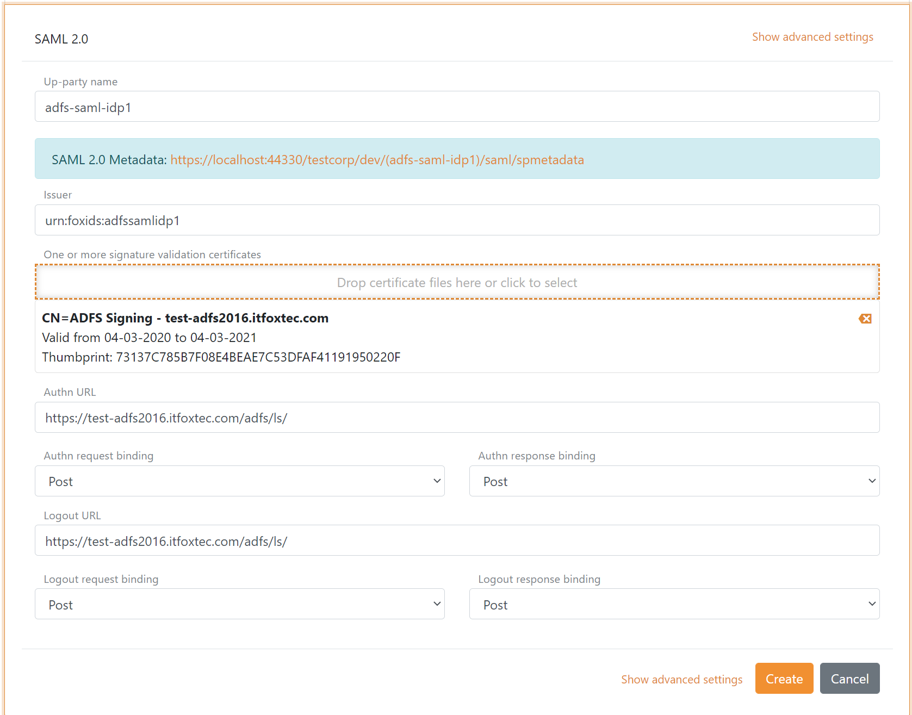

# Up-party - Connect AD SF with SAML 2.0

FoxIDs can be connected to AD FS with a [up-party SAML 2.0 Identity Provider (IdP)](up-party-saml-2.0.md). Where AD FS is a SAML 2.0 Identity Provider (IdP) and FoxIDs is acting as an SAML 2.0 Relying Party (RP).
 
Configuring AD FS as IdP using the following steps.

## 1) AD FS as a SAML 2.0 IdP on FoxIDs
First the AD FS SAML 2.0 IdP is configured in a FoxIDs track as an SAML 2.0 up-party through [FoxIDs Control](control.md). The IdP up-party can either be configured by adding the SAML 2.0 details or using the AD FS metadata `https://...adfs-domain.../federationmetadata/2007-06/federationmetadata.xml` *(future support)*.

**Recommended SAML 2.0 bindings**
- Authn request and response binding: Post
- Logout request and response binding: Post

Remark; The authn request redirect binding can result in a long query string which can cause problems I some devices.

## 2) FoxIDs as a SAML 2.0 RP on AD FS
After the AD FS SAML 2.0 up-party has been configured in a FoxIDs track a SAML 2.0 RP metadata is exposed, which can be used to configure FoxIDs as an RP on AD FS.

> FoxIDs SAML 2.0 RP metadata `https://foxids.com/tenant-x/track-y/(adfs-saml-idp1)/saml/spmetadata`  
> for 'tenant-x' and 'track-y' with the up-party name 'adfs-saml-idp1'

Alternatively, FoxIDs can be configured manually as an RP on the AD FS with the following properties:

- The public FoxIDs track ('tenant-x' and 'track-y') certificate
- Hash algorithm, default SHA-256
- The FoxIDs track identifier `https://foxids.com/tenant-x/track-y/` or another configured identifier
- Assertion consumer service endpoint `https://foxids.com/tenant-x/track-y/(adfs-saml-idp1)/saml/acs`
- Single logout (logout) service endpoint `https://foxids.com/tenant-x/track-y/(adfs-saml-idp1)/saml/singlelogout/`

## 3) AD FS issuances claims
It is recommended to add the NameID claim `http://schemas.xmlsoap.org/ws/2005/05/identity/claims/nameidentifier` (in AD FS called the NameIdentifier) to enable the SessionIndex. Without the NamID claim AD FS do not add the SessionIndex to the SAML token and it will therefore not be possible to do logout or single logout.

FoxIDs require AD FS to issue the users identity in either the NameID or at least one of the following claims:

- NameID `http://schemas.xmlsoap.org/ws/2005/05/identity/claims/nameidentifier`
- UPN `http://schemas.xmlsoap.org/ws/2005/05/identity/claims/upn`
- Email `http://schemas.xmlsoap.org/ws/2005/05/identity/claims/emailaddress`
- Name `http://schemas.xmlsoap.org/ws/2005/05/identity/claims/name`

