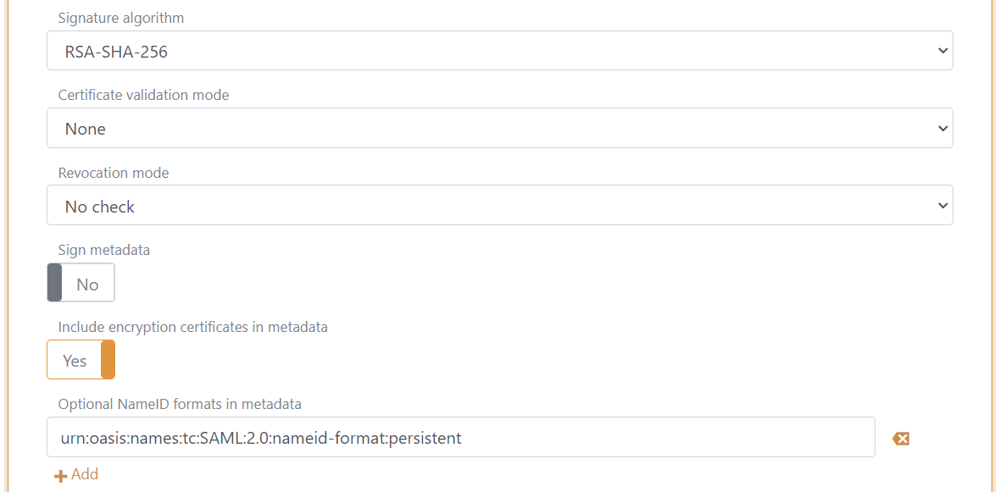
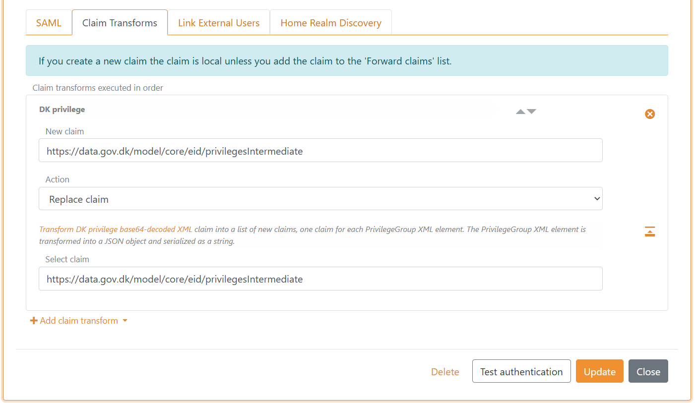

# Connect NemLog-in with SAML 2.0 up-party

You can connect FoxIDs to NemLog-in (Danish IdP) with a [SAML 2.0 up-party](up-party-saml-2.0.md) and let the users authenticate with MitID. NemLog-in is connected as a SAML 2.0 Identity Provider (IdP).

By configuring an [SAML 2.0 up-party](up-party-saml-2.0.md) and a [OpenID Conect down-party](down-party-oidc.md) FoxIDs become a bridge between SAML 2.0 and OpenID Connect. 
FoxIDs will then handle the SAML 2.0 connection as a Relying Party (RP) / Service Provider (SP) and you only need to care about OpenID Connect in your application. If needed, you can possibly select multiple up-parties from the same OpenID Connect down-party.

FoxIDs support NemLog-in and the SAML 2.0 based OIOSAML3 including single logout (SLO), logging, issuer naming, required OCES3 certificates and it is possible to support NSIS.

> You can test NemLog-in login with the [online web app sample](https://aspnetcoreoidcallupsample.itfoxtec.com) ([sample docs](samples.md#aspnetcoreoidcauthcodealluppartiessample)) by clicking `Log in` and then `Danish NemLog-in TEST` for the test environment or `Danish NemLog-in` for production.  
> The sample is configured with a separate track for the NemLog-in SAML 2.0 integration.  

NemLog-in documentation:
- The [NemLog-in development portal](https://tu.nemlog-in.dk/oprettelse-og-administration-af-tjenester/) with documentation
  - [test](https://tu.nemlog-in.dk/oprettelse-og-administration-af-tjenester/log-in/dokumentation-og-guides/integrationstestmiljo/), where you can find the NemLog-in IdP-metadata for test and get OCES3 test certificates
  - [production](https://tu.nemlog-in.dk/oprettelse-og-administration-af-tjenester/log-in/dokumentation-og-guides/produktionsmiljo/), where you can find the NemLog-in IdP-metadata for production
- Create OCES3 production certificate in the [certificate administration](https://erhvervsadministration.nemlog-in.dk/certificates) 
- The [NemLog-in administration portal](https://administration.nemlog-in.dk/) where you configure IT-systems
- Test environment
  - Create citizens test users in [MitID emulator](https://pp.mitid.dk/test-tool/frontend/#/create-identity) 
  - Create citizens and employee test users in [MitID simulator](https://mitidsimulator.test-nemlog-in.dk/Home/Create) (login with username and password)

> Transform the [DK privilege XML claim](claim-transform-dk-privilege.md) to a JSON claim.

## Consider separate track

NemLog-in requires the Relying Party (RP) to use a OSES3 certificate and [extensive logging](#logging). Therefore, consider connecting NemLog-in in a separate track where the OCES3 certificate and log level can be configured without affecting anything else.

    

You can connect two tracks in the same tenant with a [track link](howto-tracklink-foxids.md).

## Certificate

NemLog-in requires all requests (authn and logout) from the Relying Party (RP) to be signed. Furthermore, NemLog-in requires the RP to sign with a OCES3 certificate. It is not possible to use a certificate issued by another certificate authority, a self-signed certificate or a certificate issued by FoxIDs.

OCES3 test certificates are use in the test environment and OCES3 production certificates are used in production. An OCES3 certificate is valid for three years. After that, it must be updated manually.  
You will need separate FoxIDs tracks to handle the test and production environments respectively. The tracks can optionally be combined in an app track with [track links](howto-tracklink-foxids.md).

> If the `.P12` file fails to load in FoxIDs, you can convert it to a `.PFX` file with the [FoxIDs.ConvertCertificateTool](https://github.com/ITfoxtec/FoxIDs/tree/master/tools/FoxIDs.ConvertCertificateTool).

Add the `.P12` OCES3 certificate in [FoxIDs Control Client](control.md#foxids-control-client):
1. Select (or create) the track to be used for NemLog-in
2. Select the Certificates tab
3. Click the arrow down on the Swap certificate button and then in the Contained certificates section click Change container type

4. Then click on the primary certificate, then write the password and upload the `.P12` / `.PFX`  OCES3 certificate 

It is subsequently possible to add a secondary certificate and to swap between the primary and secondary certificates.

## Configuring NemLog-in 3 as Identity Provider (IdP)

> You need to [configure the OCES3 certificate](#certificate) before following this guide.

**1) - Start by creating an SAML 2.0 up-party in [FoxIDs Control Client](control.md#foxids-control-client)**

1. Select the Parties tab and then the Up-parties
2. Click Create up-party and then SAML 2.0
3. Add the name
4. Select show advanced settings
5. Select the dot URL binding pattern
6. Set the session lifetime to 1800 (30 minutes) in the Logout session tab
7. Go back to the SAML tab

8. Disable automatic update
9. Click Read metadata from file and select the NemLog-in IdP-metadata

10. Configure a custom SP issuer, the issuer can optionally start with `https://saml.`
    - The issuer in this example is `https://saml.foxids.com/test-corp/nemlogin-test/`
11. Remove the `*` and configure claims, the following claims is most often used:
    - `https://data.gov.dk/concept/core/nsis/loa`
    - `https://data.gov.dk/model/core/eid/cprNumber`
    - `https://data.gov.dk/model/core/eid/cprUuid`
    - `https://data.gov.dk/model/core/eid/email`
    - `https://data.gov.dk/model/core/eid/firstName`
    - `https://data.gov.dk/model/core/eid/lastName`
    - `https://data.gov.dk/model/core/eid/professional/cvr`
    - `https://data.gov.dk/model/core/eid/professional/orgName`
    - `https://data.gov.dk/model/core/eid/professional/rid`
    - `https://data.gov.dk/model/core/specVersion`
    - optionally include the privilege claim, see step 3)

 12. In production only! Set certificate validation mode to `Chain trust` (if the OCES3 certificate is global trusted) and revocation mode to `Online`
 13. Select to include the encryption certificate in metadata
 14. Set the NameID format in metadata to `urn:oasis:names:tc:SAML:2.0:nameid-format:persistent`

 

 15. Add an attribute consuming service in metadata and add the service name.
 16. Add all the claims configured in step 11 as requested attributes with the format `urn:oasis:names:tc:SAML:2.0:attrname-format:uri`. Optionally set each attribute as required.

 17. Add at least one technical contact person
 

 18. Click create
 19. Go to the top of the SAML 2.0 up-party
 20. Download the SAML 2.0 up-party SP-metadata, in this case https://foxids.com/test-corp/nemlogin-test/.nemlogin./saml/spmetadata. 
 21. The SP-metadata file is used to configure the NemLog-in IT system.
 
 **2) - Then go to the [NemLog-in adminstration protal](https://administration.nemlog-in.dk/)**

First you need to create an NemLog-in IT-system or have someone else creating an NemLog-in IT-system and assign you access.

1. Select the IT-system
2. Click upload metadata file and upload the SAML 2.0 up-party SP-metadata file
3. Go back to the IT-system
4. Click the button Save the technical details
5. Click Provision to integrationtest and then click Apply for integration test

> To configure production you need to upload a test report, have it approved and then repeat the FoxIDs and NemLog-in configuration.

 **3) - Optionally - add privilege claim transformation in [FoxIDs Control Client](control.md#foxids-control-client)**

*Optionally, if you are using the privilege claim.*

FoxIDs can transform the [DK privilege XML claim](claim-transform-dk-privilege.md) to a JSON claim. It is recommended to add the transformation in order to obtain smaller claims and tokens. 
Furthermore, it makes the tokens readable.

1. Add the DK privilege claim transformer. 
2. Remove the original privilege claim from the claims pipeline.

 **4 - Add SAML 2.0 claim to JWT claim mappings in [FoxIDs Control Client](control.md#foxids-control-client)**

 FoxIDs internally converts SAML 2.0 clams to JWT claims. NemLog-in / OIOSAML3 defines a set of SAML 2.0 claims where JWT mappings need to be added.

 1. Go to the Settings tab and Claim mappings
 2. Add mappings for all the claims configured in step 1.11, optionally also include mapping for the privilege claim, you can create you own short JWT claim names
 3. Click update

The SAML 2.0 up-party can now be used as an up-party for down-parties in the track.

## Logging

NemLog-in requires requests and responses to be logged including the signature proof and stored for half a year (180 days). It is also required to log which identity has login and logout of which session, at what time and the IP address.  
[FoxIDs default log](logging.md) errors and events including the time and the IP address.

> With an Enterprise plan on [FoxIDs.com](https://www.foxids.com) log data is stored for 180 days.

It can be configured which logs should be logged to the Application Insights which is part of the FoxIDs installation or to an external repository with a [log stream](logging.md#log-stream).

The log level NemLog-in require is configured in the FoxIDs log settings:

 1. Enable `log info trace`
 2. Enable `log claims trace`
 3. Enable `log message trace`
 4. Click update

## Request authentication context

You can request a desired NSIS assurance level as an authn context class reference.

Possible NSIS assurance levels:
 - `https://data.gov.dk/concept/core/nsis/loa/Low`
 - `https://data.gov.dk/concept/core/nsis/loa/Substantial`
 - `https://data.gov.dk/concept/core/nsis/loa/High`

You can likewise specify ID type as an authn context class reference.

Possible ID types:
 - `https://data.gov.dk/eid/Person`
 - `https://data.gov.dk/eid/Professional`

And possible credential types:
 - `https://nemlogin.dk/internal/credential/type/nemidkeycard`
 - `https://nemlogin.dk/internal/credential/type/nemidkeyfile`
 - `https://nemlogin.dk/internal/credential/type/mitid`
 - `https://nemlogin.dk/internal/credential/type/local`
 - `https://nemlogin.dk/internal/credential/type/test`

In the case you need to provide different sets of authn context class references. You need to create multiple SAML 2.0 up-parties connected to NemLog-in as different IT systems.  
E.g., if you need to support step-up authentication. Then you would create one SAML 2.0 up-party with authn context class reference `https://data.gov.dk/concept/core/nsis/loa/Substantial` and another SAML 2.0 up-party with authn context class reference `https://data.gov.dk/concept/core/nsis/loa/High`.