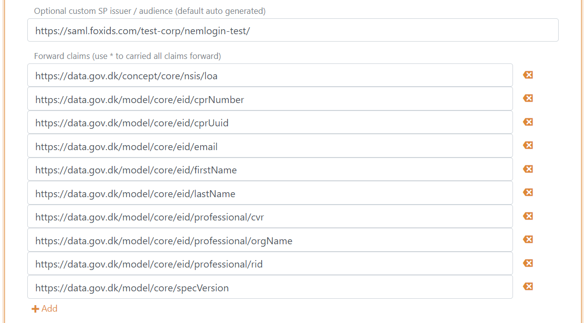

# Up-party - Connect NemLog-in with SAML 2.0

FoxIDs can be connected to NemLog-in (Danish IdP) with a [up-party SAML 2.0](up-party-saml-2.0.md). Where NemLog-in is a SAML 2.0 Identity Provider and FoxIDs is acting as an SAML 2.0 Relying Party (RP) / Service Provider (SP).

> NemLog-in give your users access to authenticate with MitID.

NemLog-in (currently called NemLog-in3) is a Danish Identity Provider (IdP) which uses the SAML 2.0 based OIOSAML 3. FoxIDs support NemLog-in / OIOSAML 3 including logging, issuer naming, required certificates and it is possible to support NSIS.

NemLog-in documentation and configuration:
- The [NemLog-in development portal](https://tu.nemlog-in.dk/oprettelse-og-administration-af-tjenester/) with documentation
  - [test](https://tu.nemlog-in.dk/oprettelse-og-administration-af-tjenester/log-in/dokumentation-og-guides/integrationstestmiljo/), where you can find the NemLog-in IdP-metadata for test and FOCES2 / OCES3 test certificates
  - [production](https://tu.nemlog-in.dk/oprettelse-og-administration-af-tjenester/log-in/dokumentation-og-guides/produktionsmiljo/), where you can find the NemLog-in IdP-metadata for production
- The [NemLog-in administration portal](https://administration.nemlog-in.dk/) where you configure IT-systems
- Test environment
  - Create citizens test users in [MitID emulator](https://pp.mitid.dk/test-tool/frontend/#/create-identity) 
  - Create citizens and employee test users in [MitID simulator](https://mitidsimulator.test-nemlog-in.dk/Home/Create) (login with username and password)
  - OCES3 certificate - [create an organization](https://testportal.test-devtest4-nemlog-in.dk/TU) and [create OCES3 certificates](https://erhvervsadministration.devtest4-nemlog-in.dk/certificates)

> A sample showing the NemLog-in integrations is configured in the FoxIDs `test-corp` with the up-party name `nemlogin_oidc`. The configuration uses a separate track where the NemLog-in integrations is configured and converted from SAMl 2.0 to OpenId Connect.  
> You can test NemLog-in login with the `AspNetCoreOidcAuthorizationCodeSample` [sample](samples.md#aspnetcoreoidcauthorizationcodesample) application by clicking `OIDC NemLog-in Log in` or by clicking `Log in` and then `Danish NemLog-in`.

## Consider separate track

NemLog-in requires the Relying Party (RP) to use a OSES certificate and a high level of logging. Therefore, consider connecting NemLog-in in a separate track where the OCES certificate and log level can be configured without affecting any other configuration.

Two FoxIDs tracks can be connected with OpenID Connect. Please see the [connect FoxIDs with OpenID Connect](up-party-howto-oidc-foxids.md) guide. The track with a up-party connected to NemLog-in is called the parallel FoxIDs track in the guide.

## Certificate

NemLog-in requires all requests (authn and logout) from the Relying Party (RP) to be signed. Furthermore, NemLog-in requires the RP to sign with a OCES certificate. It is not possible to use a certificate issued by another certificate authority, a self-signed certificate or a certificate issued by FoxIDs.

An OCES certificate is valid for three years. After that, it must be updated manually.

Add the `.P12` OCES certificate in [FoxIDs Control Client](control.md#foxids-control-client):
1. Select (or create) the track to be used for NemLog-in
2. Select the Certificates tab
3. Click the arrow down on the Swap certificate button and then in the Contained certificates section click Change container type

4. Then click on the primary certificate, then write the password and upload the `.P12` OCES certificate 

It is subsequently possible to add a secondary certificate and to swap between the primary and secondary certificates.

## Configuring NemLog-in 3 as Identity Provider (IdP)

> You need to [configure the OCES certificate](#certificate) before following this configuration.

**1 - Start by creating an SAML 2.0 up-party in [FoxIDs Control Client](control.md#foxids-control-client)**

1. Select the Parties tab and then the Up-parties
2. Click Create up-party and then SMAL 2.0
3. Add the name
4. Select show advanced settings
5. Select the dot URL binding pattern
6. Set the session lifetime to 1800 (30 minutes) in the Logout session tab
7. Go back to the SAML tab

8. Disable automatic update
9. Click Read metadata from file and select the NemLog-in IdP-metadata

10. Configure a custom SP issuer, the issuer is required to start with `https://saml.`
    - The issuer in this example `https://saml.foxids.com/test-corp/nemlogin-test/`
11. Remove the `*` and configure claims, the following claims is most often used:
    - `https://data.gov.dk/concept/core/nsis/loa`
    - `https://data.gov.dk/model/core/eid/cprUuid`
    - `https://data.gov.dk/model/core/eid/email`
    - `https://data.gov.dk/model/core/eid/firstName`
    - `https://data.gov.dk/model/core/eid/lastName`
    - `https://data.gov.dk/model/core/eid/professional/cvr`
    - `https://data.gov.dk/model/core/eid/professional/orgName`
    - `https://data.gov.dk/model/core/eid/professional/rid`
    - `https://data.gov.dk/model/core/specVersion`

 12. In production only! Set certificate validation mode to `Chain trust` and revocation mode to `Online`
 13. Select to include the encryption certificate in metadata
 14. Set the NameID format in metadata to `urn:oasis:names:tc:SAML:2.0:nameid-format:persistent`

 

 15. Add an attribute consuming service in metadata and add the service name.
 16. Add all the claims configured in step 11 as requested attributes with the format `urn:oasis:names:tc:SAML:2.0:attrname-format:uri`. Optionally set each attribute as required.

 17. Add at least one technical contact person
 

 18. Click create
 19. Go to the top of the SAML 2.0 up-party
 20. Download the SAML 2.0 up-party SP-metadata, in this case https://foxids.com/test-corp/nemlogin-test/.nemlogin./saml/spmetadata. 
 21. The SP-metadata file is used to configure the NemLog-in IT system.
 
 **2 - Then go to the [NemLog-in adminstration protal](https://administration.nemlog-in.dk/)**

 > You need to create an NemLog-in IT-system or have someone else creating an NemLog-in IT-system and assign you access.

1. Select the IT-system
2. Click upload metadata file and upload the SAML 2.0 up-party SP-metadata file
3. Go back to the IT-system
4. Click the button Save the technical details
5. Click Provision to integrationtest and then click Apply for integration test

 **3 - Optionally - add privilege claim transformation in [FoxIDs Control Client](control.md#foxids-control-client)**

*Optionally, if you are using the privilege claim.*

FoxIDs can transforms the [DK privilege XML claim](claim-transform-dk-privilege.md) to a JSON claim. It is recommended to add the transformation in order to obtain smaller claims and tokens.  
Furthermore, it makes the tokens readable.

1. Set the privilege claim depending of the Context Handler version. 
2. Remove the original privilege claim from the claims pipeline.

 **4 - Add SAML 2.0 claim to JWT claim mappings in [FoxIDs Control Client](control.md#foxids-control-client)**

 FoxIDs internally converts SAML 2.0 clams to JWT claims. NemLog-in / OIOSAML 3 defines a set of SAML 2.0 claims where JWT mappings need to be added.

 1. Go to Settings tab and Claim mappings
 2. Add mappings for all the claims configured in step 1.11, you can create you own short JWT claim names if no standard name exist
 3. Click update

You are done. The SAML 2.0 up-party can now be used as an up-party for down-parties in the track.

> A down-party will only issue added claims.  
> Therefore, remember to add the JWT claims to OpenID Connect down-parties.

See [Consider separate track](#consider-separate-track) on how to connect the NemLog-in track.

## Logging

NemLog-in requires requests and responses to be logged including the signature proof and stored for half a year (180 days). It is also required to log which identity have done login and logout of which session, at what time and the IP address.  
[FoxIDs default log](logging.md) errors and events including the time and the IP address.

> FoxIDs.com stores log data between 90 days to 180 days depending on the selected plan.

It can be configured which logs should be logged to the Application Insights which is part of the FoxIDs installation or to an external repository with a [log stream](logging.md#log-stream).

The log level NemLog-in require is configured in the FoxIDs log settings:

 1. Enable `log info trace`
 2. Enable `log claims trace`
 3. Enable `log message trace`
 4. Click update

## Request authentication context

You can request a desired NSIS assurance level as an authn context class reference.

Possible NSIS assurance levels:
 - `https://data.gov.dk/concept/core/nsis/loa/Low`
 - `https://data.gov.dk/concept/core/nsis/loa/Substantial`
 - `https://data.gov.dk/concept/core/nsis/loa/High`

You can likewise specify ID type as an authn context class reference.

Possible ID types:
 - `https://data.gov.dk/eid/Person`
 - `https://data.gov.dk/eid/Professional`

And possible credential types:
 - `https://nemlogin.dk/internal/credential/type/nemidkeycard`
 - `https://nemlogin.dk/internal/credential/type/nemidkeyfile`
 - `https://nemlogin.dk/internal/credential/type/mitid`
 - `https://nemlogin.dk/internal/credential/type/local`
 - `https://nemlogin.dk/internal/credential/type/test`

In the case you need to provide different sets of authn context class references. You need to create multiple SAML 2.0 up-parties connected to NemLog-in as different IT systems.  
E.g., if you need to support step-up authentication. Then you would create one SAML 2.0 up-party with authn context class reference `https://data.gov.dk/concept/core/nsis/loa/Substantial` and another SAML 2.0 up-party with authn context class reference `https://data.gov.dk/concept/core/nsis/loa/High`.