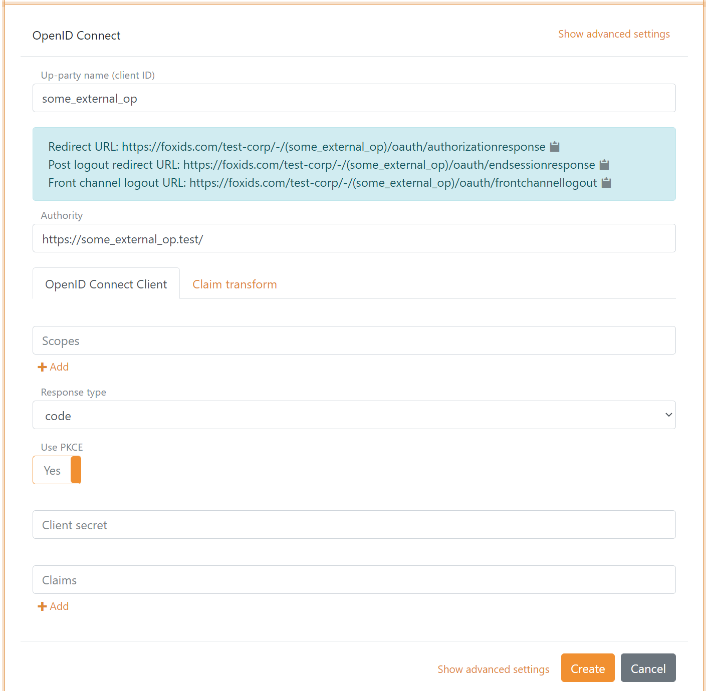

# Up-party - OpenID Connect

FoxIDs up-party [OpenID Connect](#openid-connect) client which trust an external OpenID Provider (OP) / Identity Provider (IdP).

How to guides:

- Connect [Azure AD](up-party-howto-oidc-azure-ad.md) 
- Connect [IdentityServer](up-party-howto-oidc-identityserver.md)

## OpenID Connect
An external OpenID Provider (OP) can be connected to a FoxIDs up-party OpenID Connect.

The following screen shot show the FoxIDs up-party configuration available in [FoxIDs Control Client](control.md#foxids-control-client).

The external OP is configured as an authority. FoxIDs automatically calls the OpenID Configuration endpoint (`.well-known/openid-configuration`) on create. You can see the added configuration by opening the up-party again.

FoxIDs automatically read future updates. If the endpoint become unavailable for a period of time FoxIDs will stop the automated update process. It can be restarted by doing an up-party update in [FoxIDs Control Client](control.md#foxids-control-client) or [API](control.md#foxids-control-api).

> FoxIDs Control Client only support creating automatic updated up-parties using the OpenID Configuration endpoint. [FoxIDs Control API](control.md#foxids-control-api) support both automatic and manually updated up-parties. In manual you can specify all values and the OpenID Configuration endpoint (`.well-known/openid-configuration`) will not be called.

Default the up-party is configured for Authorization Code Flow, to use PKCE and read claim from the external access token. These settings can be changed.

The scopes the FoxIDs up-party should send in the request to the external OP can be configured. E.g, `profile` or `email`.

The up-party only transfer default claims and configured claim to the down-partis. 

Default transferred claims are `sub`, `sid`, `acr` and `amr`.

FoxIDs default use the brackets party pattern `.../(up-party)/...`. If not supported by the external OP (e.g., like Azure AD), the pattern can be changed to the tildes party pattern `.../~up-party~/...` or dot party pattern `.../.up-party./...`.

If necessary, a custom client ID can be configured, otherwise the up-party name is used as the client ID.

Optionally the issuer can be changed. Otherwise read from the OpenID Configuration endpoint. Furthermore, multiple issuers can be configured to trust tokens form multiple issuers signed with the same key (often used with Azure AD).
