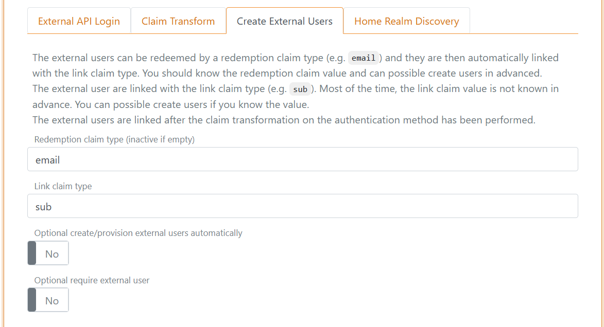

# External users
An external user is linked to one authentication method and can only be authenticated with that particular authentication method. External users can be linked to the authentication methods: OpenID Connect, SAML 2.0, External Login and Environment Link.  
It is optional to use external users, they are not created by default.

All external user grouped under an authentication method is linked with the same claim type (e.g. the `sub` claim type) and the users are separated by unique claim values.

> With external users you can store claims on each user. E.g. store the your user ID claim representing the user in your system and thereby mapping the external user ID to your user ID. 

An automatically generated unique ID is added to each external user by default.

For an overview of user concepts (internal users, external users and external user stores) see the [users overview](users.md).

## Create external user
Depending on the selected authentication method's configuration, new users is optionally asked to fill out a form to create a user.

The page is composed by dynamic elements which can be customised per authentication method.  
In this example the create user page is composed by three elements; Email, Given name and Family name, ordered with the Email element at the top.

This is the configuration in a [OpenID Connect](auth-method-oidc.md) authentication method.

[Claim transformations](claim-transform) can be added which are performed just before the external user is created.

> If the login sequence is started base on a [login](login.md) authentication method, it provides the basis for the UI look and feel ([customize](customisation.md)). Otherwise, the default [login](login.md) authentication method is selected as the base.

## Provision and redeem
External users can be created, changed and deleted with the [Control Client](control.md#foxids-control-client) or be provisioned through the [Control API](control.md#foxids-control-api).

You probably do not know the link claim value in advanced because it is an external user ID. But if you do, it is possible to create users and associate them with the link claim value. Most often, you will know a redemption claim in advanced instead.

The external users can be redeemed by a redemption claim type (e.g. `email`) and they are then automatically linked with the link claim type. 
It is bad practice to link users based on there email over a long period of time, as emails can change. But the email is unlikely to change within the short redemption period.

Once the user has been redeemed, the external user is subsequently logged in based on the link claim value.

This authentication method is configured with `email` claim redemption and `sub` link claim type.

And user's is added with their known email as the redemption claim value.

In this example the user is connected to Google Workspace with an OpenID Connect authentication method and a `app_user_id` claim is added with an internal user ID.

> You can reset a redeemed user by deleting the link claim value and, if necessary, also changing the redemption claim value. The external user is then redeemed again next time the user logs in.
