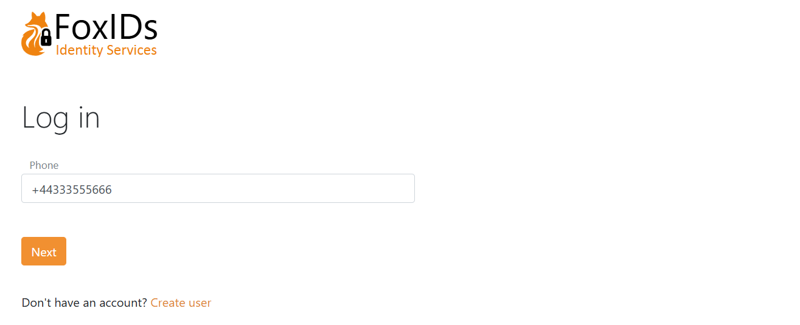
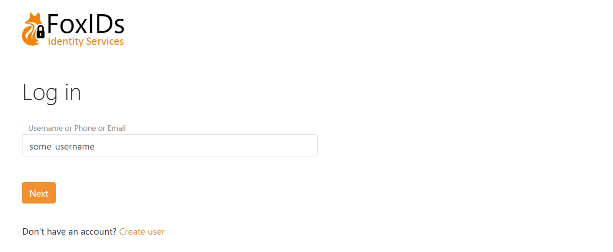
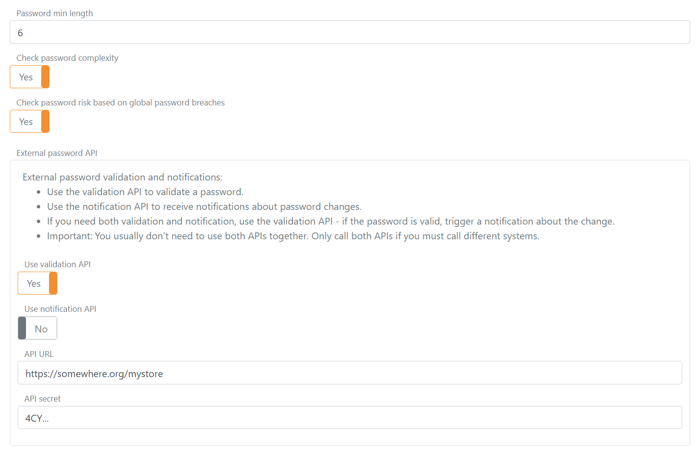
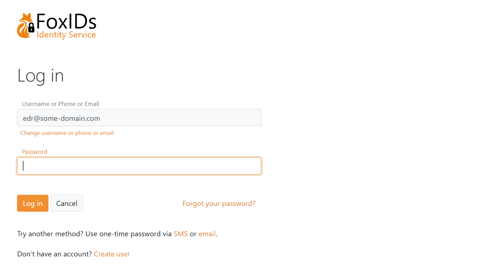
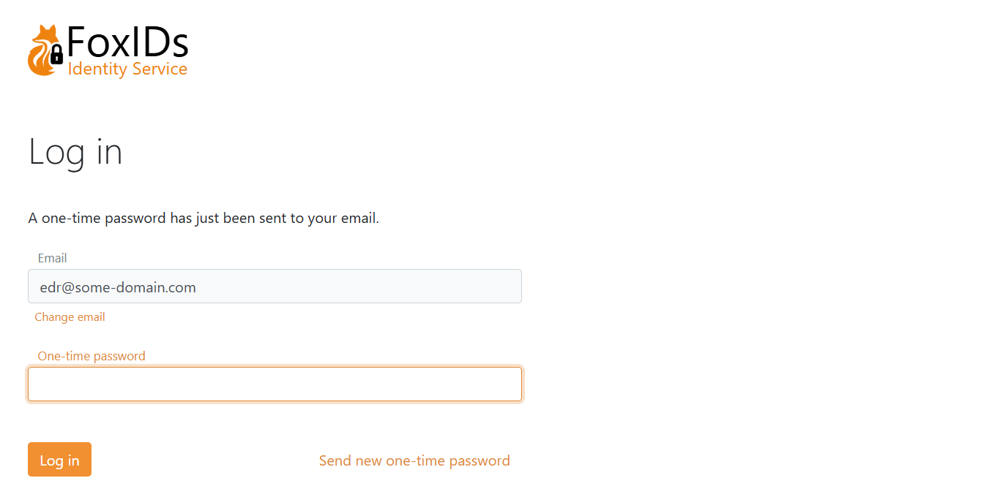
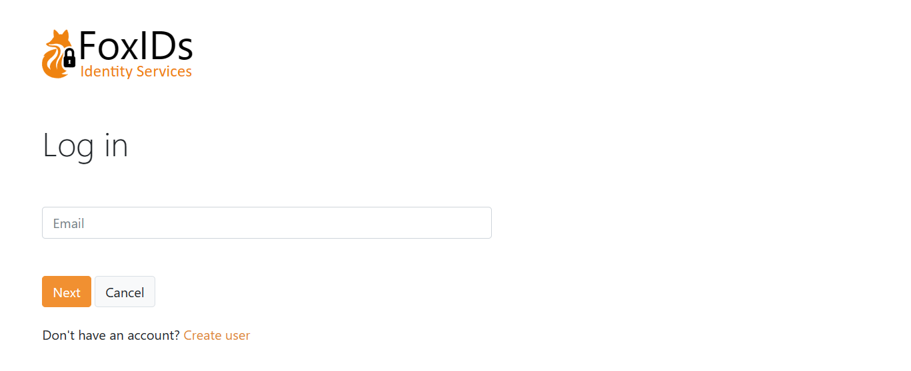
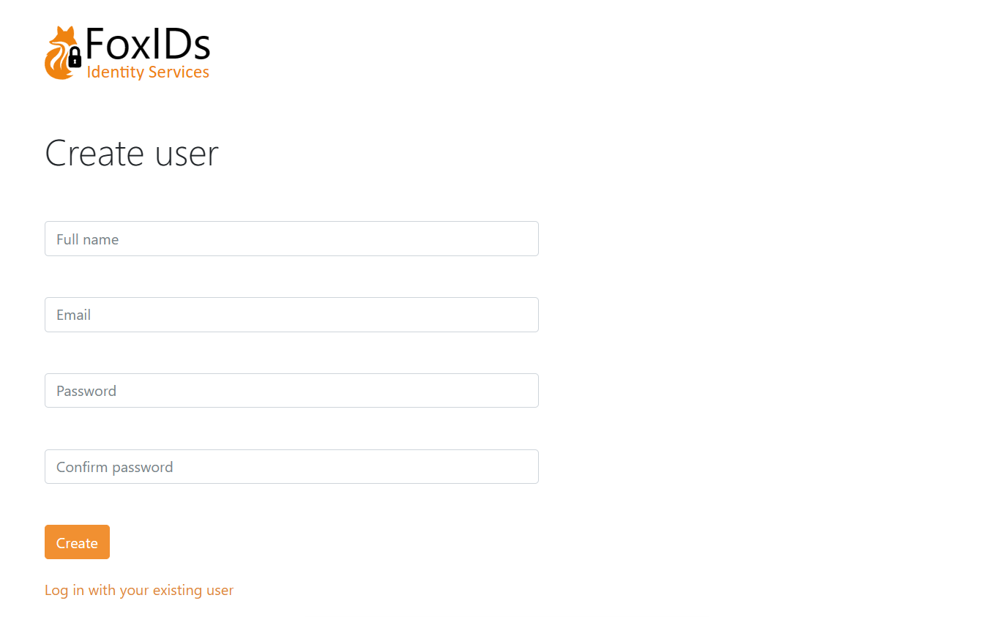
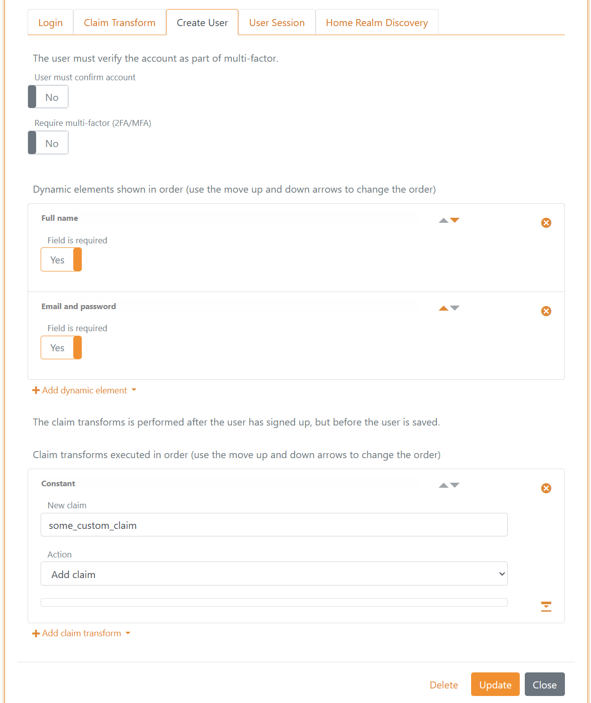

# Internal users
Internal users can be authenticated in one or more [login](login.md) authentication methods in an environment, making it possible to [customise](customisation.md) the login experience, e.g. depending on different [application](connections.md#application-registration) requirements.

> [Upload your users](users-upload.md) from a CSV file, with or without a password.

For an overview of user concepts (internal users, external users and external user stores) see the [users overview](users.md).

## User identifiers
Internal users support three user identifiers: email, phone number and username. These identifiers form the credential (username part) when a user signs in with username and password.  
You can choose to enable one, two, or all three.

Only phone number as a user identifier.  

Email, phone number and username as user identifiers.  

## Password check

Internal users can be authenticated with a password. The password is checked against the built‑in password policy and optionally an [external password API](external-password-api.md). 

The password policy is configured in the environment settings in the [FoxIDs Control Client](control.md#foxids-control-client).

1. Select the **Settings** tab
2. And subsequently select the **Environment** tab
3. Set the **Password min length** to the minimum required password length, e.g. `6` for 6 characters
4. Select **Check password complexity** to enforce a mix of character classes (upper / lower / digit / symbol) and not containing parts of the URL or user identifier (email, phone, username). Exact rules can evolve.
5. Select **Check password risk based on global password breaches** to reject passwords found in the global risk password lists. Exact list will evolve. (self-hosted see [risk Passwords](risk-passwords.md)).  
6. Configure [external password API](external-password-api.md)   
   
7. Click **Update**

If the built-in password policy rejects the password, the external password API is not called. The external password API's notification method is only called if the password has passed all configured policy checks.

## Password or one-time password
The [login](login.md) authentication method is by default configured for username (user identifier) + password.  
You can additionally enable one-time password (OTP) via email and/or SMS, and you can create multiple [login](login.md) authentication methods with different combinations.

If both password and OTP are enabled, all enabled methods are offered. The UI also allows self‑service account creation.  

If only OTP via email is enabled:  

## Create user
Depending on the selected [login](login.md) method configuration, users can create an account online.

User chooses to create a new account on the login page.  

Form to create a user.  

The page is composed of dynamic elements which can be customised per [login](login.md) method.  
In this example the form contains Given name, Family name, Email and Password fields.  
The Email field is a user identifier used for login.

This is the configuration in the [login](login.md) method. In addition, the claim `some_custom_claim` is added to each user as a constant via a [claim transformation](claim-transform).  

## Provisioning
Internal users can be created, updated, and deleted in the [Control Client](control.md#foxids-control-client) or provisioned via the [Control API](control.md#foxids-control-api).  

## Multi-factor authentication (MFA)
Two-factor / multi-factor authentication can be required per user. A user must then authenticate with an additional factor (SMS, email or authenticator app) and can register an authenticator app if not already registered.

Which second factors are available can be configured per user and per login method. See [two-factor authentication](login.md#two-factor-authentication-2famfa).  
You can see if an authenticator app is registered and an administrator can deactivate it.  

## Password hash
Only a password hash is stored.

The hashing subsystem supports evolution: hash metadata (algorithm + parameters) is stored with each hash, allowing validation of old hashes while new hashes use newer algorithms / parameters.

Currently supported hash algorithm `P2HS512:10` (definition):
- HMAC (`RFC 2104`) with SHA‑512 (`FIPS 180-4`)
- 10 iterations
- Salt length: 64 bytes
- Derived key length: 80 bytes

Standard .NET libraries are used to compute the hash.
