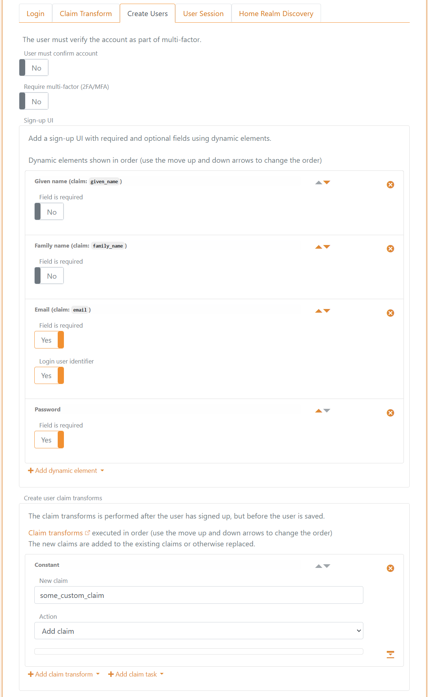

<!--
{
    "title":  "Internal users",
    "description":  "Internal users can be authenticated in one or more login authentication methods in an environment, making it possible to customise the login experience, e.g. depending on different application requirements.",
    "ogTitle":  "Internal users",
    "ogDescription":  "Internal users can be authenticated in one or more login authentication methods in an environment, making it possible to customise the login experience, e.g. depending on different application requirements.",
    "ogType":  "article",
    "ogImage":  "/images/foxids_logo.png",
    "twitterCard":  "summary_large_image",
    "additionalMeta":  {
                           "keywords":  "users internal, FoxIDs docs"
                       }
}
-->

# Internal users
Internal users can be authenticated in one or more [login](login.md) authentication methods in an environment, making it possible to [customise](customisation.md) the login experience, e.g. depending on different [application](connections.md#application-registration) requirements.

> [Upload your users](users-upload.md) from a CSV file, with or without a password.

For an overview of user concepts (internal users, external users and external user stores) see the [users overview](users.md).

## User identifiers
Internal users support three user identifiers: email, phone number and username. These identifiers form the credential (username part) when a user signs in with username and password.  
You can choose to enable one, two, or all three.

Only phone number as a user identifier.  

Email, phone number and username as user identifiers.  

## Password check

Internal users can be authenticated with a password. The password is checked against the built-in password policy (default or policy group) and optionally an [external password API](external-password-api.md).

### Built-in password policy and aging

The default password policy is configured in the environment settings in the [FoxIDs Control Client](control.md#foxids-control-client) and applies when no password policy group is assigned to the user.

1. Select the **Settings** tab
2. And subsequently select the **Environment** tab
3. Find the **Password settings** section
4. Configure the **Default password policy** box:
   - **Password min length** and **Password max length** to define the allowed range.
   - **Check password complexity** to enforce character class variety and ensure the password does not contain parts of the URL or user identifiers (email, phone, username).
   - **Check password risk based on global password breaches** to reject passwords found on risk lists (self-hosted see [risk Passwords](risk-passwords.md)).
   - **Banned characters (case-insensitive)** to block specific characters.
   - **Password history (number of previous passwords, 0 to disable)** to prevent reuse of recent passwords.
   - **Password max age in seconds (0 to disable)** to force a change when a password gets too old.
   - **Soft password change in seconds (0 to disable)** to allow a grace period: during login a non-compliant or expired password prompts the user to change it but can still sign in until the window expires.
5. Click **Update**

### Password policy groups

You can define up to 10 password policy groups per environment. A group overrides the default password policy for the users it is assigned to.

1. Select the **Settings** tab
2. And subsequently select the **Environment** tab
3. Find the **Password settings** section
4. Configure the **Password policy groups** box:
   - Click **Add policy group** and set the policy values (same fields as the default policy) plus a name and an optional display name.
5. Click **Update**
4. Apply a group to a user in **Internal Users** -> edit the user -> **Advanced** -> **Password policy**, or set the password policy name when provisioning via the Control API. If no group is selected, the default environment policy is used.

### External password API

You can optionally configure an [external password API](external-password-api.md) to validate passwords and/or notify about password changes.

If the built-in password policy rejects the password, the external password API is not called. The external password API's notification method is only called if the password has passed all configured policy checks.

## Password or one-time password (passwordless)
The [login](login.md) authentication method is by default configured for username (user identifier) + password.  
You can additionally enable one-time password (OTP) via email and/or SMS for passwordless sign-in, and you can create multiple [login](login.md) authentication methods with different combinations.

If both password and OTP are enabled, all enabled methods are offered. The UI also allows self-service account creation.  

If only OTP via email is enabled:  

## Create user
Depending on the selected [login](login.md) method configuration, users can create an account online.

User chooses to create a new account on the login page.  

Form to create a user.  

The page is composed of dynamic elements which can be customised per [login](login.md) method.  
In this example the form contains Given name, Family name, Email and Password fields.  
The Email field is a user identifier used for login.

This is the configuration in the [login](login.md) method. In addition, the claim `some_custom_claim` is added to each user as a constant via a [claim transformation](claim-transform).  

## Provisioning
Internal users can be created, updated, and deleted in the [Control Client](control.md#foxids-control-client) or provisioned via the [Control API](control.md#foxids-control-api). And [upload many users](users-upload.md) from a CSV file. 

## Multi-factor authentication (MFA)
Two-factor / multi-factor authentication can be required per user. A user must then authenticate with an additional factor (SMS, email or authenticator app) and can register an authenticator app if not already registered.

Which second factors are available can be configured per user and per login method. See [two-factor authentication](login.md#two-factor-authentication-2famfa).  
You can see if an authenticator app is registered and an administrator can deactivate it.  

## Password hash
Only a password hash is stored.

The hashing subsystem supports evolution: hash metadata (algorithm + parameters) is stored with each hash, allowing validation of old hashes while new hashes use newer algorithms / parameters.

Currently supported hash algorithm `P2HS512:10` (definition):
- HMAC (`RFC 2104`) with SHA-512 (`FIPS 180-4`)
- 10 iterations
- Salt length: 64 bytes
- Derived key length: 80 bytes

Standard .NET libraries are used to compute the hash.