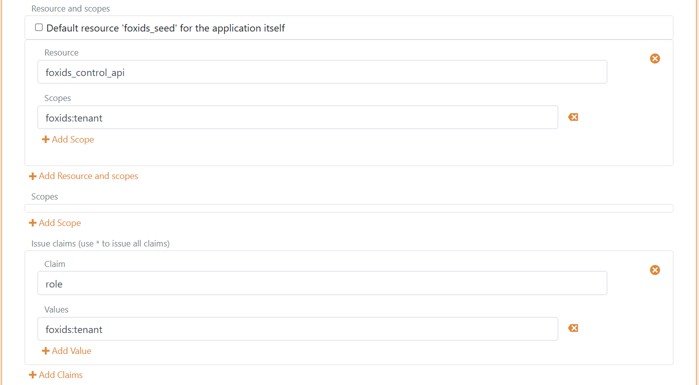

# Upload users

Provisioning your users in an environment, with or without a password:

- You can upload the users with there password, if you know the users' passwords. 
- Otherwise, you can upload the users without a password and the users are then requested to set a password with an email or SMS conformation code. Require the users to have either an email or phone number.

The users are bulk uploaded to an environment with 1,000 users at the time and supporting upload of millions of users. You can either user the [FoxIDs Control API](control.md#foxids-control-api) directly or use the [seed tool](#upload-with-seed-tool). 

## Upload with seed tool

The seed tool reads users from a `CSV` file and upload the users to the configured environment.

### CSV file

The CSV file elements are separated  with `;` and the text can optionally be in quotation marks.

The first line of the CSV file is the case sensitive headers. You can select to use all headers or a subset of the headers and change the order of the headers.  
The headers:

- Email
- Phone
- Username
- ConfirmAccount
- EmailVerified
- PhoneVerified
- Password
- ChangePassword
- SetPasswordEmail
- SetPasswordSms
- DisableAccount
- Claims
- RequireMultiFactor

The number of headers and elements in each line need to match.

This CSV file sample use the `Email` and `SetPasswordEmail` headers to upload users without passwords. The user is required to set a password with email conformation on the first login. 
The email is thereafter marked as verified.
```csv
Email;SetPasswordEmail
u1@somedomain.test;true
u2@somedomain.test;true
u3@somedomain.test;true
```

This CSV file sample include a username and set the email and phone number as verified. The passwords are set with an email or SMS conformation code.
```csv
Email;Phone;Username;EmailVerified;PhoneVerified;SetPasswordEmail;SetPasswordSms
u1@somedomain.test;;u1;true;true;true;false
;+4422222222;u2;true;true;false;true
u3@somedomain.test;+4433333333;u3;true;true;true;false
```

This CSV file sample use all the headers and upload users with passwords and claims. The last user is uploaded as a disabled user.
```csv
Email;Phone;Username;ConfirmAccount;EmailVerified;PhoneVerified;Password;ChangePassword;SetPasswordEmail;SetPasswordSms;DisableAccount;Claims;RequireMultiFactor
u1@somedomain.test;+4411111111;u1;false;true;true;"My1Password!";false;false;false;false;"[{""Claim"": ""role"", ""Values"": [""admin""]}]";false
u2@somedomain.test;+4422222222;u2;false;true;true;"My2Password!";true;false;false;false;"[{""Claim"": ""role"", ""Values"": [""admin""]}, {""Claim"": ""customer_id"", ""Values"": [""1234""]}]";true
u3@somedomain.test;+4433333333;u3;false;true;true;"My3Password!";false;false;false;true;"[{""Claim"": ""role"", ""Values"": [""admin"", ""user""]}]";false
```

You should add passwords and claims with the `;"";` notation. If a password contains the `"` symbol it is escaped, for example the password `My"Password` which become `;"My""Password";`

Claims are added with a JSON structure without line breaks and the `"` symbols is escaped.
```json
[
  { "Claim": "role", "Values": ["admin", "user"] }, 
  { "Claim": "customer_id", "Values": ["1234"] }
]
```

### Download and configure the seed tool

First download the `FoxIDs.SeedTool-x.x.x-win-x64.zip` file for Windows or `FoxIDs.SeedTool-x.x.x-linux-x64.zip` file for Linux from the [FoxIDs release](https://github.com/ITfoxtec/FoxIDs/releases) and unpack the seed tool.

The seed tool is configured in the `appsettings.json` file.

Access to upload users is granted in your `master` environment.

Create a seed tool OAuth 2.0 client in the [FoxIDs Control Client](control.md#foxids-control-client):

*This will grant the seed tool full access to your tenant, for least privileges please see [API access rights](control.md#api-access-rights).*

1. Login to your tenant (in self-hosted the main tenant)
2. Select the **master** environment (in the top centre environment selector)
3. Select the **Applications** tab
4. Click **New Application**
5. Click **Backend Application**
    a. Select **Show advanced**
    b. Add a **Name** e.g., `Seed tool`
    c. Change the **Client ID** to `foxids_seed`
    d. Click **Register**
    e. Remember the **Authority**.
    f. Remember the **Client secret**.
    g. Click **Close**
6. Click on the application in the list to open it
7. In the **Resource and scopes** section 
    a. Remove the check mark from **Default resource 'foxids_seed' for the application itself**
    b. Click **Add Resource and scope** and add the resource `foxids_control_api`
    c. Then click **Add Scope** and add the scope `foxids:tenant` 
8. Select **Show advanced**
9. In the **Issue claims** section
    a. Click **Add Claim** and add the claim `role`
    b. Then click **Add Value** and add the claim value `foxids:tenant`
10. Click **Update**



Add your FoxIDs Control API endpoint and **tenant** and **environment** and the seed tool **Authority** and **Client secret** and `CSV` file path to the seed tool configuration. 

```json
"SeedSettings": {
    "FoxIDsControlEndpoint": "https://control.foxids.com", // self-hosted "https://control.yyyyxxxx.com" or local development https://localhost:44331
    "Tenant": "xxxxxx",
    "Environment": "xxxxxx",
    "Authority": "https://id.foxids.com/zzzzz/master/foxids_seed/", // custom domain, self-hosted or local development "https://https://localhost:44331/zzzzz/master/foxids_seed/"
    "ClientId": "foxids_master_seed",
    "ClientSecret": "xxxxxx",
    "Scope": "foxids_control_api:foxids:tenant",
    "UsersSvcPath": "c:\\... xxx ...\\users.csv"
}
```

### Run the seed tool and upload the users

1. Start a Command Prompt 
2. Run the seed tool with `SeedTool.exe`
3. Click `U` to start uploading users  

> The upload can take a while depending on the number of users.
