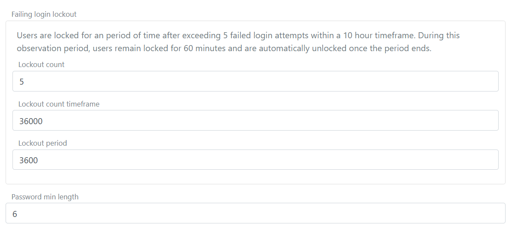

# Users
Users are saved in the environment's user repository. To achieve multiple user stores, you create additional environments and thus achieve more user stores.

There are two different types of users:
- [Internal users](users-internal.md) which are authenticated using the [login](login.md) authentication method.
- [External users](users-external.md) which are linked by an authenticated method to an external user/identity with a claim. The users are authenticated in an external Identity Provider and the users can be redeemed based on e.g. an `email` claim (see Provision and redeem section in external users doc).

Another option is to authenticate against an [existing external user store](external-login.md) via an API in. In this case the users are not saved as internal users in the environment. The uses can optionally be created as [external users](users-external.md).

## Failing login lockout
If a user fails to login and use a wrong password a number of times within a given lockout count period, the user is locked for a period of time (observation period) and are automatically unlocked once the period ends.  
Lockout is enforced for user authentications using the [login](login.md) and [external login](external-login.md) authentication methods.

> This is a security feature to prevent brute force attacks on user accounts. It is not recommended to disable this feature, but you can configure the lockout count, lockout period and count timeframe to suit your needs.

The lockout is configured in the environment settings in the [FoxIDs Control Client](control.md#foxids-control-client).

1. Select the **Settings** tab
2. And subsequently select the **Environment** tab
3. Find the **Failing login lockout** section
4. Set the **Lockout count timeframe** to the number of allowed failed login attempts, e.g. `5` for 5 attempts
5. Set the **Lockout period** in seconds, e.g. `36000` for 10 hours
6. Set the **Count time period** in seconds, e.g. `3600` for 60 minute
   
7. Click **Update**