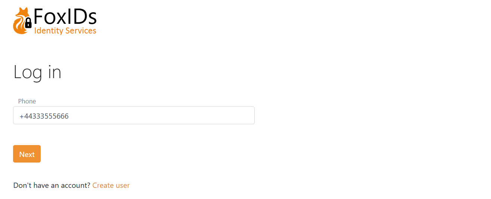
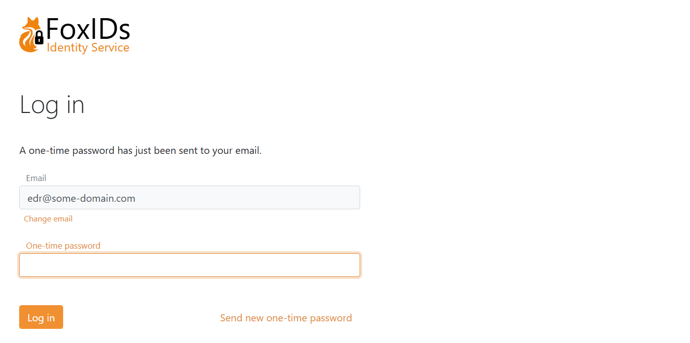
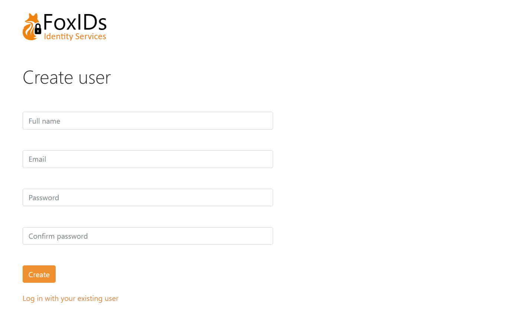
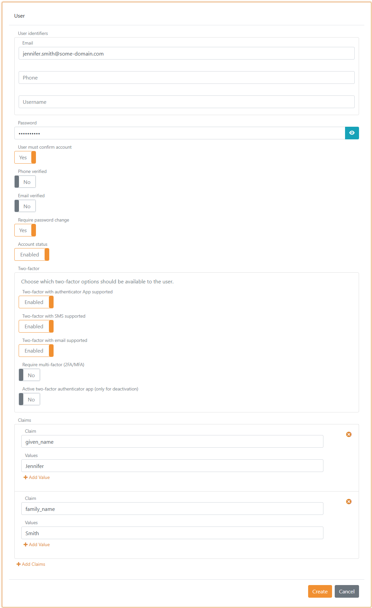

# Users
Users are saved in the environment's user repository. To achieve multiple user stores, you create additional environments and thus achieve more user stores.

There are two different types of users:
- [Internal users](#internal-users) which are authenticated using the [login](login.md) authentication method.
- [External users](#external-users) which are linked by an authenticated method to an external user/identity with a claim. The users are authenticated in an external Identity Provider and the users can be [redeemed](#provision-and-redeem) based on e.g. an `email` claim.

## Internal users
Internal users can be authenticated in one or more [login](login.md) authentication methods in an environment, making it possible to [customised](customisation.md) the login experience e.g., depending on different [application](connections.md#application-registration) requirements.

> [Upload your users](users-upload.md) from a SVC file, with or without a password.

### User identifiers
Internal users support three user identifiers; email, phone number and username. The user identifiers is the username part when a user login with username and password. 
You can choose to use only one user identifier or all of them.

Only phone number as user identifier.

Both email, phone number and username as user identifier.

### Password or one-time password
The [login](login.md) authentication method is default set for user authenticate with username (user identifier) and password. 
You can configure to support one-time password (OTP) via email and/or SMS. And optionally create many [login](login.md) authentication methods that support different authentication combinations.

If you enable both password and one-time password all methods is available for the user. This UI also allows the user to create an account.

Or if only one-time password via email is enabled.

### Create user
Depending on the selected [login](login.md) authentication method's configuration, new users can create an account online.

The user can select to create a new user.

And is then asked to fill out a form to create a user.

The page is composed by dynamic elements which can be customised per [login](login.md) authentication method.  
In this example the create user page is composed by a Given name element and a Family name element and a Email element and a Password element, ordered with the Full name element at the top.
The Email element is a user identifier used to login. 

This is the configuration in the [login](login.md) authentication method. Moreover, the claim `some_custom_claim` is added to each user as a constant in the [claim transformation](claim-transform).

### Provisioning
Internal users can be created, changed and deleted with the [Control Client](control.md#foxids-control-client) or be provisioned through the [Control API](control.md#foxids-control-api).

### Multi-factor authentication (MFA)
Two-factor / multi-factor authentication can be required per user. The user will then be required to authenticate with a two-factor based on SMS, email or authenticator app and to register a authenticator app if not already registered.

It is configurable which two-factor authentications should be available per user and per login authentication method. Please see more info about [two-factor authentication](login.md#two-factor-authentication-2famfa).  
You can see whether a two-factor authenticator app is registered for on the user, and the administrator can deactivate the configured two-factor authenticator app.

### Password hash
Only a hash of the password is saved in the database.

The password hash functionality is designed to support a growing number of algorithms with different iterations by saving information about the hash algorithm used alongside the actually hash. Therefore, it is possible to validate an old hash algorithm and at the same time save new hashes with a new hash algorithm.

Current supported hash algorithm `P2HS512:10` which is defined as:

- The `HMAC` algorithm (`RFC 2104`) using the `SHA-512` hash function (`FIPS 180-4`).
- With 10 iterations.
- Salt is generated from 64 bytes.
- Derived key length is 80 bytes.

Standard .NET liberals are used to calculate the hash.

## External users
An external user is linked to one authentication method and can only be authenticated with that particular authentication method. External users can be linked to the authentication methods: OpenID Connect, SAML 2.0, External Login and Environment Link.  
It is optional to use external users, they are not created by default.

All external user grouped under an authentication method is linked with the same claim type (e.g. the `sub` claim type) and the users are separated by unique claim values.

> With external users you can store claims on each user. E.g. store the your user ID claim representing the user in your system and thereby mapping the external user ID to your user ID. 

An automatically generated unique ID is added to each external user by default.

### Create external user
Depending on the selected authentication method's configuration, new users is optionally asked to fill out a form to create a user.

The page is composed by dynamic elements which can be customised per authentication method.  
In this example the create user page is composed by three elements; Email, Given name and Family name, ordered with the Email element at the top.

This is the configuration in a [OpenID Connect](auth-method-oidc.md) authentication method.

[Claim transformations](claim-transform) can be added which are performed just before the external user is created.

> If the login sequence is started base on a [login](login.md) authentication method, it provides the basis for the UI look and feel ([customize](customisation.md)). Otherwise, the default [login](login.md) authentication method is selected as the base.

### Provision and redeem
External users can be created, changed and deleted with the [Control Client](control.md#foxids-control-client) or be provisioned through the [Control API](control.md#foxids-control-api).

You probably do not know the link claim value in advanced because it is an external user ID. But if you do, it is possible to create users and associate them with the link claim value. Most often, you will know a redemption claim in advanced instead.

The external users can be redeemed by a redemption claim type (e.g. `email`) and they are then automatically linked with the link claim type. 
It is bad practice to link users based on there email over a long period of time, as emails can change. But the email is unlikely to change within the short redemption period.

Once the user has been redeemed, the external user is subsequently logged in based on the link claim value.

This authentication method is configured with `email` claim redemption and `sub` link claim type.

And user's is added with their known email as the redemption claim value.

In this example the user is connected to Google Workspace with an OpenID Connect authentication method and a `app_user_id` claim is added with an internal user ID.

> You can reset a redeemed user by deleting the link claim value and, if necessary, also changing the redemption claim value. The external user is then redeemed again next time the user logs in.